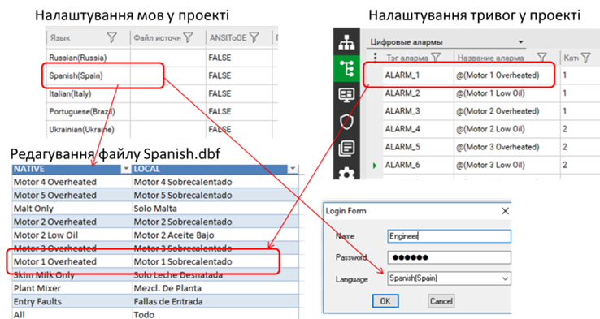
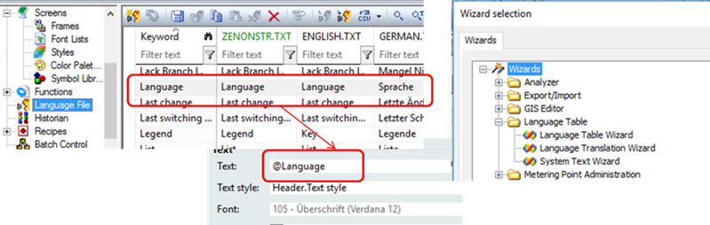
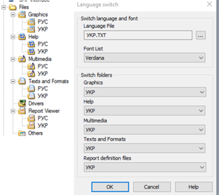
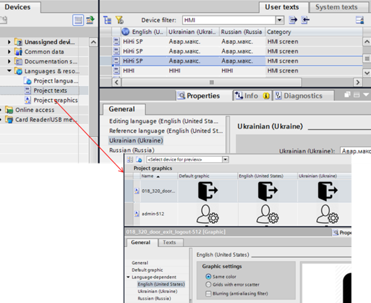

[Головна](README.md) > [8.Інші підсистеми SCADA/HMI](8.md)

# 8.8. Мультимовна підтримка

## 8.8.1. Загальні підходи до керування доступом 

Враховуючи, що проект може розроблятися для використання в різних країнах або регіонах, інструменти SCADA/HMI, як правило, надають готові функції мультимовної підтримки. Треба розуміти, що мультимовність не передбачає автоматичного перекладу, хоч сучасні засоби можуть забезпечити і такий функціонал. Зрештою, підтримка кількох мов, як правило, проводиться в такі кроки:

- тексти проекту пишуться однією із мов, причому це може бути набір будь-яких символів, які вважатимуться "оригінальними (проектними) текстами" або "ключовими фразами";

- визначається набір мов, які будуть використовуватися в середовищі виконання;

- для кожної з мов ставиться відповідний текст до оригінального (до ключових фраз);

- у середовищі виконання викликається функція, яка переключає мову, що приводить до зміни оригінальних текстів.

У деяких SCADA/HMI окрім зміни тексту, також автоматизовано зміну шрифтів, графічних зображень або інших ресурсів, які можуть потребувати локалізації. 

## 8.8.2. Мультимовна підтримка в Citect 

Переключення мов у Citect (починаючи з версії 7.4) відбувається з використанням функцій входу в систему користувача. Citect підтримує зміну тексту як у ЛМІ, так і в деяких властивостях тегів, тривог, трендів та інших розділів проекту.

Для забезпечення мультимовної підтримки в проекті та в середовищі виконання Citect необхідно виконати такі процедури:

1. *Позначити тексти, що будуть перекладатися*. Для текстів, що будуть перекладатися, використовуються спеціальні позначки зміни мови (@). Citect розрізняє оригінальну мову (native), яка використовується в проекті при розробленні, та локальну (local), яка відображається для користувача в режимі виконання. Будь-який текст, позначений для перекладу, змінюватиметься в середовищі виконання на локальну, якщо є відповідник. 

2. *Означити мови, що підтримуються в проекті*. Для цього у проекті Citect SCADA є файл бази даних LANG.dbf, в якому записи означують локальні мови, які підтримуються даним проектом. Для кожної мови створюється однойменна база даних, яка створюються під час компіляції. 

3. *Перекласти бази даних локальних мов*. Бази даних локальних мов використовуються для означення перекладу з оригінальної мови проекту на локальну. При компіляції проекту будь який-текст, позначений для перекладу, потрапляє в базу даних локальних мов. Можна вручну редагувати бази даних для означення перекладів, після перекомпіляції записи будуть зберігатися. 

4. *Забезпечити переключення мови при реєстрації користувача*. У середовищі виконання викликається одна з функцій реєстрації користувача, в якій вибирається також мова. 

Тексти, які необхідно відображати в середовищі виконання різними мовами, повинні в проекті бути поміченими з використанням спеціального синтаксису:

```
@( Native Text, Width, Justify)
```

де Native Text – оригінальний текст;

*Width –* опція, яка задає кількість літер, що виділяється для тексту;

*Justify* – опція, яка задає вирівнювання (L – Left, R – Right, C – Center, N – None).

Наприклад, на рис. 8.69 у налаштуваннях тривог проекту використовується запис 

```
@(Motor 1 Overheated)
```

який вказує на необхідність його перекладу. 

                               

*Рис.8.69.* Налаштування мультимовного проекту в Citect

Створення кількох мовних таблиць у проекті проводиться в розділі Setup (рос. лок. "Настройка") на закладці Languages (рос. лок. "Языки"), який, по суті, редагує файл LANG.dbf . Можна вказати кілька мов у проекті, вказавши назву, наприклад, Spanish та в дужках регіон, наприклад, Spain (рис. 8.69). Назва регіону буде використовуватися для вибору кодової сторінки, налаштувань відображення дати та часу, а за назвою мови буде створено однойменний файл "*.dbf". При компіляції буде створено файл "*.dbf", в якому в колонці Native будуть вписані всі тексти, що позначені в проекті як мультимовний текст. Якщо в колонці налаштування Source File (рос. лок. "Языки") буде вказаний файл DBF, усі тексти перекладу будуть взяті з нього; в іншому випадку в колонці LOCAL файлу будуть порожні записи, які можна буде заповнити. Редагувати файл мови можна в Excel з використанням Citect DBF Add-in. Наприклад, для іспанської мови у файлі Spanish.dbf буде локальний відповідник оригінальному тексту (див. рис. 8.69).

Вибір мови в середовищі виконання відбувається із застосуванням функцій реєстрації користувача з використання Cicode функцій Login(), UserLogin() або LoginForm(). У результаті LoginForm з’явиться вікно реєстрації користувача в системі (рис. 8.64), а синтаксис Login матиме такий вигляд: 

```
Login(sUserName, sPassword, bSync, sLanguage)
```

де `sUserName` – ім’я користувача; 

`sPassword` – пароль;

`bSync` – блокуюча чи неблокуюча функція (1 – блокує викликаючу програму, поки користувач не зареєструється); 

`sLanguage` – мова, вказана в переліку мов проекту.

Citect підтримує системні повідомлення кількома мовами та має деякі об’єкти (наприклад Process Analyst), які також підтримують вибір мови. Перелік цих мов обмежений і він входить до списку "офіційно підтримуваних мов". До цього переліку, наприклад, не входить українська мова, і це значить, що тексти в цих елементах будуть відображатися однією з офіційних мов. Крім того, в citect.ini в параметрі `[Language]CharSet` можна виставити кодову сторінку, яка буде використовуватися.

## 8.8.3. Мультимовна підтримка в zenon 

У SCADA zenon мультимовність підтримується не тільки для тексту, а й для рисунків та шрифтів. Тобто залежно від вибраної мови автоматично можуть змінюватися інші елменти інтерфейсу. Крім того, zenon підтримує переклад системних повідомлень (із середовища виконання). Для забезпечення мультимовної підтримки в проекті zenon необхідно виконати такі процедури:

1. *Позначити тексти, що будуть перекладатися*. Для текстів, що будуть перекладатися, використовуються спеціальні позначки зміни мови (`@`). 

2. *Означити мови, що підтримуються в проекті*. Для цього у проекті zenon є текстові мовні файли, які можна редагувати безпосередньо в редакторі проекту або зовнішніми засобами. 

3. *Перекласти мовні файли*. Текстові файли локальних мов використовуються для означення перекладу з оригінальної мови в проекті на локальну. 

4. *Забезпечення переключення мови*. У середовищі виконання викликається функція зміни мови, в якій також вказуються додаткові параметри шрифтів та папок із змінними ресурсними файлами (рисунки, файли допомоги тощо).

Оригінальний текст у проекті, що потребує перекладу, виділяється з обох боків за допомогою символів "@". У записі 

```
@Text1@Text2
```

оригінальний текст "Text1" буде замінено на локальний з мовного файлу. Текст "Text2" залишиться без зміни. Якщо треба перекласти весь текст праворуч від символу "@", другий символ можна не ставити.

Мовні файли (TXT) створюються в розділі проекту Language File (рис. 8.70). Файли вміщують оригінальні тексти, які в zenon називаються ключовими словами (keywords), та їх переклад, розділені символом "|". За замовченням ці файли порожні. Щоб заповнити їх ключовими словами автоматично в zenon можна скористатися помічником Language Table Wizard (Tools -> Start Editor wizard). Цей помічник також перед заповненням може усі звичайні тексти в потрібних розділах проекту помітити символом "@", таким чином автоматизувавши перетворення зі звичайного проекту в мультимовний. Усі ключові слова записуються в колонку “keyword” та в файл "ZENONSTR.TXT", який завантажується автоматично при старті середовища виконання (типу файл мови за замовченням). 

Перекладені відповідники ключовим словам можна вставляти у відповідну колонку мовного файлу безпосередньо в редакторі проекту. Можна також імпортувати та експортувати ці файли. Додатково можна скористатися помічником System Text Wizard, який знаходить усі тексти та їх відповідні переклади в системних вікнах та меню zenon а також існуючі перекладені варіанти та записує їх у відповідні файли. Таким чином можна реалізувати або змінити переклад існуючих системних вікон середовища виконання zenon. 

 

Рис.8.70. Налаштування мультимовного проекту в zenon

Переключення мови проводиться викликом функції "Language switch" (рис. 8.71). Окрім файлу мови можна опційно вказати набір шрифтів та попередньо створені папки ресурсів проекту (рисунків, файлів допомоги, мультимедіа, файлів звітів). У випадку вибору папок для мови, вони повинні містити ресурси з тією самою назвою та розширенням. 

 

*Рис. 8.71.* Конфігурування виклику функції "Language switch" в zenon

## 8.8.4. Мультимовна підтримка у WinCC Comfort

WinCC Comfort підтримує можливість зміни тексту або графіки залежно від вибраної мови. Для забезпечення мультимовної підтримки в проекті TIA Portal необхідно виконати такі процедури:

1. *Означити мови, що підтримуються в проекті* *TIA Portal*. Для цього в проекті TIA Portal у розділі "Languages & Resources -> Project languages" вибираються потрібні мови. 

2. *Означити мови, що підтримуються в пристрої* *WinCC Comfort*. Для цього в проекті TIA Portal у розділі пристрою (операторської панелі) “Runtime Settings” -> "Languages & Fonts" вибираються потрібні мови з вибраних в п.1 та означуються для них шрифти. 

3. *Перекласти* *тексти*. Тексти редактору (Editing Language) перекладаються на локальні. 

4. *Забезпечити переключення мови*. У середовищі виконання викликається функція зміни мови, в якій також вказуються додаткові параметри шрифтів та папок зі змінними ресурсними файлами (рисунки, файли допомоги тощо).

При виборі мови у п.1 у проекті TIA Portal вказується мова, що буде використовуватися як мова редагування ("Editing Language"), а також як мова за замовченням ("Reference Language"). Усі тексти автоматично будуть копіюватися в "Reference Language". Переклад для всіх інших вибраних в п.2 мов можна зробити у вкладці "Texts" конкретного елемента, або централізовано у розділі "Languages & Resources”->“Project texts” (рис. 8.72). Окрім тексту, до мови можна також прив’язати зміну графічних зображень. 

 

*Рис. 8.72.* Налаштування мультимовної підтримки в TIA Portal

Переключення мови в середовищі виконання відбувається шляхом виклику функції SetLanguage. 

[<-- 8.7. Підсистема керування доступом](8_7.md)

[--> Розділ 9. Інтеграція з іншими засобами та кібербезпека](9.md)
