[Головна](README.md) > [9.Інтеграція з іншими засобами та кібербезпека](9.md)

# 9.1. Мережні архітектури

## 9.1.1. Архітектура на базі одного ПК

У найбільш простому випадку системи на базі SCADA/HMI мають ***одиночну*** (***standalone***) архітектуру, де на одному комп’ютері суміщені усі підсистеми, включаючи АРМ оператора. У цей же час на інших ПК в системі, що об’єднуються однією мережею, можуть також функціонувати інші SCADA/HMI, однак вони не обмінюються даними між собою. Така архітектура передбачає наявність одного оператора в один момент часу та збирання усіх даних у тій самій точці (ПК), яка слугує і для інтерфейсу з оператором. 

Одиночна архітектура передбачає можливість кількох джерел даних (ПЛК або інших засобів) у тому числі може підтримуватися резервування каналів для зв’язку з ними. На рис. 9.1,1 показано архітектуру системи, в якій SCADA/HMI поєднані з ПЛК двома різними мережами. Такий спосіб резервування каналів повинен підтримуватися з боку підсистеми збирання даних. У випадку відсутності зв’язку по основному каналу (мережа М1) SCADA/HMI намагається налагодити зв'язок по іншому (мережа М2). Як правило, первинний канал має вищий пріоритет, тому при відновленні основного каналу збирання даних відбувається через нього. Деякі засоби SCADA/HMI надають можливість виділяти кілька резервних каналів.  

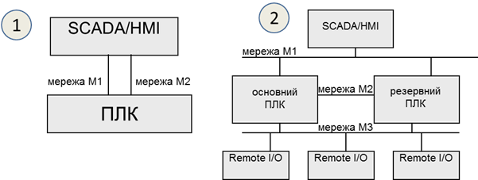                               

*Рис.* *9.1.* Архітектура з резервуванням каналів зв’язку з ПЛК (1) 
 та з резервуванням ПЛК (2)

Схема, що показана на рис. 9.1,1, може використовуватися і в системах з резервуванням ПЛК. У цьому випадку основний канал буде зв’язаний з основним ПЛК, а резервний – з резервним. Тим не менше, у системах з резервуванням контролерів може бути використана інша схема, яка показана на рис. 9.1,2. Розгляд рішення з резервуванням ПЛК виходить за рамки цього посібника, тим не менше коротко його розглянемо. У цьому випадку, основний і резервний ПЛК забезпечують зв'язок із засобами віддаленого введення/виведення (Remote I/O) через одну й ту саму мережу (на рисунку – мережа М3). В один момент часу зв'язок із засобами введення/виведення та SCADA/HMI проводить тільки один з двох ПЛК, який відіграє роль основного. У випадку виходу його з ладу цю роль бере на себе інший ПЛК. Для контролю стану дубльованого ПЛК та обміну даними контексту процесорів використовується високошвидкісна мережа (на рис. 9.1,2 – М2). Для функціонування такої архітектури ПЛК повинні змінювати свою адресу залежно від їх ролі (основний або резервний). Тоді для SCADA/HMI переключення буде виливатися в тимчасову відсутність доступу, пов’язана, наприклад з відновленням буферів комунікаційного обладнання. 

Архітектура з одним ПК має ряд недоліків:

- передбачається тільки одне робоче місце оператора, тобто весь персонал, що бере участь у керуванні чи обслуговуванні, може працювати тільки через один термінал;

- відсутність резервування робить систему нестійкою до збоїв різного типу, тобто при неполадках у мережі чи в складових робочої станції втрачається зв’язок з процесом, але при цьому система керування на рівні контролерів може надалі функціонувати;

- значне навантаження на один комп’ютер не дає можливості побудувати великі системи;

- відсутність інтеграції з рівнем керування виробництвом не дає можливості повністю оцінити ефективність роботи процесу.

## 9.1.2. Архітектура клієнт-сервер 

Для можливості доступу до керування або тільки для контролю з декількох робочих місць багато засобів SCADA/HMI пропонують ***клієнт-серверну архітектуру*** (рис. 9.2), в якій на сервер покладається завдання збирання даних (а також архівування, контроль за тривогами та ін.), а клієнтська частина (тобто людино-машинний інтерфейс) реалізується на окремих комп’ютерах.

***Клієнт*** (***HMI клієнт, Client***) – це програма, яка реалізує людино-машинний інтерфейс доступу до даних на сервері (зокрема через мережу). ***Сервер*** (***SCADA сервер, Server***) – це програма, яка надає доступ до своїх даних клієнтам (зокрема через мережу) та реалізує одну або всі функції: збирання даних, їх оброблення, архівування, формування тривог та ін. Як правило, на комп’ютерах з програмою сервера виконуються і програми клієнтів. Слід розуміти, що клієнти і сервери у більшості випадків спілкуються між собою з використанням спеціалізованих протоколів, тобто поєднання складових від різних програм SCADA можливе тільки за певних обставин, наприклад, використовуючи технології ОРС. 

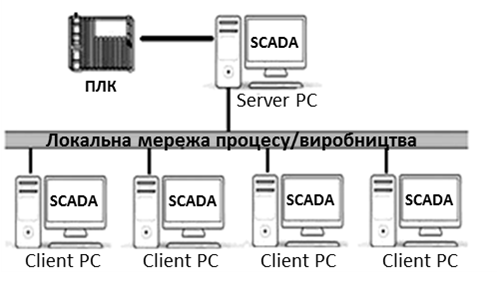                               

*Рис.* *9.2.* Клієнт-серверна архітектура

Часто для опису роботи клієнт-серверних архітектур SCADA/HMI використовують поняття ***тонкий клієнт*** (thin client) та ***товстий клієнт*** (у різних джерелах можуть називатися як fat, thick, heavy або rich client). 

Під товстим клієнтом частіше всього розуміють ПК з установленим середовищем виконання SCADA/HMI, яке виконує роль клієнта при взаємодії з іншим середовищем виконання (сервером). У даному випадку велика частина роботи, зокрема стосовно функцій ЛМІ, покладена на клієнтський застосунок, а сервер у цей час може збирати дані, обробляти їх, зберігати і т.п. Обмін між клієнтом та сервером SCADA реалізується через пропрієтарні закриті протоколи. 

При побудові архітектури на базі товстого клієнта слід враховувати деякі особливості реалізації. Зокрема, внутрішні змінні можуть належати як клієнтській частині, так і серверній. У першому випадку кожен клієнт матиме свою копію внутрішніх змінних, у другому – один і той самий екземпляр внутрішніх змінних буде доступний усім клієнтам.  

Тонкий клієнт частіше всього має меншу функціональність і не потребує встановлення спеціалізованого ПЗ. В якості тонкого клієнта можуть виступати термінальні клієнти (RDP – Remote Desktop Protocol) або WEB-браузер, а обмін даними відбувається через класичні стеки протоколів, наприклад TCP/IP. Роботу WEB-клієнтів розглянемо в наступному в параграфі.

Ще один спосіб реалізації віддаленого підключення до засобу SCADA/HMI, що має популярну ОС, – це VNC (Virtual Network Computing). VNC дає можливість відображати екран засобу, на якому встановлено VNC Server, на іншому засобі, на якому встановлений VNC Client. Окрім відображення, доступні також функції керування, тобто пересилання натискань клавіатури та миші (або сенсора) на VNC Server. На сьогоднішній день є багато безкоштовних реалізацій VNC під різні платформи. Недоліком такого підходу є дублювання всього змісту на обох засобах, що не дає можливості повноцінно замінити клієнт-серверну архітектуру. 

## 9.1.3. WEB-клієнти та хмарні SCADA

   Сучасні SCADA/HMI надають можливість доступу до системи через Internet або локальну мережу, використовуючи WEB-браузер [[1](http://ua.automation.com/content/scada-udalennyy-dostup-vsegda-i-vezde)]. На відміну від товстих HMI клієнтів, які використовують для зв’язку із серверами SCADA спеціалізовані протоколи, ***WEB клієнти*** з’єднуються з технологічним процесом, використовуючи WEB-сервіси. Тобто вони використовують ті самі технології, що й при доступі звичайного браузера до якогось сайту в мережі Інтернет. Це має ряд переваг, зокрема:

- на відміну від протоколів обміну між HMI та SCADA, WEB-технології прозорі для комунікаційного обладнання (маршрутизатори, брандмауери, шлюзи та ін.), що дає змогу з’єднуватися через Інтернет;

- у багатьох випадках можуть використовуватися будь-які браузери, в тому числі на планшетах та мобільних телефонах;

- підвищена мобільність клієнтів, оскільки Інтернет доступний на великій території.

На рис. 9.3 показано приклад архітектури з доступом через WEB. Для роботи такої системи необхідний запуск служб WEB-сервера, які потребують окремого комп’ютера. WEB-сервер конвертує дані, які зчитує/записує зі SCADA-серверів та передає їх WEB-клієнтам через локальну мережу підприємства або через Інтернет.

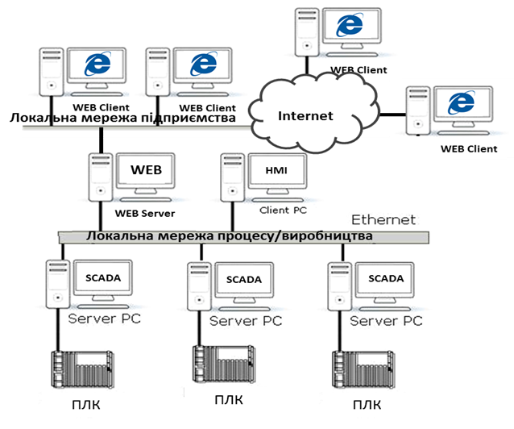 

*Рис.* *9.3*. Архітектура з доступом через WEB

Не дивлячись на привабливість WEB-доступу, слід розуміти деякі обмеження та передбачити потенційну небезпеку несанкціонованого доступу, зокрема:

- функція WEB-доступу, як правило, ліцензується окремо, тобто потребує додаткової оплати і часто – встановлення додаткового ПЗ для WEB-сервера; при необхідності доступу через Інтернет WEB-сервери розміщують на окремих ПК в зонах DMZ (див. підрозділ 9.5); 

- як правило, через WEB-клієнт доступні не всі функції, які доступні через HMI клієнт;

- ряд систем працюють тільки через обмежений перелік браузерів і потребують інсталювання додаткових програм на комп’ютер WEB клієнта;

- перед організацією доступу через Інтернет слід подбати про неможливість несанкціонованого доступу (кібербезпеку), щоб зловмисник не зміг втрутитися в процес керування.

Для багатьох засобів HMI (операторських панелей) також передбачається доступ через WEB. У цьому випадку, такий доступ надає можливість здійснювати керування не безпосередньо по місцю розташування устатковання, а віддалено від нього. 

   Деякі програми SCADA по своїй суті є WEB-орієнтованими, тобто передбачають наявність клієнтів HMI тільки з WEB-доступом. Такі SCADA легко інтегруються в хмарні рішення, оскільки дають можливість розміщувати середовища виконання на віддалених серверах в Інтернеті. У цьому випадку використовуються архітектурні рішення Промислового інтернету речей IIoT (Industrial Internet of Things). Прикладом WEB-орієнтованих SCADA є Overvis (Україна, https://www.overvis.com), WebHMI (Україна, http://webhmi.com.ua), WebAccess/SCADA (Advantech, https://www.advantech.com), Integraxor (Ecava, Малайзія https://www.ecava.com) та багато інших. Хмарні SCADA та IIoT надають можливість побудувати розподілену архітектуру без необхідності встановлення ПК та їх обслуговування безпосередньо на об’єкті. Також це значно спрощує віддалений доступ та дає можливість значно спростити використання багатьох Інтернет-сервісів, таких як електронна пошта, месенжери, хмарні сховища, звіти та багато інших. Тим не менше, вибираючи рішення з використанням хмарних SCADA, треба розуміти ризики, які супроводжують такі системи, зокрема можливості тимчасової відсутності комунікації з Інтернет, кібер-атак на мережну інфраструктуру та ін. Крім того, рішення на базі IIoT включають у себе частину сервісів SCADA (збирання даних, локальне архівування, аналіз) в так званих IIoT Edge шлюзах. Більше про IIoT-архітектури і рішення можна прочитати в матеріалах Industrial Internet Consortium [[2](https://www.iiconsortium.org/white-papers.htm)] та в підрозділі 9.4. 

## 9.1.4. Робота з мобільними застосунками та віддалений доступ

Останнім часом мобільні засоби, такі як смартфон, планшет, стали невід’ємною частиною існування будь-якої людини. Враховуючи їхню функціональну потужність, використання їх в якості мобільних терміналів було питанням часу. На сьогоднішній день більшість постачальників інструментів SCADA/HMI надають готове рішення для підключення мобільних пристроїв в якості віддалених засобів оповіщення, відображення та керування. Виділимо такі підходи до побудови таких рішень:

1) *Доступ до серверів через WEB-застосунки*. Цей підхід практично нічим не відрізняється від звичайного WEB-доступу, за винятком таких особливостей:

- необхідно врахувати діагональ екрана мобільного пристрою;

- необхідно передбачити використання платформо-сумісних технологій; наприклад, WEB-застосунки з використанням технології ActiveX працюватимуть тільки на деяких типах пристроїв;

2) *Доступ через відкриті технології, наприклад* *OPC UA**,* *HTTP API**,* *WEB SOCKET* *або протоколи* *IoT (MQTT**,* *AMQP)**.* У цьому випадку клієнтський застосунок на мобільному пристрої може бути стороннім по відношенню до серверного SCADA/HMI і розроблятися в окремому середовищі, можливо навіть на самому мобільному пристрої.  

3) *Доступ через спеціалізовані клієнтські застосунки, розроблені саме для конкретної* *SCADA**.* У цьому випадку для розробника потрібно тільки налаштувати з’єднання; все інше є прозорим і прихованим від розробника.    

На сьогоднішній день є багато застосунків, так званих APPів для Android та iOS, що по суті є повноцінними HMI, які самі вміють збирати дані (використовуючи протоколи поверх стеку TCP/IP, Bluetooth), та реалізовувати інші функції (ЛМІ, тривоги, тренди і т.п). При цьому середовище розроблення також є застосунком для цих мобільних пристроїв. По суті, за невеликий проміжок часу можна розробити людино-машинний інтерфейс для невеликих задач, як обслуговування обладнання чи контроль певних виробничих операцій. Ці ж самі застосунки можна використовувати в якості клієнтів до SCADA/HMI, використовуючи стандартні протоколи промислових мереж (наприклад Modbus TCP/IP) або доступу до даних (OPC UA, JDBC тощо).     

## 9.1.5. Мультисерверна архітектура та резервування.

При великій кількості джерел даних (наприклад контролерів) може використовуватись мультисерверна архітектура (рис. 9.4). У таких системах кожний сервер збирає дані з окремої групи пристроїв, а клієнт (клієнти) мають доступ до всіх даних серверів. У деяких програмах SCADA можна виділити окремі комп’ютери для виконання функцій серверів збирання даних, серверів трендів, серверів тривог, серверів звітів, що дає змогу розподіляти ресурси між декількома апаратними засобами.

Якщо технологічний процес є функціонально-небезпечним або втрата даних є недопустимою, то необхідно використовувати архітектури з резервуванням (рис. 9.5). У таких системах ***основний сервер*** (Server PC) дублюється ***резервним*** (RServer PC), який функціонує разом з ним, виконує всі ті самі функції, окрім записування даних на контролери. Резервний сервер контролює працездатність основного, і у випадку виходу його з ладу починає виконувати всі його функції, в тому числі й спілкування з клієнтами та записування даних на контролери.

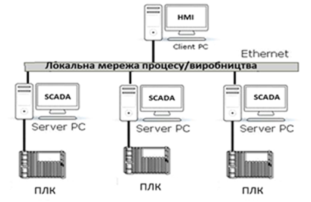 

*Рис.* *9.4.* Мультисерверна архітектура

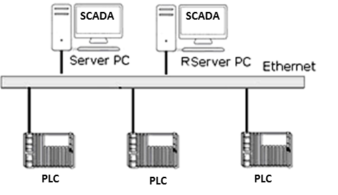 

*Рис.* *9.5.* Архітектура з резервуванням

Принципи роботи системи з розподіленими серверами та резервуванням можуть відрізнятися залежно від постачальника програмних засобів. 

Наведені вище приклади структур стосуються як системи керування одним відділенням, так і всього цеху чи навіть виробництва. Зрештою, автоматизація технологічних процесів для всього виробництва може бути однією великою розподіленою системою, в якій дані досить легко можуть бути надані в тій точці, де вони потребуються, незалежно від сервера, на якому вони збираються і оброблюються. У цьому випадку, якщо всі засоби SCADA/HMI постачаються від однієї фірми-виробника, таке рішення може бути реалізоване як один великий проект SCADA. Такі рішення для розподілених систем SCADA/HMI пропонують багато відомих брендів, деякі з них наведені в параграфах 9.1.6 та 9.1.7. Усі вони базуються на пропрієтарних, часто закритих протоколах, однак не потребують великих зусиль розробника для налаштування взаємодії між компонентами (клієнтами, серверами, додатковим ПЗ). У випадку реалізації подібних рішень від різних виробників завдання стає досить трудоємким, а в деяких випадках технічно нереалізованим без заміни компонентів. У наступному параграфі показані деякі варіанти реалізації такого обміну.      

## 9.1.6. Обмін між SCADA/HMI різних виробників

Об’єднання декількох SCADA/HMI в одну розподілену систему може знадобитися для вирішення таких завдань:

- контроль/керування станом процесу на ПК віддаленому від основних серверів, наприклад для центрального диспетчерського пункту;

- контроль за деякими параметрами суміжного відділення;  

- реалізація централізованого виробничого сервера реального часу для збирання виробничих даних, їх оброблення, уніфікації для надання верхнім рівням керування (MES/MOM);

- доступ до архівних даних трендів та тривог різних підсистем для формування централізованої звітності.  

Наведені завдання можна вирішувати різними способами, в тому числі шляхом реалізації обміну даними між контролерами. У попередньому параграфі наводиться приклад реалізації розподіленої системи з використанням рішення від одного виробника. Однак на українських підприємствах досить типовою є ситуація, в якій АСКТП для різних відділень реалізовані з використанням засобів автоматизації від різних постачальників. Це стосується й засобів SCADA/HMI. Тому при необхідності інтегрування таких підсистем розробник повинен у кожному конкретному випадку вибирати шляхи з кількох доступних. Інколи рішенням може бути заміна однієї або кількох підсистем. У цьому параграфі розглянемо способи інтеграції, які можуть бути використані при цьому.

Найбільш придатною для обміну даними реального часу є технологія OPC, яка розглянута в розділі 4. Зокрема, приклад використання у розподілених архітектурах наведений у параграфі 4.2.5. У цьому випадку SCADA може виступати як сервером OPC DA, так і сервером OPC UA. Доступ до SCADA через OPC, як правило, надається для читання/записування тегів (змінних), але може бути реалізований також інтерфейс AE (Alarm Event) та Trend. 

У ряді випадків SCADA може надавати доступ до своїх даних через стандартні інтерфейси доступу до баз даних ODBC, JDBC, OLE DB, ADO.NET та інших, які розглянуті в підрозділі 8.3. Тоді дана SCADA може виступати в ролі сервера, а інша, яка може користуватися цими інтерфейсами, – в ролі клієнта. У багатьох випадках це вирішується через написання додаткового коду. 

Можуть бути доступними старі технології Windows, як наприклад DDE/NetDDE. Наразі NetDDE не підтримується сучасними версіями Windows, тому в цьому посібнику не розглядається. Опис та приклади застосування можна прочитати в [3].

Можливо не дуже продуктивним, але інколи єдиним рішенням може бути використання протоколів промислових мереж, що призначені для обміну між ПЛК. Наприклад, при наявності в одній із SCADA/HMI драйвера Modbus Server обмін можна побудувати по протоколу Modbus [3].   

При використанні скриптів на обох SCADA способи інтегрування залежать від наявних обмежень середовища програмування та інтерфейсу з операційною системою. Це можуть бути різноманітні API, в тому числі HTTP API, WebSocket, або звичайний обмін на базі стеку TCP/IP і сокетів.

У ряді випадків є можливість побудувати обмін через файли. Популярним є формат "*.CSV", оскільки він є звичайною текстовою таблицею з розділювачем і має менше проблем із сумісністю.      

## 9.1.7. Мережні архітектури в Citect

Проект Citect може бути розроблений як для одного комп’ютера (одиночна структура, Standalone), так і для всього підприємства з мульти-серверною структурою. У Citect виділяються такі компоненти:

- Client (клієнт) – це середовище виконання, що реалізує товстого клієнта, тобто людино-машинний інтерфейс для оператора на комп’ютері; 

- I/O Server (сервер введення/виведення) – це середовище виконання, що реалізує функції керування базою даних реального часу;

- Trend Server (сервер трендів) – це середовище виконання, що реалізує функції збереження даних трендів та доступу до них клієнтів; 

- Alarm Server (сервер тривожної сигналізації) – це середовище виконання, що реалізує функції керування тривогами; 

- Report Server (сервер звітів) – це середовище виконання, що реалізує функції генерування звітів за вказаними шаблонами.

Усі наведені компоненти є однаковими середовищами виконання, але виконують різні функції (ролі) одного проекту. При одиночній структурі усі компоненти запускаються на одному ПК, при цьому можуть виконуватися як один процес, так і у вигляді окремих процесів, що конфігурується безпосередньо в файлі налаштувань Citect.ini або через майстер налаштувань. При розподіленій системі для кожного компонента задається IP адреса та, за необхідності, додаткові налаштування TCP-портів для доступу. У файлі Citect.ini активується мережна архітектура (TCP/IP=true), і при запуску середовища виконання його роль буде визначатися шляхом порівняння власної IP адреси та означеної в проекті. Так само сервери різного типу та клієнти можуть запускатися на різних ПК. Зрештою, клієнтському екземпляру середовища виконання треба знати, де знаходиться джерело даних. Враховуючи, що проект єдиний для всіх середовищ, IP-адреси та TCP-порти будуть відомі всім. У параграфі 2.5.4 наведено приклад використання сервера розгортання, який значно спрощує процес введення в дію. 

Розділення внутрішніх змінних на клієнтські і серверні відбувається на рівні розділення типів тегів:  Variable Tags та Local variables. Variable Tags за визначенням не є внутрішніми змінними і потребують вказівки джерела даних. Але якщо властивість "Memory" пристрою введення/виведення (I/O Devices) вказати рівним TRUE, усі теги, що до нього прив’язані, стануть внутрішніми серверними. Локальні клієнтські теги, які будуть унікальними для кожного клієнта, створюються через Local variables. Для цих змінних не потрібно вказувати джерело даних і вони не мають відношення до сервера введення/виведення.     

Для клієнта усі процеси сервера – це єдиний розподілений сервер, на якому знаходяться теги різного призначення (введення/виведення, трендові, тривогові). У Citect цей "розподілений сервер" зветься кластером (Cluster). До кластера входить набір усіх серверів та, за необхідності, їх резервні екземпляри. У проекті може бути кілька кластерів (рис. 9.6). Це потребується для великих систем, де є кілька відділень підприємства з виділеною підсистемою АСКТП (окремий технологічний процес, окремі ПЛК, окремі оператори). При конфігуруванні серверів вказується їхня приналежність до кластера. Якщо в проекті не потребується багатокластерної системи, назву кластера для серверів можна не вказувати, але створювати його все одно потрібно.     

<a href="media9/9_6.png" target="_blank">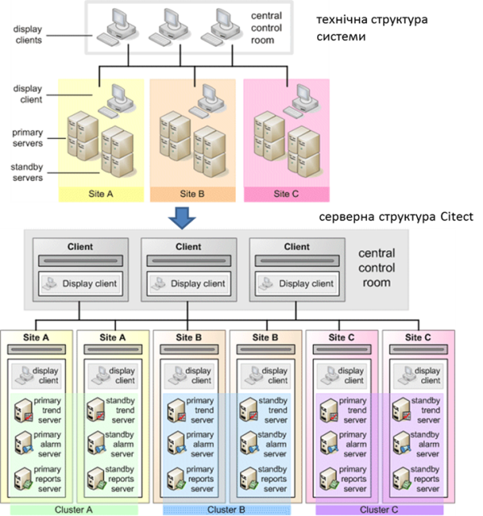</a> 

*Рис.* *9.6.* Мережна архітектура Citect з кількома кластерами

Розділення на кластери при проектуванні можна організувати через механізм включення проектів (див. підрозділ 2.5). У цьому випадку кожен включений проект може бути розроблений для окремого кластера, а загальний – включати усі проекти виробництва. 

По суті, клієнт не належить кластеру. У багатокластерній системі для доступу до тегів перед їх ім'ям вказується ім’я кластера: 

```
ClusterName.TagName
```

Якщо кластер в імені тегу не вказаний, клієнт братиме назву кластера з кластерного контексту – умовна змінна, в якій зберігається назва кластера. Наприклад, при відкритті першої сторінки у функції виклику можна вказати ім’я кластера, інші сторінки після цього можуть відкриватися вже без його явної вказівки. Такий підхід дає можливість створювати гнучкі архітектури, де сторінки можуть "прив’язуватися" до необхідного кластера.

Citect підтримує архітектури з резервуванням. Для кожного Alarm, Trend і Report сервера можна створити по одному резервному екземпляру, для якого вказується властивість режиму рівною standby. Для I/O Server такого режиму немає, оскільки резервування проводиться через означення основних та резервних I/O Devices. Таким чином, в одному кластері може бути по одному екземпляру основного та резервного серверів Alarm, Trend і Report, а також кількох I/O Server, кожен з яких обов’язково має бути прив’язаний до різних адрес IP.

Кластерна архітектура надає широкі можливості щодо оптимізації навантаження на ПК. Так, можна зробити проект, в якому в двох підсистемах (див. "Site A" і "Site B" на рис. 9.7) буде знаходитися по одному ПК, але забезпечуватиметься взаємне резервування. Проект міститиме два кластери, в кожному з яких буде пара основних і резервних серверів. Мережна адреса основних серверів однієї підсистеми збігатиметься з мережною адресою резервних іншої. Таким чином, якщо вийде з ладу одна підсистема SCADA, інша тимчасово візьме на себе її функції.   

<a href="media9/9_7.png" target="_blank">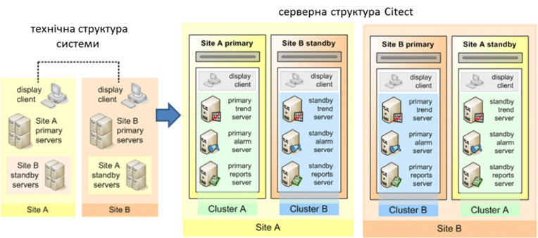</a> 

*Рис.* *9.7*. Мережна архітектура Citect з розподіленим резервуванням

Резервування серверів введення/виведення, по суті, зводиться до резервування I/O Devices. Це дещо незвичний підхід, але має більшу гнучкість, ніж резервування серверів. По суті, необхідно резервувати теги введення/виведення, а саме – забезпечити збирання даних для них та доступ до них клієнтів. Розглянемо це на прикладі резервування шляхів (рис. 9.8) до пристроїв введення/виведення. Три сервери введення/виведення зв’язані різними шляхами з трьома пристроями введення/виведення. Для кожного шляху кожного пристрою у проекті створено окремий I/O Device, в якому вказано весь набір властивостей для з’єднання. Для тих самих фізичних пристроїв вказуються однакові імена, але різні налаштування властивостей Startup mode (режим запуску) та Priority (пріоритет). Оскільки теги введення/виведення прив’язуються до I/O Device, з точки зору тегів їх буде всього три, але в проекті їх буде стільки, скільки шляхів, – 8. Кожен I/O Device, у свою чергу, прив’язується до сервера введення/виведення. Таким чином, при старті серверів введення/виведення, спочатку буде спроба з’єднатися з пристроями введення/виведення, що мають властивість Startup mode = Primary (на рис. 9.8 показані синім кольором). Якщо зв'язок з пристроєм недоступний, сервер, на якому є I/O Device з таким самим ім'ям але Startup mode = Standby, з найнижчим значенням пріоритету буде намагатися підключитися до нього. Так забезпечується резервування шляхів до пристроїв введення/виведення. Таке резервування доступне і для Standalone рішень, тобто з одним сервером введення/виведення.  

<a href="media9/9_8.png" target="_blank">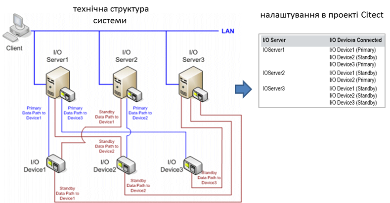</a> 

*Рис.* *9.8.* Резервування I/O devices в Citect

Для того самого прикладу (див. рис. 9.8) розглянемо ситуацію, коли клієнти для серверів введення/виведення (Client, Alarm Server, Trend Server, Report Server) не можуть отримати доступу до необхідних тегів введення/виведення, бо I/O Server з налаштованою властивістю для I/O Devices Startup mode = Primary відключився. У цьому випадку клієнти будуть отримувати дані з іншого сервера, де є однойменні I/O Devices. Таким чином, через механізм резервування I/O Devices реалізовано резервування шляхів (мереж до пристроїв введення/виведення), серверів введення/виведення, мереж доступу до серверів введення/виведення. У Citect також налаштовується кешування даних на серверах та обмін кешами для безударності переходу.   

Як уже зазначалося, товсті клієнти Citect – це те саме середовище виконання, що й інші компоненти. Тим не менше він може запускатися як в режимі повноцінного керування (Control Client) або тільки для перегляду (View-only Client). Крім товстих клієнтів, у Citect є можливість розгортати проект для WEB-доступу. Це потребує інсталяції WEB-сервера IIS від Microsoft, а клієнти реалізовані на базі технології ActiveX, яка на разі підтримується тільки в браузерах Internet Explorer. Крім того, на ПК клієнта необхідно інсталювати спеціальний ActiveX WebClient. Для можливості доступу до WEB-сервера з браузерів, що підтримують HTML5 (наприклад, з мобільних пристроїв), пропонується розширення – Citect Anywhere.

Для доступу до Citect сторонніх продуктів можна використовувати інтерфейси DDE, ODBC або OPC DA. Для забезпечення останнього Citect надає інтерфейс OPC DA Server (підтримує OPC DA v2.05 та OPC DA v3). Для цього в розділі проекту OPC DA Servers проекту створюються записи з зазначенням адреси, де буде розгорнутий OPC DA сервер, та налаштовуються його особливості. Зокрема, через властивість "Browsing Hierarchy" можна налаштувати вид простору ідентифікаторів ItemID: плаский (flat) – буде надавати доступ через список назв тегів, ієрархічний (Hierarchy) – через ієрархію устатковання (див. наступний підрозділ). OPC-клієнт зможе підключатися до сервера через ProgID  “SchneiderElectric.SCADA.OpcDaServer.1”.

SCADA Citect також може виступати в якості клієнта для ОП Magelis (Schneider Electric). Для цього в палітрі інструментів графічного редактора доступний компонент VijeoWEBGate. 

## 9.1.8. Мережні архітектури в SCADA zenon

Проект zenon може бути розроблений як для одного комп’ютера (одиночна структура, Standalone), так і для всього підприємства з мультисерверною структурою. На одному комп’ютері може бути виконано кілька середовищ виконання, кожне для свого проекту. Тому роль комп’ютера в обміні розглядається виключно з точки зору конкретного проекту. За необхідності мережної архітектури у властивостях проекту активується опція "Network active", задається адреса ПК для основного та, за необхідності, резервного сервера (рис. 9.9). При запуску середовища виконання автоматично буде запущена служба "zenNetSrv", яка реалізовуватиме обмін у мережі (вхідний TCP-порт = 1100). 

Таким чином, середовище виконання може виступати в ролі:

- основного сервера (Primary Server);  

- резервного сервера (Standby Server)

- товстого клієнта (Client) 

Сервери виконують усі функції проекту, а клієнти – тільки функції ЛМІ. На ПК з роллю сервера доступні і клієнтські функції ЛМІ.

<a href="media9/9_9.png" target="_blank">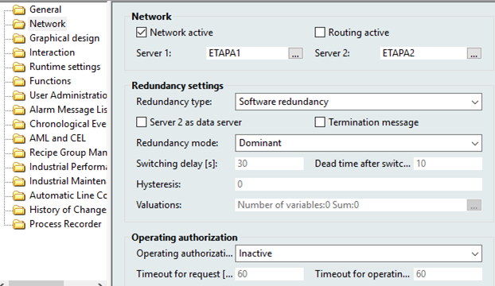</a> 

*Рис.* *9.9.* Налаштування мережної архітектури в zenon 

На рис. 9.10 показано схему клієнт-серверної архітектури з резервуванням, налаштування якої зображені на рис. 9.9. На схемі показано чотири ПК, один з яких є станцією розробника (Development PC). Дані з пристрою введення/виведення (Process Data Flow PLC) зчитуються тільки основним сервером, а при його відмові – резервним. Клієнти, а також резервний сервер обмінюються даними з основним сервером (Process Data Flow PLC control system). Резервний сервер також відслідковує стан тривог та записує тренди. У випадку відмови основного сервера його функції бере на себе резервний. При відновленні функціональності основного сервера ролі будуть розподілятися залежно від налаштування Redundancy Mode (див. рис. 9.9).

Сервери можуть працювати в двох режимах резервування: програмному (Software) та апаратному (Hardware). При апаратному режимі резервування передбачається наявність двох комплектів ПЛК (або окремих комунікацій до одних і тих самих ПЛК), які резервують один одного. У цьому випадку обмін даними з ПЛК відбувається одночасно і основним, і резервним сервером.  

Сервери в zenon виступають не тільки як джерела процесних даних, вони також містять актуальні проекти середовища виконання. Клієнти та резервні сервери відслідковують наявність нової версії проекту на основному сервері, і у випадку її появи завантажують її собі (Dataflow project data на рис. 9.10). Таким чином, усі учасники мережної структури працюватимуть із останніми проектами, а завантаження зміненого проекту достатньо робити тільки на основний сервер.     

Внутрішні змінні в zenon реалізовані як "Internal Variable". Властивість цих змінних "Internal Variable -> Calculation" задає режим їх обчислення. При налаштуванні "Local" ці змінні є клієнтськими, а при "Network" – серверними. 

<a href="media9/9_10.png" target="_blank">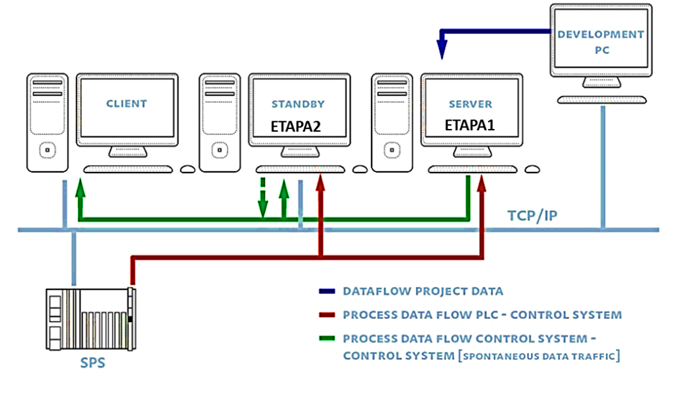</a> 

*Рис. 9.10.* Клієнт-серверна архітектура з резервуванням

Кожен проект розрахований тільки на одну пару серверів (основний та резервний). За необхідності розроблення мультисерверної архітектури, де клієнти можуть відображати змінні з різних серверів, у zenon використовується мультипроектний підхід, при якому кілька проектів включається в єдиний інтегрований проект. Таким чином, кожен проект матиме свій набір серверів, а їх включення в загальний проект дасть можливість, якщо потрібно вибрати елементи (наприклад змінні) з необхідного включеного проекту. 

Мультипроектність дає можливість у zenon реалізувати так зване кільцеве резервування (circular redundancy). У цьому випадку кілька проектів, що інтегровані в один загальний проект можуть бути налаштовані таким чином, що основні сервери одного проекту можуть мати адресу того самого ПК, що й резервні іншого. На рис. 9.11 показано приклад структури, в якому є три ПК, на кожному з яких виконується основний сервер з одного проекту, резервний – з другого і клієнт – з третього.   

<a href="media9/9_11.png" target="_blank">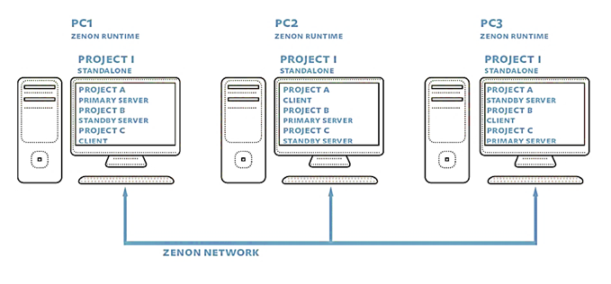</a> 

*Рис. 9.11.* Клієнт-серверна архітектура з резервуванням 

Обов’язковою умовою функціонування мережної архітектури є синхронізація часу між ПК. За замовченням ця синхронізація робиться автоматично засобами zenon, де основний сервер виступає в якості сервера часу. Однак в архітектурах з кільцевим резервуванням часову синхронізацію рекомендується робити зовнішніми засобами, наприклад з використанням команди "NET TIME" з явним задаванням сервера часу, а в zenon її відключити (через параметри zenon6.ini). 

SCADA zenon підтримує два типи тонких клієнтів – термінальний клієнт ("Remote Desktop", див. параграф. 2.6.4), або через додатковий WEB SERVER. Враховуючи, що для людино-машинного інтерфейсу використовуються компоненти ActiveX, WEB-доступ забезпечується з використанням клієнтського ПЗ "Web Client", який попередньо необхідно встановити на ПК, перед запуском браузера. Такий клієнт може бути запущений тільки на ПК з ОС MS Windows. Тим не менше, в zenon є спеціальний серверний застосунок "HTML Web Engine", який забезпечує віддалений доступ з використанням сторінок HTML5, який підтримується усіма сучасними браузерами на сучасних ОС. Також доступні клієнти "Everywhere App" для доступу з пристроїв з операційними системами Android та iOS.

   Для доступу до SCADA zenon сторонніх програм можна використати спеціальний шлюз "Process Gateway". Він надає ряд інтерфейсів, у тому числі OPC DA Server, OPC UA Server, SNMP Server та SQL Online (OLE DB). Крім цього zenon має прямий інтерфейс для SAP/RP ERP та має інтерфейс DDE. Запуск OPC DA сервера проводиться через zenon Tools (перший раз необхідно запустити з опцією " /RegSrvD" для реєстрації сервера). Враховуючи що на одному ПК може бути запущено кілька проектів, змінні будуть видимі в просторі ItemID у фоматі "PROJECT_NAME.Variable_Name". Детальний розгляд налаштування цих сервісів виходить за рамки посібника. Деякі приклади можна почитати в статті [[4](https://www.svaltera.ua/press-center/articles/8773.php)]. 

## 9.1.9. Мережні архітектури в операторських панелях SIMATIC Comfort

Операторські панелі не виконують функції SCADA, тому не передбачають розподілених систем збирання даних та мультисерверної підтримки. Тим не менше, у зв’язку з попитом та розвитком сучасних технологій, розробники засобів автоматизації все більше включають деякі функції щодо доступу до даних та функцій ЛМІ операторських панелей з інших пристроїв. Операторські панелі SIMATIC класу Comfort мають дуже широкий вибір способів інтегрування, зокрема мають функцій для виконання  таких завдань:

- доступ до даних процесу ОП, тривог, трендів, діагностичних даних;

- керування установкою з використанням готових екранів ЛМІ;

- завантаження проекту в ОП віддалено через Інтернет;

- копіювання даних з ОП.

Механізми віддаленої передачі проекту розглянуті в підрозділі 2.7. Тут зупинимося на функціях, пов’язаних з доступом до даних, функцій контролю та керування а також діагностики. Для цього в панелях Comfort можуть бути активовані сервіси:  

- Sm@rtServer – надає можливості застосункам Sm@rtClients доступатися до панелі; 

- Web server – надає WEB доступ до операторських панелей; 

- HTTP channels Server – надає доступ до даних поверх HTTP; 

- Web service SOAP – надає доступ до даних з використанням Microsoft SOAP (більше не підтримується Microsoft);

- OPC UA server – надає доступ до даних ОП через OPC UA.

Активація, потрібного сервісу, відбувається через налаштування проекту Runtime Settings (рис. 9.12). 

Сервіс Sm@rtServer по суті є VNC-сервером і надає доступ до панелі з застосунків Sm@rtClients, які необхідно попередньо встановити на віддаленому пристрої. Відповідно, застосунки Sm@rtClients є VNC-клієнтами і доступні для різних платформ, наприклад ПК з Windows (клієнт входить в дистрибутив WinCC TIA), а також для мобільних ОС – iOS та Android. Кількість одночасно підключених клієнтів обмежена, для панелей Comfort – до трьох (на момент написання посібника). На операторській панелі за необхідності можна відключити підключеного клієнта. При використанні цього сервісу усі дії оператора в Sm@rtClients будуть приводити до аналогічних на панелі, і навпаки. 

<a href="media9/9_12.png" target="_blank">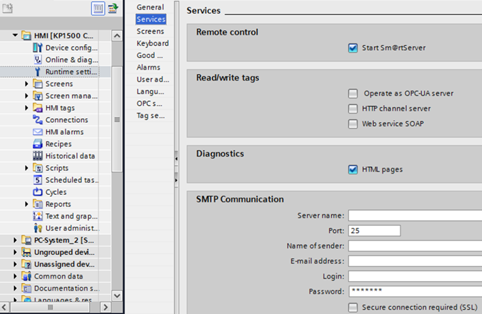</a> 

*Рис. 9.12.* Налаштування сервісів віддаленого доступу у WinCC Cofort

Окрім виставлення опції Start Sm@rtServer (див. рис. 9.12), необхідно також на панелі керування Windows CE налаштувати обмеження доступу та паролі. Детально інструкцію можна подивитися на відео за посиланням [[5](https://www.youtube.com/watch?v=oIeaLk3jsDM)]. На    пристрої віддаленого клієнта вказується адреса сервера, користувача та пароль, а також інші параметри зв’язку. 

Операторські панелі Comfort також можуть виступати в якості Sm@rtClients. На будь-якому екрані можна розмістити елемент Sm@rtClientView, доступний з вкладки Controls панелі інструментів. Це дає змогу будувати розподілені архітектури, в яких операторські панелі можуть виступати як у якості клієнтів, так і серверів, що дає змогу операторам контролювати та керувати не тільки ділянкою, що керується підключеним ПЛК до панелі, а й іншими ділянками (рис. 9.13). 

<a href="media9/9_13.png" target="_blank">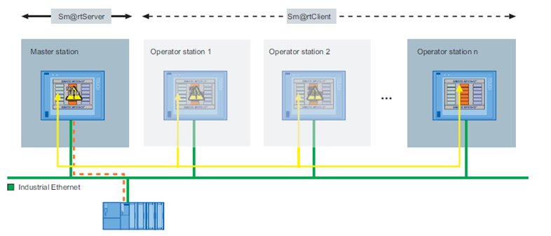</a> 

*Рис. 9.13.* Розподілена система керування з операторськими панелями Simatic Comfort 
 на базі Sm@rtClient та Sm@rtServer 

Для віддаленого доступу з точки зору кібербезпеки рекомендується використовувати VPN з’єднання (див. параграф 9.5.7). 

ОП Simatic Comfort надають також WEB-доступ до панелі. Для повноцінного використання усіх можливостей необхідно використовувати браузер Internet Explorer. Інтегрований WEB-сервер надає такі можливості:

- віддалене керування Sm@rtServer через вбудований у WEB-сторінку Sm@rtClient (без необхідності встановлення);

- запуск і зупинка середовища виконання;

- віддалений доступ (імпорт/експорт) до даних рецептів та списку й паролів користувачів;

- відображення системної та діагностичної інформації;

- доступ до файлів змінних носіїв (карти, USB-сховища, папка WEB);

- завантаження конфігураційних даних. 

Налаштування доступу та обмежень Web Server проводиться на панелі керування Windows CE. Також можна створювати власні HTML-сторінки. 

Операторські панелі Simatic Comfort підтримують обмін даними по протоколу SIMATIC HMI HTTP Protocol. При цьому вони можуть виступати як клієнтами, так і серверами. Серверна частина активується відповідною опцією HTTP channels Server (див. рис. 9.12), а дозволи – в налаштуваннях панелі керування Windows CE. Клієнт підключається аналогічно як до інших засобів введення/виведення (див. підрозділ 3.13), де в настройках connection вказується протокол "SIMATIC HMI HTTP", а в адресі тега – ім’я тега на сервері. Використання SIMATIC HMI HTTP Protocol дає можливість будувати з операторських панелей мульти-серверні та клієнт-серверні системи, як наприклад, показано на рис. 9.14.   

<a href="media9/9_14.png" target="_blank">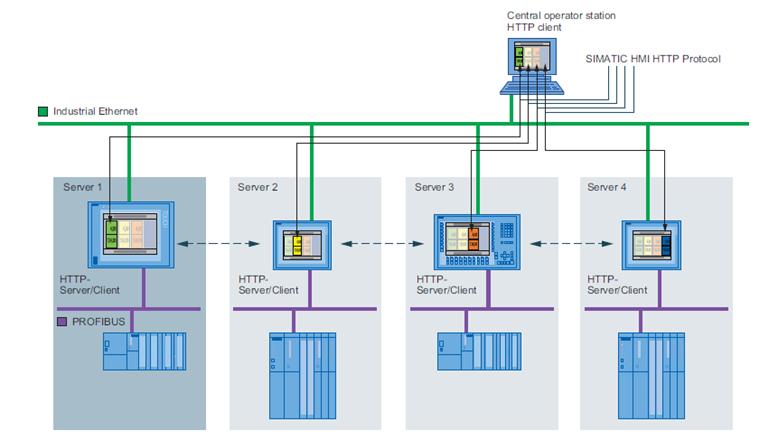</a> 

*Рис. 9.14.* Розподілена система керування з операторськими панелями Simatic Comfort на базі HTTP Protocol

Для інтегрування з іншими засобами Simatic або сторонніх виробників можна використовувати сервіси OPC UA. Операторські панелі Simatic Comfort підтримують як серверний інтерфейс, що активується відповідною опцією (див. рис. 9.12) та налаштовується у вкладці “OPC Settings”, так і клієнтські підключення – через налаштування connection. Детальний розгляд налаштування цих сервісів виходить за рамки посібника, хоч усі налаштування інтуїтивно зрозумілі користувачеві, знайомому з OPC UA. 

[<-- Розділ 9. Інтеграція з іншими засобами та кібербезпека](9.md)

[--> 9.2. Інтегрування SCADA/HMI з верхніми рівнями керування](9_2.md)