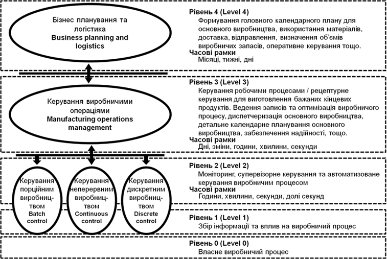
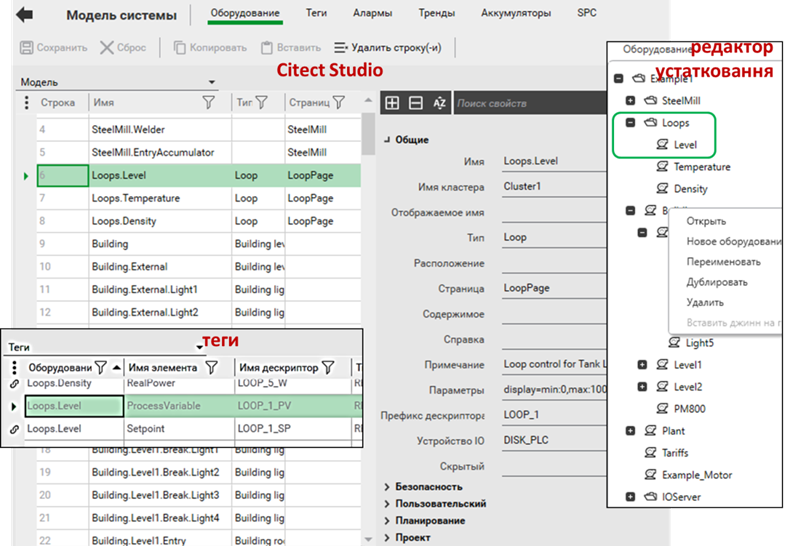
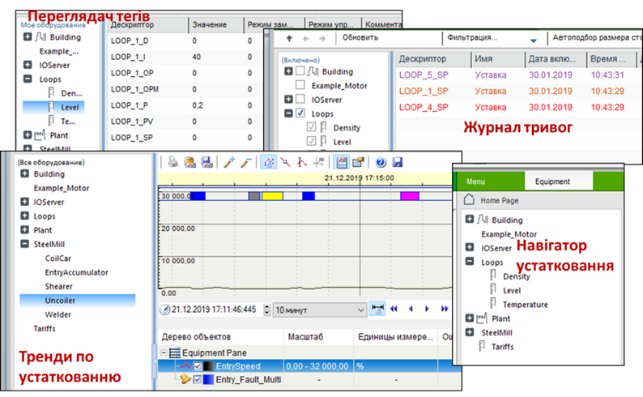
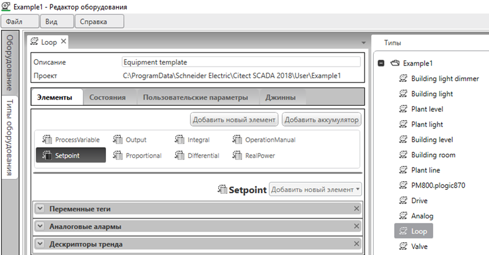
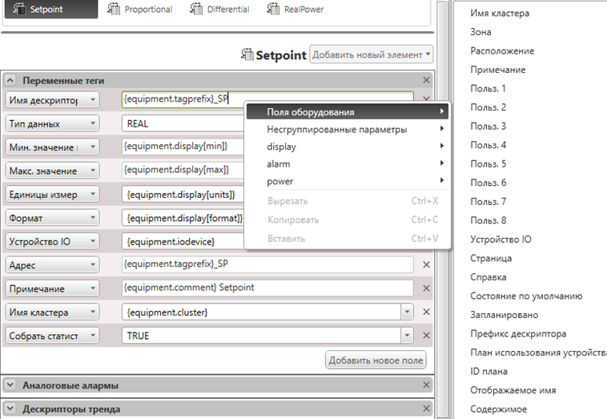
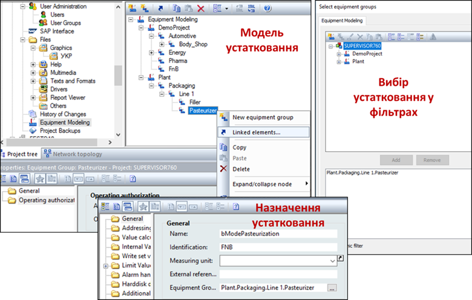

[Головна](README.md) > [9.Інтеграція з іншими засобами та кібербезпека](9.md)

# 9.2. Інтегрування SCADA/HMI з верхніми рівнями керування

## 9.2.1. Місце SCADA/HMI в інтегрованій системі керування

Вище наведено різні архітектури систем на базі SCADA/HMI, де робочі станції (клієнти) і сервери взаємодіють між собою, обмінюючись даними процесу для відображення, диспетчерського керування, архівування та формування тривог. Такий обмін відбувається на одному рівні диспетчерського керування (SCADA), тому його прийнято називати ***горизонтальною інтеграцією\***. Однак у сучасних підприємствах засоби SCADA/HMI не функціонують самі по собі і повинні взаємодіяти з іншими рівнями керування. 

Класична структура інтегрованої системи керування підприємством має вигляд піраміди (рис. 9.15), де засоби SCADA/HMI та ПЛК займають другий рівень (керування АСКТП). Вони взаємодіють з процесом через контролери (PLC), які, в свою чергу, можуть бути поєднані між собою промисловими мережами. Обмін SCADA/HMI з контролерами проходить у м’якому реальному часі, тобто коли запізнення оновлення даних не є критичним, а між контролерами – в жорсткому реальному часі, коли дані повинні надходити в чітко визначені проміжки часу. У свою чергу, промислові контролери взаємодіють з технологічним процесом через датчики та виконавчі механізми, які можуть підключатися з використанням уніфікованих сигналів або промислових мереж рівня датчиків.

                               

*Рис.* *9.15.* Типова технічна структура інтегрованої системи керування підприємством

Як видно з рис. 9.15, у сучасних системах керування підприємством рівень SCADA/HMI не є найвищим. Для ефективного керування всією виробничою діяльністю використовують системи керування виробництвом (АСК В), які прийнято називати ***MOM\*** (Manufacturing Operations Management). До завдань MOM входять функції керування різними виробничими операціями, зокрема (не повний перелік): 

‒    *керування операціями основного виробництва* (системи MES – Manufacturing Execution Systems): планування, диспетчерування, запуск виконання, контроль та звітність виконання і т. п; системи призначені для різного типу керівників виробництва (начальник виробництва, начальник дільниці і т. п); 

‒    *керування операціями по обслуговуванню устатковання* (***ТОіР\*** – технологічне обслуговування та ремонт; ***EAM\*** – Enterprise Asset Management, який включає також функції вищого рівня): планування, контроль стану, контроль виконання, звітність, замовлення деталей і т. п.; системи призначені для інженерно-технічних підрозділів підприємства (механіки, електрики, КВПіА);

‒    *керування операціями по контролю якості* (LIMS – Laboratory Information Management System): планування та виконання контролю якості, формування звітної інформації з якості і т. п.; системи призначені для керівників з якості, працівників лабораторій і т. п; 

‒    *керування операціями з запасами* (WMS – Warehouse Management System): планування та контроль наявності, переміщення сировини, напівпродуктів та продуктів; системи призначені для начальників складів, виробничників та іншого персоналу, відповідального за запаси.     

У свою чергу, системи MOM взаємодіють із системами рівня керування підприємством (АСК П), а саме – його фінансово-економічною діяльністю. До таких систем належать ERP (Enterprise Resource Planning), призначення яких – автоматизація планування та виконання бізнес-процесів, організаційно-економічної діяльності, документообігу і т. п. Також там можуть виконуватися інші спеціалізовані застосунки, як ***SCM\*** (Supply Chain Management) для керування ланцюжком постачань. З рівня MOM в системи рівня АСК П передаються узагальнені виробничі показники, а на рівень MOM – об’ємні виробничі плани.

Системи керування рівня MOM та АСТКП забезпечують виконання виробничих операцій, або, іншими словами, автоматизують операційні технології ***OT\*** (Operation Technologies). Системи керування бізнес-процесами автоматизують інформаційні процеси; вони належать до класу ***IT\*** (Information Technologies). На *виробничому* підприємстві ці два сектори взаємодіють для забезпечення функціонування єдиної інтегрованої системи керування усім підприємством.

Для реалізації єдиної інтеграційної платформи даних OT часто використовуються засоби Historian, які детально розглянуті в підрозділі 9.3.  

Фізична структура інтегрованої системи може відрізнятися залежно від підходів. Наприклад, інтегрування рівнів може проводитися з використанням технологій промислового Інтернету речей (IIoT), а явно виділених систем деяких рівнів може не бути. 

## 9.2.2. Інтегрування зі SCADA та ієрархія устатковання 

При доступі до даних SCADA/HMI використовуються ті самі технології, що й наведені в попередньому підрозділі. Однак треба розуміти, що забезпечення інтеграції на рівні даних – це лише частина завдання, інша частина – це інтерпретація цих даних.    

На сьогоднішній день ці питання інтегрування систем керування описуються рядом стандартів, зокрема ДСТУ EN 62264 та ДСТУ EN 61512. Згідно з цими стандартами, керування підприємством може бути представлено у вигляді функціональної ієрархії (рис. 9.16). На кожному рівні вирішуються окремі функції, які потребують різних часових рамок. Відповідно до рис. 9.15, обмін між другим і третім рівнем може функціонувати як обмін зі SCADA. Стандарт ДСТУ EN 62264 стандартизує представлення об’єктів та функцій, які стосуються операційної діяльності на рівні 3. Тобто стандарт описує, які повинні бути сутності (об’єкти) і як вони мають бути представлені в інформаційних структурах (наприклад таблицях), для того щоб представити операційну діяльність виробництва. До таких об’єктів входять різні види ресурсів: устатковання (забезпечує виробництво), персонал, матеріали (з чого виготовляється і що виготовляється), активи (наявні підконтрольні необоротні ресурси) та їх об’єднання. Для представлення об’єктів рівня 2 (АСКТП) існують стандарти групи ДСТУ EN 61512, але вони стосуються тільки порційного типу виробництва, хоч можуть бути так само прийняті й до інших типів виробництв. 

 

*Рис. 9.16.* Функціональна ієрархія виробничого підприємства

Для обох стандартів спільним є представлення моделі рольової ієрархії устатковання (рис. 9.17). Відповідно до цієї ієрархії, кожне устатковання (***equipment, обладнання\***) виконує певну роль у процесі виготовлення продукції. При інтегруванні верхніх рівнів з системами АСКТП керування та контроль відбуваються саме в поняттях устатковання. Тобто підконтрольне устатковання знаходиться в якомусь стані, і на нього йде певна команда. Розглянемо, яке саме устатковання стосується АСКТП.          

***Модуль керування\*** (***Control Module\***) – забезпечує виконання функцій керування обладнанням. По суті, це ті засоби та їх функції, які прийнято показувати на схемах автоматизації як засоби КВПіА: датчики, виконавчі механізми, регулятори та їх об’єднання. Цей рівень устатковання може бути цікавим для систем класу ТОіР та EAM. Наприклад, системи ТОіР (технічного обслуговування та ремонту) може цікавити інформація про кількість спрацювань, мотогодини роботи, статистика тривог і т. п. Зверніть увагу, що в цьому прикладі систему верхнього рівня цікавить інформація не про стан датчиків положення, а про узагальнений стан виконавчого механізму.     

 

*Рис. 9.17.* Рольова ієрархія устатковання підприємства

***Модуль технологічного устатковання\*** (***Equipment Module\***) – виконує певну дію в технологічному процесі, наприклад, перекачування продукту (насосні агрегати) чи нагрівання (теплообмінники) і т. п. Вони включають у себе різне технологічне устатковання та модулі керування. При інтегруванні з верхнім рівнем так само може передаватися інформація про стан. 

***Робочий вузол\*** (***Work\*** ***Unit\***) – виконує певну одну або кілька виробничий операцій. Для порційного виробництва (***Технологічний вузол,\*** ***Unit\***) це може бути реактор або ємність, в якій виробляється певна порція продукту. Для неперервного виробництва це може бути певний апарат неперервного типу, для дискретного – якась машина (наприклад пакувальна). На верхній рівень може передаватися стан устатковання, кількість виготовленої продукції та інші узагальнені показники й статистичні дані. З верхнього рівня можуть передаватися команди на запуск (зупинку, паузу і т. п), задану кількість, потрібну операці, рецепт і т. п.  

***Робочий центр\*** (***Work Center\***) – це набір устатковання, що виготовляє певний напівпродукт. Як і в попередньому випадку, може відбуватися обмін станами, командами і параметрами.  

Як правило, рівень АСКТП не виходить за межі робочого центру, а часто – й за рамки робочого вузла. Тому устатковання на вищих рівнях не стосується SCADA.

   Отже, з кожним устаткованням пов’язані, як мінімум, два параметри: стан і команда. Для модулів керування та модуля технологічного устатковання стан може бути представлений набором статусів типу відкрито/закрито, відкривається/закривається або включено/відключено, а також нормальна робота/тривога і т. п. Для робочих вузлів і робочих центрів стан може описуватися складним автоматом станів. Крім станів та команд, устатковання також може мати режим (наприклад, ручний/автоматичний), статистичну інформацію про кількість спрацювань, мотогодин роботи, кількість поломок і т. п. Детальніше про це можете дізнатися зі статей [6] та опису каркасу [7].

   Наявність моделей устатковання на кожному з рівнів робить можливим побудувати єдину базу SCADA. Це значно спростить інтегрування з функціональної точки зору. Якщо в рівень MOM необхідно передати якусь інформацію, зручно буде, якщо вона буде вже підготовленою в термінах устатковання. Це може бути також певна звітна інформація, наприклад, про кількість тривог, статистика по трендах, тощо за певний період. У засобах SCADA/HMI деяких виробників з’являється підтримка устатковання. У більшості випадків це зроблено не з метою інтегрування, а для спрощення контролю та керування. У наступних параграфах наведено приклади використання моделей устатковання в SCADA Citect та zenon, які надають можливість у середовищі виконання фільтрувати тривоги та записи в журналах по вибраному устаткованню, а також виконувати функції для нього. Для середовища розроблення устатковання можна використовувати як допоміжне поле для фільтрації. Це тільки частина з переліку доступних функцій, детальніше описано нижче.      

## 9.2.3. Використання ієрархії устатковання в Citect 

У SCADA Citect наявність устатковання не обов’язкове. Однак його використання значно поліпшує для оператора ситуаційну обізнаність, керованість процесом та може значно скоротити час розроблення та модернізації. Починаючи з версії 7.4, в Citect з’явилися додаткові таблиці з означенням моделі устатковання (equipment; рос. лок. "оборудование"). Кожен запис устатковання включає ім’я, яке має ієрархічну структуру, де ієрархічні рівні розділені крапкою. Так, “Loops.Level”, передбачає устатковання з ім'ям “Level”, що входить в устатковання верхнього рівня з ім'ям "Loops" (рис. 9.18). Ієрархію можна створювати шляхом добавлення подібних імен у редакторі моделі устатковання Citect Studio, але зручніше це робити через спеціальний редактор устатковання, який входить в середовище розроблення Citect. Цей редактор відображає модель у наглядному деревоподібному вигляді (див. рис. 9.18).

Після створення екземпляра устатковання його можна вказати в налаштуваннях тегів, трендових тегів та тегів тривог. Наприклад, тег із назвою LOOP_1_PV слугує елементом ProcessVariable в устаткуванні "Loops.Level" (див. рис. 9.18). Тепер до тегу в будь-якому місці проекту можна звертатися двома способами: 

‒    через ім’я тегу “LOOP_1_PV”

‒    або через елемент устатковання “Loops.Level.ProcessVariable” 

Після встановлення середовище розроблення Citect за замовчуванням редактор графіки відображає вікно вибору тегу саме за ім'ям устатковання, а не ім'ям тегу. Це можна змінити в налаштуваннях параметрів Citect Studio.     

 

*Рис. 9.18*. Зв'язок устатковання з тегами введення/виведення

Окрім іншого формату посилань на теги, їх прив’язування в якості елементів устатковання дає такі можливості в середовищі виконання (рис. 9.19):

‒    на сторінці переглядача тегів фільтрувати список тегів відповідно до вибраного устатковання;

‒    на сторінках активних тривог, журналів подій (SOE) відображати записи тільки для елементів вибраного устатковання;

‒    відображати тренди для вибраного устатковання;

‒    використовувати навігатор устатковання.  

Використання устатковання в якості фільтру значно спрощує вибір необхідних тривог, тегів у списку або трендів. У першому випадку оператор аналізує тільки ті тривоги та події із журналу, які стосуються конкретної частини процесу. При цьому він робить це звичайним вибором у навігаторі. Те саме стосується відображення трендів. Зрештою, можна зробити окремі вікна, що динамічно прив’язуються до конкретного устатковання і надають усю необхідну інформацію саме по ньому. Для цього в Citect є багато Cicode функцій, що надають можливість отримувати дані з тегів про устатковання, та навпаки, робити навігацію по устаткуванню, отримувати та змінювати його властивості. Властивість устатковання Page (рос. лок."Страница") дає можливість задати сторінку, яка буде асоціюватися з ним. Через цю властивість навігацію за сторінками можна зробити з використанням навігатора устатковання, що доступний поруч з меню в шаблонах стилю SxWStyle. 

    

*Рис. 9.19.* Використання устатковання в якості фільтра в середовищі виконання 

Устатковання також може мати стани, за допомогою яких можна налаштувати керування ним через планувальник. Цей механізм описаний у підрозділі 8.6.

Крім тегів, до устатковання можуть бути прив’язані акумулятори (Accumulator). Акумулятори можуть рахувати кількість запусків, інтегрувати певну величину та рахувати загальний час роботи. 

При конфігуруванні в Citect інтерфейсу OPC ієрархія устатковання може бути використана для формування простору імен ItemID (див. параграф 9.1.6).

Окрім додаткових можливостей, які надає ієрархія устатковання SCADA Citect у середовищі виконання, розробник проекту може використовувати його як вихідну точку проектування. Враховуючи, що устатковання (Equipment) є додатковою властивістю тегів, їх можна використовувати в якості фільтрації та упорядкування записів в табличних редакторах тегів. Механізм устатковання дає можливість зовсім по-іншому побудувати процес розроблення. Класичний для Citect до версії 7.3 механізм розроблення передбачав створення тегів (за необхідності – акумуляторів) через заповнення таблиць або полів у редакторі. Це має ряд недоліків, зокрема передбачає велику кількість рутинної роботи по заповненню. При необхідності зміни тегу, розробнику доводиться шукати його в таблиці тегів, де змінювати поля, потім у таблиці тегів тривог, а потім, можливо, ще в таблиці трендових тегів. Більшість об’єктів передбачають однотипні структури, які згуртовані навколо устатковання. Так, з насосом пов’язано кілька параметрів (частота обертів, операційний стан, температура підшипників і т. п.), тривог та трендів. Citect дає змогу процес створення розпочати з устатковання, яке автоматично створить пов’язані з ним теги. 

Спочатку визначається тип устатковання, в якому задаються правила створення устатковання та необхідних тегів, що з ним пов’язані. Тип устатковання описується файлом XML, але розробникові не обов’язково розуміти його внутрішню структуру. Типи можна створювати та редагувати через редактор типів устатковання, який представлений окремою вкладкою в редакторі устатковання (рис. 9.20).      

 

*Рис. 9.20.* Редактор типів устатковання

Основним змістом типу є елементи (Item), кожен з яких може асоціюватися з змінним тегом, тривоговим тегом або трендовим тегом. При створенні тегів він міг прив’язуватися до елемента існуючого устатковання. Тут же конфігурується зворотний напрямок – від створення  устатковання та його елемента до тегів. На рис. 9.20 до елемента Setpoint будуть прив’язані змінний тег, аналоговий аларм та трендовий тег. Екземпляри устатковання одного типу матимуть однаковий набір елементів, що створюватимуться за однаковими правилами.

На рис. 9.21 показано правила створення змінного тегу для елемента з ім'ям "Setpoint". У лівій частині вказуються імена властивостей тегу, а справа – правила створення їх значення. Текст, що взятий у фігурні дужки "{}", передбачає вставку замінника, що означений у цьому тексті. Так,  "{equipment.tagprefix}_SP" вказує на те, що значенням даної властивості буде конкатенація (поєднання) значення властивості “Tag prefix” (рос. лок. "Префикс дескриптора") устатковання та "_SP".   

 

  *Рис. 9.21.* Налаштування правил створення тегів, асоційованих з елементом 

У якості полів устатковання можуть бути усі, що перелічені на рис. 9.21 (показані через контекстне меню), та додаткові користувацькі. Таким чином, при створенні нового устатковання в редакторі вказується його тип, ім’я, заповнюються його властивості, після чого необхідно виконати команду оновлення устатковання. У результаті оновлення створиться не тільки устатковання, а й усі необхідні теги. При зміні типу устатковання (видалення, зміна, добавлення елементів) процедура повторюється. При цьому всі створені теги не доступні для редагування з редактора тегів, вони оновлюються тільки через зміну устатковання та його типу. 

Аналогічним чином можна означувати акумулятори. Через вкладку типу States (рос.лок."Состояния") означуються стани (див.рис. 9.20). 

Практика використання такого підходу до розроблення проектів доказала свою ефективність та значне скорочення часу в життєвому циклі проекту.

## 9.2.4 Використання ієрархії устатковання в SCADA zenon  

У SCADA zenon ієрархія устатковання створюється у відповідному розділі проекту "Equipment Modeling" (див. рис. 9.22). Ім’я групи устатковання (Equipment group) може бути вказано як додатковий параметр для більшості елементів проекту, в тому числі:

\-    змінних (Variables) та типів змінних; 

\-    екранів (Screens) та шаблонів (frames);

\-    функцій та скриптів;

\-    стандартних рецептів та груп рецептів;

\-    часових функцій;

\-    моделей планувальника;

\-    пунктів меню;

\-    користувачів;

\-    матриць реакцій;

\-    переприсвоєнь (Allocation);

\-    класів, груп та дільниць тривог.

Один елемент може одночасно бути назначений кільком групам устатковання. Назначивши елемент устаткованню, воно може бути використано як фільтр у середовищі виконання. Фільтр налаштовується шляхом вибору груп устатковання, до якого має входити елемент, щоб відображатися в таблиці. Крім того, в ієрархії устатковання можна отримати інформацію про прив’язані до нього елементи через пункт "Linked elements" контекстного меню.   

 

  *Рис. 9.22.* Створення ієрархічної моделі устатковання та використання її в змінній 

У середовищі виконання устатковання може бути використано в якості фільтрів та додаткових параметрів в функціях. Наприклад, в аргументах функцій виклику екранів AML, CEL, Recipegroup Manager або керування змінами (Shift management) для фільтру може бути використана група устатковання. При цьому можна вказати, необхідно відображати елементи тільки вибраного рівня чи усіх підлеглих (опція "Hierarchic filter"). Ієрархію устатковання також можна використовувати в означенні тривог. 

Вибирати устатковання для фільтрів можна і після відкриття екранів. Це можна зробити через спеціальні екрани налаштування фільтрів, де поряд з вибором часу, формату відображення тощо можна вказати групу устатковання. Однак це не дуже зручно, оскільки потребує великої кількості операцій. Альтернативою є використання спеціального типу екрана "Equipment model". Після створення екрана для його виклику створюється функція "Screen switch", в аргументах якої можна налаштувати екрани, фільтри яких будуть оновлюватися при виборі групи устатковання ("Screens to be update"). Тут можна також вказати текстову змінну, яка отримуватиме назву вибраної групи устатковання. 

Використовуючи екран моделі устатковання в середовищі виконання, оператор зможе вибрати необхідну групу та підтвердити свій вибір. Після цього фільтри усіх налаштованих екранів будуть оновлені. Використовуючи кнопку запуску функції, можна також запустити усі функції, що прив’язані до вибраної групи устатковання. 

 

*Рис. 9.23.* Налаштування аргументів функції "Screen switch" для відкриття екрана моделі устатковання та вигляд екрана в режимі виконання 