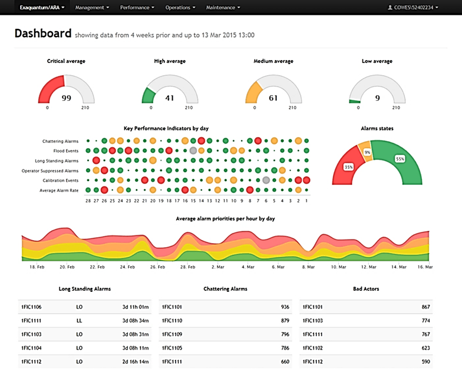

[Головна](README.md) > [9.Інтеграція з іншими засобами та кібербезпека](9.md)

# 9.3. Historian 

## 9.3.1. Загальні принципи

Для засобів SCADA/HMI збирання даних з пристроїв потрібен тільки для виконання функцій цього підрівня АСКТП, зокрема супервізорного контролю та керування, архівування та інших додаткових функцій, що розглянуті в розділах 2–8. На сьогодні ж дані можуть надавати значно більше інформації, ніж це можуть забезпечити засоби SCADA/HMI. Це принаймні пов’язано з кількома причинами.

\1.    Засоби SCADA/HMI, як правило, призначені тільки для функцій диспетчеризації технологічних процесів однієї ділянки, а не збирання й архівування даних для всього виробництва. Звичайно можна будувати ієрархічні системи, як це показано в попередніх підрозділах, але їх призначення – диспетчеризація, а не централізоване ведення бази даних реального часу та архіву виробництва. Іншими словами, при необхідності доступу до певних даних буде створено запит на конкретний сервер. Якщо ж потрібні дані з усього підприємства, то запитів буде кілька і їх потрібно узгоджувати. Це зрештою можливо, але складно і не завжди відповідає показникам продуктивності. Навантаження централізованого збирання та архівування всього виробництва засоби SCADA/HMI не витримають, інакше вони переходять в інший клас ПЗ.       

\2.    Засоби SCADA/HMI, як правило, не мають розвинутих можливостей оброблення даних при вибірці. Тобто якщо, скажімо, на сервер трендів прийде запит на вибірку даних за рік, то він перешле усі дані за цей період. Це ж може бути сотні тисяч значень; чи зможе, скажімо, переглядач трендів відобразити ці дані? А скільки часу це займе? Якщо ж вибірку оптимізувати під запит, це завдання вирішується.  

\3.    Засоби SCADA/HMI, як правило, не можуть зберігати дуже великий обсяг часово-базисних даних з можливістю швидкого доступу до них для читання. Сервери SCADA з такою метою не розробляються. 

\4.    Сервери SCADA мають обмежені можливості щодо підключення сторонніх клієнтів. Це, як правило, інтерфейси OPC Server (DA, UA), рідко – ODBC чи OLE DB. Сучасні застосунки для роботи з даними поряд зі стандартизованими інтерфейсами доступу до баз даних повсякмісно використовують HTTP API, яких немає в більшості засобів SCADA/HMI.  

\5.    З точки зору безпеки рекомендується, щоб сервери SCADA не мали прямого доступу з бізнес-застосунків. Про це детальніше розглянуто в підрозділі 9.5.  

Слід розуміти, що ці причини можуть не стосуватися конкретного програмного продукту SCADA/HMI і конкретного завдання. Для невеликих виробництв деякі SCADA/HMI можуть забезпечити необхідний функціонал. 

Крім цих причин, виникає ряд завдань, які потребують додаткового збирання та оброблення даних, для яких не призначені  SCADA, наприклад:

‒    Інтегрування АСКТП з рівнем MOM значно полегшує наявність єдиної інформаційної платформи виробництва, що базується на єдиному сховищі даних (централізованому або розподіленому). Засоби MOM можуть постачатися такими сховищами, але часто вони мають обмежене застосування для глибокого аналізу даних; 

‒    Велика кількість даних із пристроїв не збирається засобами SCADA/HMI і навіть ПЛК, оскільки не потребуються в завданнях АСКТП, але потрібні в завданнях MOM та глибокому аналізі даних. Наприклад, у перетворювачах частоти є велика кількість даних про плинний стан двигуна, статистиці тривог і т. п. Для ПЛК та SCADA/HMI ця інформація надлишкова, бо не використовується через необхідність статистичного аналізу, який на цьому рівні відсутній. Але ці дані могли б бути використані в інших типах застосунків для аналізу ефективності устатковання та предиктивного обслуговування.   

Таким чином, є необхідність у спеціалізованих системах керування базами даних, які, з одного боку, поєднували б функції серверів введення/виведення, трендів та тривог, а з іншого – надавали стандартизовані інтерфейси для інших застосунків (клієнтів) від різних виробників, при цьому були б високопродуктивними і, в ідеалі, не мали обмежень на глибину архіву та кількість клієнтів. Такі типи застосунків прийнято називати ***Historian\*** (також відомий як Data Historian, Plant Historian, Process Historian) – це система архівування даних, призначена для збирання, зберігання, оброблення та надання часово-базисної інформації з різних джерел даних великого обсягу та з високою швидкістю. Наближений переклад цього терміна – "Історичний Сервер" або, "Сервер Історичних Даних", однак надалі по тексту будемо використовувати термін Historian, як це прийнято в спільноті українських користувачів. 

Виділимо такі основні функції Historian [8]–[11]:

\1)                                    збирання даних з різних джерел АСКТП у реальному часі: засобів SCADA/HMI, ПЛК, засобів DCS, інтелектуальних датчиків та приводів (перетворювачі частоти, сервоприводи тощо), різних інтелектуальних пристроїв, лабораторного устатковання,  файлів, інших систем, параметрів роботи ПК (частота та температура процесора, розподіл оперативної пам’яті, кількість підключень і т. п.);

\2)   збирання даних із засобів автоматизації рівня АСКВ (MOM): LIMS, АСКОЕ (Автоматизована система комерційного обліку електричної енергії), АС контролю витрат інших енергоносіїв, облікових цехових систем, екологічного моніторингу і т. ін; 

\3)   можливість ручного введення даних;  

\4)   можливість збирання різного типу даних: числових (цілі, дійсні), дискретних, строкових, бінарних блоків (Blob); 

\5)   базове оброблення даних: фільтрація (очистка), компресія (наприклад, алгоритмом "SwingingDoor"),  агрегація (сумарне, середнє, відхилення 
 і т. ін), інтерполяція та ін.;

\6)   проведення складних розрахунків на основі прийнятих необроблених даних, які дають можливість в реальному часі створювати з них аналітичні часові ряди; 

\7)   перевірка на достовірність (вихід за межі вимірювання, за межі нормального діапазону, втрата зв’язку) 

\8)   збирання тривог з нижнього рівня;

\9)   формування тривог для клієнтів верхнього рівня (наприклад, за обмеженнями або за аналітичними розрахунками); 

\10) накопичення даних *великого обсягу* в *часово-орієнтованому форматі* з можливістю фіксації з точністю до мілісекунд або навіть мікросекунд

\11) надання *швидкого доступу* до накопичених даних та даних реального часу через різноманітні відкриті інтерфейси, зокрема OPC (OPC HDA, OPC UA), SQL, REST API, OLE DB, .NET;

\12) можливість резервного збереження даних, резервування сервера, резервування зв’язку із джерелами даних; 

\13) синхронізація часу з іншими підсистемами.

У загальній архітектурі керування сервер Historian умовно знаходиться між рівнями АСКВ АСКТП або на рівні АСКВ (див. рис. 9.15). Типові джерела даних знаходяться на рівні АСКТП, а також в інших засобах рівня керування виробничими операціями. Таким чином, Historian слугує в якості інтеграційної платформи усього виробництва і використовується як для вертикальної (АСКТП<->АСКВ<->АСКП) так і горизонтальної інтеграції (різні застосунки АСКВ).  

Аналіз даних, що зберігаються в Historian, як правило, не входить до його функцій або ж ці функції обмежені кількома типовими рішеннями. Historian є лише сервером, який має швидко оперувати великою кількістю даних (записувати, робити вибірку) та надавати поширені способи первинного оброблення. Користувачами цих даних є різнорідні клієнтські застосунки. Типовими клієнтами для Historian можуть бути зокрема:

‒    системи звітності та візуалізації даних;

‒    системи рівня MOM;

‒    системи рівня ERP;

‒    спеціалізовані застосунки типу EAM, SCM, тощо;

‒    надбудови (add-on) для офісних та інших застосунків, наприклад для Excel; 

‒    аналітичні застосунки, що використовують засоби машинного навчання.

Доступ до даних клієнтських застосунків повинен забезпечувати режими отримання даних без складних засобів аналізу інформації. Тобто певне оброблення даних повинна відбуватися на сервері Historian, що значно спрощує завдання клієнта. Для операцій доступу до збережених даних можуть бути доступні налаштування за обсягом даних (за тегами та часовим діапазоном або вибірки за кількістю записів), за режимом запиту (не оброблені або статистично оброблені дані), за відбором записів (усі з указаного діапазону, з певним інтервалом, за критеріями). Можуть бути доступні функції співвідношення даних з різними часовими подіями, такими як початок/завершення виробничої зміни, партії сировини чи продукту і т. п. 

Використовуючи спеціалізовані клієнтські застосунки разом з Historian, можна, наприклад, вирішувати такі завдання:

‒    контролювати пристрій, щоб підтримувати його функціонування та визначати необхідність калібрування, ремонту чи заміни;

‒    контролювати процес, набір устатковання, щоб змусити його працювати в рамках набору специфікацій процесу;

‒    проводити моніторинг виробництва партії, порівнюючи її параметри з найкращою ("золотою") партією;

‒    контролювати якість продукції в межах можливостей процесу;

‒    контролювати виробничу лінію для досягнення максимальної експлуатаційної ефективності та мінімальних витрат;

‒       контролювати всі аспекти діяльності підприємства для оптимізації попиту та споживання ресурсів;

‒    одночасно контролювати декілька однотипних об'єктів для порівняльного аналізу;

‒    прогнозувати відмову устатковання за даними реального часу та історичними даними. 

На рис. 9.24 показано приклад використання даних Historian для відображення статистичного розподілу 20-ти найчастіших тривог (типи показано кольором) для визначення їх причин [8]. 

 

*Рис. 9.24.* Приклад використання клієнта Historian для аналізу тривог

А на рис. 9.25 показано приклад онлайн-звіту по тривогах, який дає змогу інженерам робити висновок щодо ефективності устатковання [8]. У звіті показано тривоги в кінці зміни, найпопулярніші тривоги за кількістю, блоковані оператором тривоги та тривоги калібрування в кінці зміни, середній показник кількості тривог за зміну, розподіл частот тривог кожного типу.  Натиснувши один із кольорових кружечків на "тепловій карті", можна перенести користувача до звіту про вибраний тип тривоги, який попередньо фільтрується на потрібний день. Користувач може продовжувати поглиблення до тих пір, поки в кінцевому підсумку не з'являться вихідні сигнали тривоги та події, які можуть бути використані для аналізу першопричини та відображення відфільтрованих подій до, під час та після аварійної тривоги.

Ці приклади показують можливості клієнтів, що дозволяють будувати подібні онлайн-звіти. Ці дані стосуються всієї виробничої ділянки, на якій знаходиться велика кількість польових засобів та HMI. У даному випадку наявність Historian значно спрощує поставлене завдання.   

 

*Рис. 9.25.* Приклад використання клієнта Historian для аналізу причин тривог

Хоч Historian може бути застосований самостійно в одному або декількох виробничих відділеннях, він дійсно може показати свою цінність тоді, коли застосовується для всього виробництва. Часто його називають ***Операційний Historian (\******Operational Historian\***), і він, як правило, розміщується на виробничому майданчику, оскільки там знаходяться джерела даних і основні клієнти. Однак для багатьох виробничих підприємств характерна наявність кількох виробничих майданчиків, і є необхідність сформувати єдиний Historian для всіх виробництв. Їх називають ***Корпоративним Historian\*** (***Enterprise Historians\***), і вони розташовуються в центральному офісі, центрі оброблення даних або в іншому місці, відмінному від виробничого об'єкта. 

   Корпоративний Historian – це постачальник даних набагато ширшої бази користувачів, ніж Операційний Historian [11]. Ці терміни досить умовні, оскільки багато, якщо не всі дані Операційного Historian можуть також з’являтися в Корпоративному, особливо в ситуаціях, коли використовується багаторівнева (каскадна) конфігурація. Багато організацій у Корпоративний Historian збирають дані також з інших джерел, окрім оперативних. В основному Операційні Historian використовуються на рівні операторів виробництва, а Корпоративні – на рівні бізнесу для планувальників, проектантів, менеджерів та інших зацікавлених сторін. База користувачів Корпоративного Historian дуже велика, а результати значно вимогливіші, ніж потребуються для Операційних. З іншого боку, вимоги до реального часу для Операційних Historian значно жорсткіші, ніж для Корпоративних, а останні можуть забирати лише підмножину даних. Тому ці ролі можуть виконувати як однакові програмні засоби, так і різні, і базуватися на різних архітектурних підходах. 

Класичною схемою взаємодії є каскадна – при ній Корпоративний Historian знаходиться на верхньому рівні керування підприємством, а Операційний є для нього джерелом даних (наприклад, як на рис. 9.28). Не виключена схема, при якій збирання даних обома Historian проводиться паралельно. Класичними клієнтськими застосунками для Корпоративного Historian є системи ERP, EAM, SCM та інші застосунки рівня АСКП. Окрім функціонального призначення, наявність кількох Historian може слугувати для побудови зон DMZ, що зрештою підсилює кіберзахист підприємства і розділяє зони відповідальності різних підрозділів (див. підрозділ 9.5). У ряді випадків застосовують структури, в яких функції Операційного та Корпоративного Historian виконуються на одному сервері. 

Сучасні Historian можуть пропонувати різні варіанти структур: централізовані, каскадні або розподілені. Крім того, з розвитком промислового Інтернету речей (IIoT)  Historian можуть знаходитися як на рівні Edge-шлюзів, так і на хмарних платформах (див. підрозділ 9.4).  Завдяки хмарним платформам, IIoT та відкритим інтерфейсам історичні дані можуть бути доступні для будь-якої програмної системи. Їх можна переглядати як локально, так і віддалено. Ця можливість, наприклад, дає змогу інженерам у центральній локації компанії стежити за умовами на виробничих майданчиках по всьому світу або інженерам одного заводу бачити аналогічні дані подібної установки на іншому. Наприклад, використовуючи показники якості роботи ПІД-регуляторів, статистики тривог та подій однакових установок різних виробничих майданчиків можна налаштувати їх за показниками кращого екземпляра [8]. До того ж користувачі не обмежуються доступом до історичних даних через локальний ПК, їх можна переглянути на будь-якому смартфоні чи планшеті, підключеному до корпоративної інтрамережі або Інтернету.

Як і для засобів SCADA/HMI, внутрішня структура та конфігурування серверів Historian різних виробників можуть сильно відрізнятися. Вони можуть базуватися на тегах або точках, для яких означуються джерела даних та параметри записування. Але основна відмінність криється в реалізації сховища. Внутрішня структура може базуватися як на стандартних реляційних баз даних (наприклад SQL-сервері), так і не реляційних, які також прийнято називати NOSQL. 

   Для завдань Historian найбільше підходить формат ***бази даних часових рядів\*** (***TSDB\***) – програмної системи, яка оптимізована для зберігання та обслуговування часових рядів через пов'язані пари полів "відмітка часу"-"значення"[10]. У багатьох випадках сховища даних часових рядів для ефективного керування даними використовують алгоритми стиснення та фільтрування. Зокрема, наприклад, можна зберігати дані тільки при їх зміні, подібно до того, як це роблять сервери трендів SCADA. 

База даних часових рядів зазвичай відокремлює набір фіксованих, дискретних характеристик від динамічних, безперервних значень тегів/точок. Прикладом може слугувати зберігання даних для моніторингу використання продуктивності процесора: фіксовані характеристики (метадані) включатимуть назву "Викорис­тання процесора", одиниці вимірювання "%" та діапазон "0 до 1"; а динамічні значення зберігатимуть відсоток використання та відмітку часу. Розділення призначене для ефективного зберігання та індексації даних для цілей застосунків, які можуть шукати набір тегів інакше, ніж їх значення, індексовані часом. 

Беручи до уваги, що організація бази даних впливає на його характеристики, рішення вибору типу бази даних (SQL або TSDB), Historian має враховувати три основні показники: витрати на зберігання (storage costs), масштабовність (scalability) та швидкість (speed).

\-    *Витрати на зберігання* все зменшуються, особливо з появою хмарних рішень та більшими дисковими просторами на серверах, однак різниця в розмірах реляційних та часових рядів може бути надзвичайно великою. Слід зважити вартість не лише значного додаткового дискового простору, що використовується в реляційних базах даних, а й вартість захисту (резервного копіювання, дзеркального відображення на диску) за конкретні, часто регульовані періоди часу. 

\-    *Масштабовність* може бути і вертикальною (scaling up, надання можливості одній машині зберігати більше даних), і горизонтальною (scaling out, що дає можливість зберігати дані на кількох машинах), що також треба враховувати. 

\-    *Швидкість записування та читання* є одним із обмежень, які можуть стати ключовими при виборі рішення. Необхідно врахувати залежність швидкості від обсягу збережених даних та величини вибірки. Як правило, TSDB значно швидше проводять записування та вибірку, оскільки вони адаптовані саме під часові ряди і можуть використовувати алгоритми компресії як при записуванні так і при читанні. Наприклад, при запиті на дані за значний період часу сервер може надати значно меншу кількість записів, передаючи стиснені дані, що вплине на швидкість передачі та відображення. Слід врахувати, що кешування даних в оперативній пам’яті для TSDB також потребує значно меншого обсягу, тому можна побудувати обмін даними реального часу (останні дані, що були прочитані з джерел) значно швидше.  

Зрештою, для того щоб надати повну функціональність Historian, у них суміщають бази даних часових рядів та SQL, що дає можливість використовувати їх як для швидкого читання/записування даних реального часу, так і для даних, що потребують збереження у вигляді реляційних таблиць.

Серед доступних на території України застосунків Historian можна виділити такі:

‒    Proficy Historian (GE Digital);

‒    Wonderware Historian (AVEVA Schneider Electric);

‒    FactoryTalk Historian (Rockwell Automation);

‒    SIMATIC Process Historian (Siemens);

‒    PI System (OSI Soft).

При виборі рішення конкретного виробника слід орієнтуватися на необхідні функції, вбудовані інструментальні засоби, вимоги до продуктивності та сумарний обсяг затрат, зокрема:

‒    максимальна кількість точок/тегів;

‒    показники швидкості читання/записування;

‒    обмеження на кількість джерел даних;

‒    можливості аналітичного оброблення даних та формування розрахункових часових рядів;

‒    наявність та зручність засобів конфігурування, контролю та тестування, наявність помічників (Wizard); 

‒    можливість побудови розподіленої системи серверів та/або збирання даних;

‒    максимальна кількість клієнтів;

‒    вартість сервера з урахуванням усіх вимог та підтримки високої доступності й резервування;

‒    наявні інтерфейси, вартість ліцензії та додаткових затрат на доступ клієнтських застосунків (SDK, API та інші інтерфейси); 

‒    наявність WEB-сервера;

‒    наявні інтерфейси доступу до джерел даних (наприклад, OPC, OPC HDA тощо);

‒    умови ліцензування тонких WEB-клієнтів (необмежено, на кожне місце, тощо);

‒    умови ліцензування товстих клієнтів (необмежено, на кожне місце, тощо);

‒    наявність та вартість Application Add-ins (наприклад, Excel);

‒    можливість введення даних вручну (інструмент для вставки оператора);

‒    наявність моделі ієрархії активів, яка підтримує декілька відображень (наприклад, Asset, GIS, Devices тощо);

‒    наявність вбудованої аналітики (повідомлення, події, сповіщення);

‒    щорічна вартість підтримки у відсотках від основної ціни;

‒    зниження цін на розширення ліцензії та розширення системи.

У наступному параграфі розглянемо один із продуктів цього класу від GE Digital. 

## 9.3.2. Proficy Historian

   Одним із світових лідерів постачання програмного забезпечення класу Historian є GE Digital [12]–[13]. Архітектурне рішення GE Historian показане на рис. 9.26. Сам Historian є центральним застосунком для керування всіма клієнтськими інтерфейсами, зберіганням та (за бажанням) стисненням та відновленням даних. Збирання даних відбувається з використанням розподіленої системи так званих колекторів, які є окремими застосунками. 

   Конфігурування та оперування даними проводиться через механізм тегів. Для зручності теги логічно об’єднуються у Сховищах Даних (Data Store), які використовуються для зберігання, організації та керування тегами відповідно до джерела даних та вимог зберігання. Усі значення тегів (числові, строкові, бінарні блоки) зберігаються в Архівах Даних (Archive) у пропрієтарному форматі. Кожен Архів Даних представляє певний часовий період історичних даних для тегу і зберігається як файл "*.iha". Сховище Даних може мати декілька Архівів даних, воно включає в себе означення логічного та фізичного зберігання. Наприклад, ви можете помістити табличку з іменами або статичні теги, де значення рідко змінюються, в одному сховищі, а теги процесів – в інше. Це може поліпшити ефективність запитів.

 

*Рис. 9.26.* Архітектурне рішення GE Historian 

Сервіс, який забезпечує записування в архів, називається Архіватором Даних (Data Archiver). Він також індексує всю інформацію за ім'ям тегу та відміткою часу. Для клієнтських застосунків деталі збереження у файлах Архівів Даних не потрібні, доступ до історичних даних для читання проводиться по імені тегу та часовому діапазону. 

Historian здатний зберігати великі об’єми даних різних типів, таких як Float, Integer, String, Byte, Boolean, Scaled і BLOB (бінарні блоки даних як об'єкти). Сервер також може керувати зберіганням та завантаженням тривог та подій в MS SQL Server Express. Таким чином, в Proficy Historian використовується комбінація типів баз даних TSDB та SQL, що робить його гнучким для збереження інформації різного типу та призначення. 

Як уже зазначалося, збирання даних від різних джерел в Historian виконується за допомогою спеціалізованих програмних модулів – колекторів (Collector), які працюють у фоновому режимі, як правило, на тому самому пристрої (наприклад ПК), на якому знаходиться джерело даних. Розподілена система колекторів дає великі переваги порівняно з централізованою, коли драйвери введення/виведення знаходяться на самому сервері Historian. Колектори Historian володіють потужним механізмом відправки даних з проміжним зберіганням (Store-and-Forward), який гарантує збереження даних під час втрати зв'язку із сервером. Тобто, в моменти будь-якого збою колектори здійснюють буферизацію даних, а після усунення неполадок – їх гарантовану доставку на сервер Historian. Обсяг буферизованих даних обмежений обсягом вільного дискового простору ПК, на якому встановлено колектор. Буферизовані дані після усунення збою, який став причиною початку буферизації, передаються на сервер поступово, не заважаючи доставці поточних оперативних значень. Ця функція автоматична, тобто не потребує конфігурування та адміністрування. Для забезпечення додаткової надійності збирання даних колектори Historian можуть бути резервовані, тобто доступно використання двох і більше колекторів, які збирають дані з одного джерела.

Historian включає декілька типів колекторів для збирання даних із найрізноманітніших програм, включаючи iFIX (для однойменної SCADA від GE Digital), iFIX Alarm and Events, OPC DA, OPC HDA, OPC UA (Windows), OPCUA (Linux), OPC AE, текстові файли (.csv або .xml), PI (від OSI-Soft), MQTT, Simulation, Wonderware та ін. Колектор Calculation дає змогу робити розрахунки (наприклад на VBScript) на базі одних тегів, а результат записувати в інші теги. Колектор Server-to-Server має ті самі можливості обчислення, що й колектор обчислень, але він зберігає результати в тегах на віддаленому сервері, тому використовується для обміну між серверами Historian (S2S) та хмарною платформою Predix (S2C). Для колекторів підтримується використання виразів на Python. Усі колектори даних Historian читають значення даних із зазначеного джерела і записують їх на сервер Historian. Деякі колектори даних Historian є бімодальними (Bi-Modal), тобто мають можливість записувати дані часових рядів або на сервер GE Historian, або на сервіс Predix Time Series, що знаходиться у хмарі. 

Для забезпечення надійності роботи сервера Historian можна застосовувати декілька підходів: резервування з використанням Microsoft Cluster Server, дзеркалювання серверів Historian, використання відмовостійкого (резервованого на апаратному рівні) сервера Stratus, використання засобів віртуалізації (VMWare, EverRun). Технологія збирання даних спільно з підтримкою різних підходів щодо забезпечення надійності зберігання, представлених у Historian, гарантують цілодобову доступність технологічних і виробничих даних підприємства.

Для налаштування та моніторингу роботи архіву використовують Historian Administrator (див. рис. 9.27). Тут можна відобразити записи, відсоток заповнення архіву, кількість підключених клієнтів, протокол помилок і системних повідомлень та багато іншого. Існує також "тонкий" WEB-клієнт адміністратора Historian, який забезпечує дистанційне конфігурування і керування застосунком, використовуючи тільки WEB-браузер. Адміністрування сервера GE Historian проводиться в режимі он-лайн, тобто створення, редагування, видалення тегів здійснюється без зупинки роботи сервера, а значить, без втрати інформації. Програмне забезпечення адміністрування сервера дає можливість робити віддалене конфігурування сервера і колекторів за допомогою "тонкого" і "товстого" клієнтів.

 

*Рис. 9.27.*Вікно системної статистики Proficy Historian

Усі клієнтські програми отримують архівні дані за допомогою API Historian – інтерфейс  клієнт/сервер, який підтримує зв’язок із сервером Historian і надає функції для зберігання та пошуку даних у розподіленому мережному середовищі. Окрім цього, може надаватися доступ через ряд додаткових інтерфейсів (Historian OLE DB Provider, .NET API, OPC HD), а також у ньому є наявний комплект SDK для розроблення власних застосунків клієнтів. 

Серед доступних клієнтських застосунків можна виділити такі:

‒    Historian Analysis – це простий і зручний WEB-клієнт архіву Historian, призначений для візуалізації і подальшого аналізу історичних даних за допомогою графіків і звітів. Виконується у вікні стандартного браузера і має 2 режими роботи: "Аналіз" і "Звіти". У режимі "Аналізу" дані відображаються у вигляді різних графіків, що настроюються користувачем, з можливістю внесення анотацій та імпорту у файл. Завдяки зручному редактору можна створювати звіти;

‒    Historian Excel Add-In дає змогу витягувати дані і відображати їх в MS Excel, проводити аналіз історичних даних і створювати динамічні та інтерактивні звіти без написання скриптів. Excel Add-In використовується для імпорту нових даних, імпорту та поновлення тегів, створення нових алгоритмів для колектора обчислень;

‒    За допомогою вбудованих в SCADA iFIX діаграм користувачі можуть відображати історичну інформацію з декількох серверів GE Historian, комбінуючи різні періоди, діапазони, часові пояси та оперативну інформацію на одному графіку. Оновлення графіка, що відображає дані за кілька місяців, займає всього декілька секунд;

‒    Використовуючи компоненти VisiconX зі складу HMI/SCADA Proficy iFIX і OLE DB провайдер Historian, можна складати інформативні екрани з історичними даними у вигляді таблиць, що настроюються, графіків і лист-боксів;

‒    застосунки сторонніх фірм через наявні інтерфейси, наприклад Dream Report. 

Завдяки розвитку промислового Інтернету речей та використання хмарних сервісів сучасна система GE Historian пропонує дуже гнучкі рішення:

‒    від "базового" використання, як інтеграційної платформи диспетчерської або MES-системи масштабу підприємства, до корпоративної розподіленої інфраструктури;

‒    від вбудованої Linux версії для використання у розширеній Edge-аналітиці до архіву часових рядів у хмарному сервісі із можливістю інтеграції з системами оброблення big data;

‒    від безкоштовної Essentials версії, яка постачається з кожним SCADA/HMI сервером GE, до корпоративної ліцензії на розподілені 20млн тегів. 

Таке рішення для збирання, зберігання, перетворення та надання даних дає змогу замовникові будувати різні сучасні стратегії інформаційної виробничої архітектури (рис. 9.28).

 

*Рис. 9.2**8.*Інформаційна виробнича архітектура на базі Historian

Кожний потік даних (показаний стрілками на рис. 9.28) – це спеціалізована програмна технологія збирання даних, що реалізована окремим колектором з підтримкою буферизації, багаторазового стиснення та бімодальності. Враховуючи вбудовані засоби сучасної кібербезпеки та резервування серверів/колекторів, усе це надає рішенню швидкість, стабільність та надійність. 

Останні версії GE Historian можуть функціонувати на ОС Linux. Це дає можливість використовувати Historian у рішеннях промислового Інтернету речей (IIoT, див. підрозділ 9.4) з більш потужною аналітикою на рівні Edge. Такий архів потребує мало ресурсів (одне ядро x86, 1 Гб оперативної пам’яті, 8 Гб енергонезалежної пам’яті) та може інтегруватися зі звичайним Historian для Windows або Predix Time Series. Для Linux реалізації Historian отримав додатковий MQTT колектор. 

Архітектура Linux-контейнера архіву GE Historian побудована на концепції мікросервісів, тобто мінімалістичного підходу до розроблення модульної програми (рис. 9.29). Контейнер бази даних Historian несе відповідальність за зберігання даних у часових рядах, контейнер служби Historian REST API забезпечує виконання запитів даних з бази. Сервіс Historian Web Admin виконує хостинг консолі адміністратора. Колектори OPC UA та MQTT відповідають за збирання даних за відповідними протоколами, а колектор Server-to-server (S2S/S2C) забезпечує передачу даних від одного сервера Historian до другого або у промислову хмарну платформу GE Predix.

 

*Рис. 9.2**9*. Структура GE Historian для Linux

GE Historian має такі показники продуктивності:

‒    висока швидкість збирання та вибірки даних: записування до мільйона записів за одну секунду, читання до мільйона значень за секунду;

‒    можливість надання даних кільком тисячам клієнтів одночасно;

‒    записування відміток часу для подій з мікросекундною точністю 

‒    більше ніж 2000 колекторів на один сервер Historian.

‒    64-розрядний архіватор збирає як числові (аналогові, дискретні) дані, так і строкові змінні.

‒    ефективне дворівневе стиснення даних у колекторі і сервері – обсяг зберігання в 6 разів менший у порівнянні з SQL-сервером при 1% стиснення.

‒    зона нечутливості налаштовується індивідуально для кожного тегу;

‒    точність реєстрації часу події: мітки часу автоматично синхронізуються з годинником сервера, забезпечуючи синхронізацію часу всіх комп'ютерів навіть у різних часових зонах;

‒    є спеціальний колектор Windows Performance Collector, який збирає дані про продуктивність системи, що дає можливість виявити і запобігти можливим проблемам;

‒    масштабовність від 100 до кількох мільйонів тегів у рамках одного сервера.