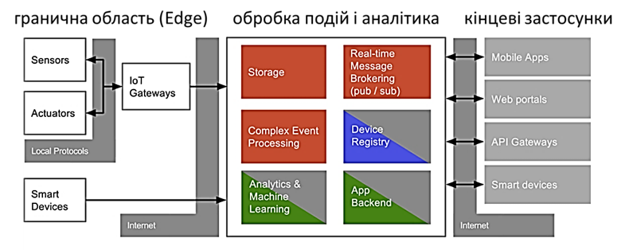
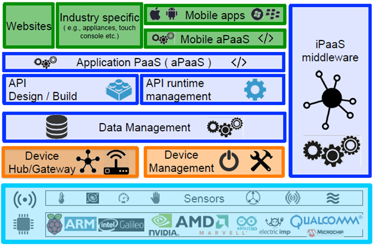
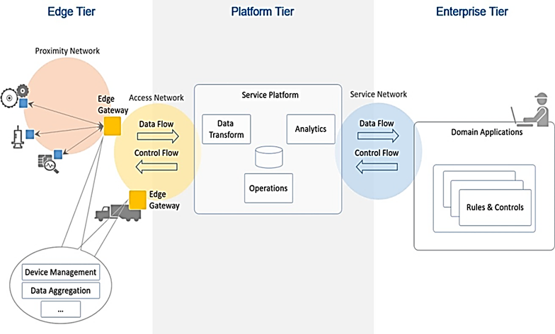
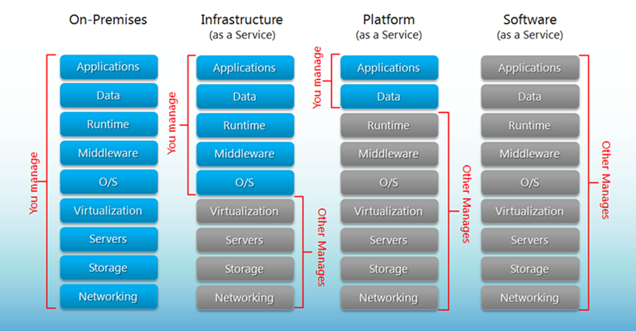
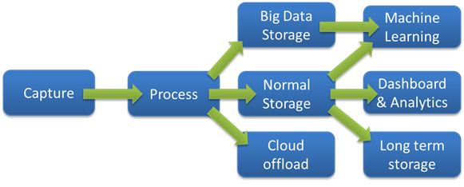
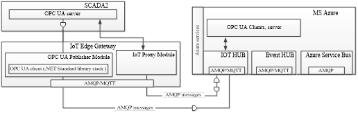
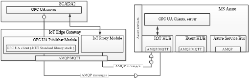
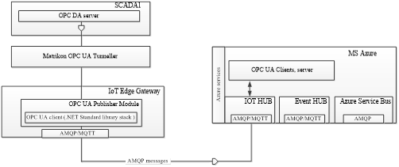
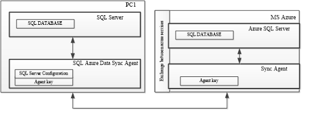

[Головна](README.md) > [9.Інтеграція з іншими засобами та кібербезпека](9.md)

# 9.4. Промисловий Інтернет речей та інтеграція з хмарними застосунками

## 9.4.1. Промисловий Інтернет речей

***Інтернет речей*** (***Internet of Things***, ***IoT***) — концепція мережі взаємозв'язаних фізичних пристроїв, які мають вбудовані датчики або/та виконавчі механізми, а також програмного забезпечення, що взаємодіють між собою та із зовнішнім світом. Основними компонентами IoT є інтелектуальні датчики та виконавчі механізми, що роблять річ "розумною", мережні компоненти та Інтернет з доступними сервісами. Саме наявність Інтернету робить цю технологію дуже гнучкою і функціональною, проте вразливою до кібератак та до втрати контрольованості, що треба враховувати. IoT набирає оберти у повсякденному житті. Так, трекер активності (фітнес-годинник), робот-пилосос є типовими IoT засобами і, між іншим, будь-який смартфон при взаємодії з ними також. 

Мережа датчиків та виконавчих механізмів не є чимось новим для промислової автоматизації. Але в контексті IoT ключовою відмінністю є використання ресурсів глобальної мережі Інтернет з усіма доступними там можливостями. Наявність великої кількості сервісів в Інтернет дає можливість використовувати його інфраструктуру і в промисловій автоматизації. Наведемо кілька прикладів.

У попередньому підрозділі наводився приклад використання корпоративних Historian на хмарних платформах, який дає можливість, з одного боку, розміщувати великі обсяги даних з можливістю легкого масштабування, а з іншого – отримувати усю необхідну доступну в усьому світі інфраструктуру візуальними налаштуваннями конфігурації. Розміщення будь-якого обсягу даних та їх доступність 24/7 – це один із головних критеріїв використання сервісів в Інтернет. При цьому плата йде саме за використовувані ресурси, а для масштабування не потрібно купувати додаткове серверне устатковання та розміщувати його в спеціалізованих приміщеннях, достатньо сплачувати послугу за більший обсяг. Слід також звернути увагу, що хмарна інфраструктура надає усі функції кіберзахисту та при необхідності резервування.

Наявність даних дає можливість використовувати різноманітні сервіси аналітики та звітності. З IoT та хмарними сервісами їх використання не обмежене виробничим майданчиком і може бути доступним з будь-якої точки світу. При цьому використання HTML5 дає можливість дивитися і налаштовувати звіти на мобільних засобах (телефонах, планшетах).  

Аналіз великої кількості даних з використанням сучасних аналітичних методів може бути використаний у системах діагностики та предиктивного обслуговування. 

На сьогодні є багато хмарних рішень, які надають можливість реалізувати концепцію цифрових двійників, що передбачає створення цифрової моделі активу в цифровому світі який супроводжує його протягом усього життєвого циклу. У якості активу може бути будь-яка "річ" – від клапана до всієї установки. Це дає змогу ефективніше використовувати актив на виробництві та поліпшувати якість нових екземплярів активу такого типу.      

Диспетчеризацію віддалених та сильно розподілених об’єктів тепер зробити набагато простіше. Як мінімум, Інтернет можна використовувати для побудови віртуальних приватних мереж (VPN), які будуть поєднувати усі розосереджені об’єкти в єдину систему (див. параграф 9.5.7). Є й інші способи побудови системи диспетчеризації з використанням хмарних SCADA, які спеціально розроблені для таких застосунків [14, 16].   

Наявність Інтернету дає можливість користуватися безлічі сервісів обміну повідомлення і оповіщення: SMS, пошта, додзвін на телефон, месенжери і т. п. Це дає змогу без додаткового розгортання інфраструктури поліпшити функції тривог.

Кількість доступних типів сервісів в Інтернеті не обмежуються наведеним вище переліком, і вона постійно зростає. Можна використовувати як загальнодоступні сервіси погоди, так і аналіз закупівельних цін. Можна автоматизувати взаємодію між інформаційними системами різних підприємств або з державними організаціями.   

Використання концепцій IoT для промислових об’єктів носить назву ***промислового Інтернету речей*** (***Industrial IoT****, **IIoT***). IIoT – це підмножина сегменту рішень IoT, яка зосереджується на спеціалізованих вимогах промислових застосувань, таких як виробництво, нафта і газ та комунальні послуги. Хоча IoT та IIoT поділяють загальні технології (датчики, хмарні платформи, підключення та аналітику), на цьому їхня схожість закінчується. Багато людей припускають, що IoT та IIoT відрізняються функціональністю, але насправді функції засобів можуть бути однакові, а основні відмінності полягають у їх виконанні та структурі системи. При виборі рішення IIoT необхідно враховувати вимоги до промислового виконання. Нижче наведемо 10 особливостей IIoT порівняно з IoT [15].

**Безпечність** (Security). Безпека є критичною для всіх рішень IoT, але промислові рішення IoT потребують більш жорстких заходів. Зрив виробничого процесу з великим обсягом продукції може призвести до втрат в мільйони гривень за день. А відключення електричної мережі впливає на економічну активність мільйонів людей і ставить під загрозу національну безпеку. Рішення IIoT використовують різноманітні вдосконалені заходи безпеки, зокрема побудови безпечної та стійкої архітектури системи, використання спеціалізованих плат, шифрування та аутентифікації, виявлення загроз та використання особливих алгоритмів у самих процесах керування. Деякі аспекти кібербезпеки в IIoT наведені в наступному підрозділі.  

**Сумісність** (Interoperability). Промислові IoT рішення повинні співіснувати в середовищі зі значною кількістю застарілих засобів OT, включаючи SCADA/HMI, ПЛК та інші системи керування виробництвом. Ці системи все ще функціонують і використовуються і з певних причин не можуть бути замінені на сучасні. Рішення IIoT повинні інтегруватися з цими системами, тому повинні підтримувати різні протоколи та інтерфейси. Не менш важливо, щоб рішення IIoT інтегрувалися також із системами класу MOM та ERP. 

**Масштабовність** (Scalability). Рішення IIoT, розгорнуті в промислових мережах, повинні мати можливість підтримувати сотні тисяч нових датчиків, пристроїв та контролерів, а також існуючі пристрої, які не мають інтерфейсів IoT. IoT, як правило, орієнтується на порівняно невелику кількість даних. 

**Точність** (Precision and Accuracy). Промислові операції потребують більш високого рівня точності. Автоматизовані високооб'ємні, високошвидкісні виробничі процеси синхронізуються до мілісекунд. Системи забезпечення якості виявляють малі відхилення та вживають негайних коригувальних дій на основі цих вимірювань. У цьому середовищі забезпечення регулювання на рівні "десь близько заданого значення" недостатнє, так як це призводить до втрати ефективності, збільшення простоїв та втрати прибутків. Промислові IoT рішення повинні підтримувати виконання операцій з високою точністю. 

**Програмованість** (Programmability). Промислові системи керування, як і програмовані логічні контролери чи машини, мають властивість змінювати програми та конфігурації, що дає можливість підтримувати нові технологічні процеси. Це програмування може бути виконано віддалено, на виробничому майданчику та безпосередньо за місцем розташування. Промислові IoT рішення повинні мати таку саму гнучкість та пристосовність для підтримки нових операцій. 

**Низька затримка реагування** (Low latency). У високошвидкісній системі неперервного виробництва з датчиками, що відстежують кожен аспект операції, кожна секунда має значення. Потрібно виявити аномалії та застосувати коригувальні дії в реальному часі. Будь-яка затримка з виявленням, оцінкою, прийняттям рішень та виконанням може привести до небезпеки працівників, погіршення якості продукції або втрат. Промислові IoT рішення повинні будуватися таким чином, щоб забезпечити вимогу до швидкодії. 

**Надійність** (Reliability). Промислові системи працюють протягом тривалого часу до їх заміни, типовим є кілька десятків років. Вони працюють у суворих кліматичних умовах, вібрації, при цьому часто віддалено від обслуговуючого персоналу. Промислові IoT рішення повинні забезпечувати таку саму високу доступність, витримувати тривалі робочі цикли та працювати надійно протягом років із відключенням лише з метою технічного обслуговування. 

**Живучість** (Resilience). Найважливіші виробничі процеси та системи, де простої (або навіть доступ до обслуговування) недопустимі, розроблені з урахуванням живучості. Поломка в одній частині не повинна припинити роботу всієї системи. Незважаючи на те, що можуть виникнути втрати експлуатаційних можливостей, завдання можуть взяти на себе резервні системи, або необхідні процеси можуть виконуватися на резервних потужностях. Промислові рішення IoT в критичних операціях мають підтримувати відмовостійкість або живучість. При втраті датчиків або підключення з мережею промислові IoT системи та архітектури повинні мати можливість компенсувати це та задовільно завершити свої процеси та операції.

**Автоматизованість** (Automation). Багато виробничих процесів високо автоматизовані від початку до кінця, з обмеженим втручанням людини. Рішення IoT, що працюють у промислових умовах, повинні підтримувати цілий спектр вимог до автономності. Це може привести до втілення інтелекту в граничні пристрої (Edge), включення логіки керування та автоматизації в шлюз, або включення в систему можливостей глибокого навчання. 

**Зручність обслуговування** (Serviceability). Промислові системи повинні працювати надійно та передбачувано в суворих умовах протягом багатьох років. Підтримка такого рівня продуктивності потребує регулярного обслуговування технічними службами; це може бути як заміна датчиків чи оновлення мікропрограм, так і зміна налаштування шлюзів і серверів. 

Для розвитку IIoT та популяризації кращих практик організація Industrial Internet Consortium випускає документи, які можна вільно завантажити з їхнього сайта https://www.iiconsortium.org. Тому розробникам систем автоматизації, які мають намір використовувати рішення IIoT, варто ознайомитися з цими документами щоб мати можливість вибрати кращі засоби та архітектурні рішення. Нижче зупинимося тільки на деяких варіантах для загальної обізнаності читача.  

Архітектура Інтернету речей відрізняється залежно від реалізації. Тим не менше вона дещо схожа на архітектуру класичних систем АСКТП. Один із прикладів архітектури показано на рис. 9.30.

 

*Рис.* *9.30.* Приклад архітектури IIoT

Взаємодія з "речами" відбувається через датчики (sensors) та виконавчі механізми (Actuators), подібно до того, як це робиться в АСКТП для будь якого об’єкта керування. Ці датчики разом з усією інфраструктурою для інтеграції з рівнем оброблення подій через мережу Internet формують так звану граничну область (***Edge***). 

Події (дані), що надходять з граничної області, зберігаються та оброблюються відповідно до завдання (рівень оброблення подій та аналітики, ***event processing***, ***Platform***). На цьому рівні події (дані) зберігаються (storage), оброблюються (Event Processing), перенаправляються потрібним застосункам (Real-Time Message Brokering, Stream Processing). Додатково на цьому рівні відбувається адміністрування та керування пристроями з граничної області (Device Registry, Edge Device Management). Події (дані) оброблюються з використанням аналітичних сервісів (Analytics) на основі яких проводиться машинне навчання (Machine Learning), що дає змогу зробити певні висновки про об’єкт. Цей рівень, як правило, реалізований з використанням хмарних (Cloud) або туманних (Fog) обчислень. Якщо провести аналогію з АСКТП, то ці функції наближені до рівня контролерів та SCADA (за винятком функцій HMI).    

Отримання результатів, контроль, віддалене керування та адміністрування системи проводяться через кінцеві застосунки з використанням Internet. Цей рівень можна умовно порівняти з HMI в АСКТП.  

На рис. 9.31. показано подібну наведеній на рис. 9.30 архітектуру, однак у вигляді сервісів. На ньому область Edge представлена у вигляді датчиків (Sensors), Device Hub/Gateway (збирання та маршрутизація даних) та Device Management (керування пристроями). Останні частково виконуються як хмарні обчислення, так і на граничних пристроях. Усі функції збереження та первинного оброблення подій (даних) зведені до Data Management. Усі інші функції оброблення, в тому числі аналітичні, показано як застосунки PaaS, що взаємодіють із сервісами керування даними через API (Application Program Interface).     

 

*Рис. 9.31.* Приклад архітектури IIoT у вигляді шарів сервісів

Ще один приклад архітектури промислового Інтернету речей показаний на рис. 9.32. Як видно, усі наведені архітектури мають спільні риси: наявність трьох рівнів, подібні функції, наявність хмарних обчислень, використання Інтернету як інтеграційного рівня.  

Для IIoT може бути характерним підключення цілих підсистем АСКТП. Тобто поряд із датчиками та виконавчими механізмами можуть підключатися розумні пристрої, засоби розподіленого введення/виведення, ПЛК та SCADA/HMI. Функцією спряження цих пристроїв до хмарної платформи займається ***IoT Edge Gateway***. Якраз він і є тим пристроєм, який розуміє два світи в IIoT – OT та IT. З одного боку, він підтримує різнорідні протоколи промислових мереж, а з іншого – протоколи IoT та WEB, зокрема MQTT, AMQP, HTTP API, WebSocket та ін. Протокол MQTT розглянуто в розділі 4 посібника. Крім самих функцій шлюзування, IoT Edge Gateway виконує додаткові функції, які характерні саме для сегмента IIoT, і відповідають вимогам, які наведені вище. Зокрема, тут додатково можуть проводитися:

- первинне оброблення сирих даних;

- накопичення даних у випадку відсутності зв’язку із хмарною платформою;

- контроль та керування пристроями;

- зв'язок з локальними засобами відображення та контролю.

 

*Рис. 9.32.* Приклад архітектури промислового Інтернету речей від Industrial Internet Consortium

Щоб навчитися правильно оцінювати, як система буде розвиватися й зростати, необхідно розібратися в усіх тонкощах і складнощах архітектури хмарних систем, та який вплив на IoT-систему робить запізнювання. Крім того, не всі дані необхідно відправляти на хмарну платформу. Пересилання всіх IoT-даних обходиться значно дорожче, ніж їх оброблення на межі мережі (граничні обчислення, Edge Computing), або включення граничного маршрутизатора в зону, яку обслуговує хмарний сервіс (туманні обчислення, Fog computing). Туманні обчислення також стандартизуються, наприклад, є архітектура OpenFog.

Наступним ланцюжком в обміні даними є рівень платформи, тобто хмарні обчислення. Хоча тема хмарних обчислень виходить за рамки посібника, розробникам систем АСКТП та проектів SCADA/HMI у тому числі варто розуміти базові принципи їх побудови, про які йдеться в наступному параграфі. 

## 9.4.2. Поняття про хмарні сервіси  

***Хмарні обчислення*** (Cloud Computing) — модель забезпечення повсюдного та зручного доступу через мережу на вимогу до загальнодоступного набору обчислювальних ресурсів, що підлягають налаштуванню (наприклад, до комунікаційних мереж, серверів, засобів збереження даних, прикладних програм та сервісів) і які можуть бути оперативно надані та звільнені з мінімальними затратами на керування та зверненнями до провайдера.

Поняття "хмара" належить до інфраструктури обчислювальних служб, які зазвичай необхідні відповідно до запиту. Набір ресурсів (обчислень, мереж, сховищ і пов'язаних з ними програмних сервісів) може динамічно масштабуватися в бік збільшення або зменшення залежно від середнього навантаження і якості обслуговування. Хмари, як правило, – це великі центри оброблення даних, які надають клієнтам послуги, орієнтовані на зовнішнього споживача, і модель оплати за використання. Ці центри створюють ілюзію єдиного хмарного ресурсу, в той час як насправді може бути використано багато географічно розподілених ресурсів (наприклад серверів). Це дає користувачеві відчуття незалежності від місця їх розташування. Ресурси є еластичними (що означає масштабованість), а сервіси – це еквівалент плати за використання, незмінний дохід для провайдера. Сервіси, які працюють у хмарі, відрізняються від традиційного програмного забезпечення своєю конструкцією та реалізацією. Хмарні застосунки можуть розроблятись і розвиватися швидше і менше залежати від мінливості середовища. Таким чином, розгортання хмар відбувається дуже швидко.

У хмарному середовищі існують три різні моделі топології хмар: приватна хмара (private cloud), хмара загального користування, або публічна (public cloud), та гібридна хмара (Hybrid cloud). 

***Публічна хмара*** **(*Public Cloud*)** – хмарна інфраструктура, при якій серверні потужності обов'язково знаходяться на стороні провайдера хмарних послуг, який надає ресурси відразу кільком організаціям одночасно. Тут інфраструктура надається на вимогу для безлічі клієнтів і застосунків. Тут інфраструктура – це набір ресурсів, які будь-яка людина може використовувати в будь-який час у рамках своїх угод про рівень обслуговування. Перевага використання в тому, що хмарні центри оброблення даних дають змогу забезпечити безпрецедентну масштабованість для багатьох клієнтів, які обмежені тільки тим, яку частину послуг вони хочуть придбати. Прикладами публічних хмар є AWS (Amazon Web Services), Google Cloud, Microsoft Azure, IBM Cloud, Alibaba Cloud.

***Приватна хмара*** **(private cloud)** – хмарна інфраструктура, надана у виключне користування однієї організації або корпорації. Приватна хмара існує з ряду причин, включаючи безпеку та перевіреність якості. Тобто це потрібно для гарантування, що інформація оброблюється виключно системами, керованими клієнтом. Однак щоб вважатися хмарою, повинні існувати деякі аспекти хмарних сервісів, такі як віртуалізація й балансування навантаження. 

***Гібридна хмара*** (**Hybrid cloud**) – одночасне використання приватної та публічної хмари. 

Незалежно від моделі, каркаси хмар повинні забезпечувати динамічну масштабованість, швидкість розроблення і розгортання, а також використання в потрібному місці незалежно від його дальності. Сучасні корпоративні системи, як правило, використовують гібридну архітектуру для забезпечення безпеки критично важливих застосунків та даних за місцем і використовують публічну хмару для підключення, простоти й швидкості розгортання.

Хмарні провайдери зазвичай підтримують цілий ряд продуктів "Все як сервіс" (XaaS). Тобто послуга програмного забезпечення з оплатою за використання. Сервіс включає в себе службу мережі (NaaS), програмне забезпечення як послугу (**SaaS**), платформу як послугу (**PaaS**) та інфраструктуру як послугу (IaaS). Кожна модель представляє все більше хмарних сервісів від постачальників. Ці сервісні пропозиції – додана вартість хмарних обчислень. Як мінімум, ці послуги повинні компенсувати капітальні витрати, з якими зіштовхується клієнт для придбання і обслуговування такого обладнання центру оброблення даних, і врахувати це як експлуатаційні витрати. 

 

*Рис. 9.33.* Різні моделі надання хмарних сервісів

***SaaS*** (Software as a Service – ***програмне забезпечення як послуга***) пропонує користувачеві використовувати готове програмне забезпечення, яке виконується в хмарі. З точки зору користувача, віртуальний SaaS фактично працює на його пристрої. Прикладами таких сервісів є різноманітні застосунки Google (наприклад, Google Sheet) або Microsoft Office 365.

***PaaS*** (Platform as a Service – ***платформа як послуга***) використовує базове устаткування і програмні засоби нижнього рівня, що надаються хмарою. У такому випадку кінцевий користувач тільки використовує апаратне забезпечення центру оброблення даних, операційну систему, проміжне ПЗ і різні бази даних постачальника для розміщення свого приватного застосунку або сервісу. Проміжне ПЗ може складатися із систем керування базами даних. Рішення IIoT частіше всього будуються з використанням спеціалізованих платформ типу Predix (GE Digital) чи MindSphere (Siemens). Тобто кінцеве рішення для клієнта розроблює інтегратор, але в якості проміжного ПЗ використовується певна платформа. Цей підхід, по суті, такий самий, як розроблення АРМ-оператора з використанням спеціалізованих програмних пакетів SCADA/HMI, за винятком того, що середовище розроблення і виконання знаходяться в хмарі, а не на локальному ПК.  

У моделі ***IaaS*** (Infrastructure as a Service – ***інфраструктура як послуга***) постачальник створює масштабовані апаратні служби в хмарі і надає модифікацію програмних каркасів для створення клієнтських віртуальних машин. По суті, клієнт отримує віртуальні комп’ютери з необхідною ОС і встановлює на них усе, що необхідно. Кількість комп’ютерів, їх графік роботи керується ззовні як користувачем так і скриптами, що надає такому рішенню гнучкості. По суті, можна розгорнути SCADA/HMI на віртуальній машині в хмарі, але слід розуміти, до чого це може привести і як будувати інфраструктуру АСКТП. Тим не менше, є програмні пакети SCADA/HMI, які призначені саме для цього, наприклад, WebAccess/SCADA від Advantech.

При використанні хмарних платформ в архітектурі IoT дані, що збираються з Edge, проходять певне оброблення. Хмарні IoT сервіси розраховані на отримання великої кількості запитів на одиницю часу, що дає можливість побудувати розподілені системи IoT із тисячами джерел даних, при цьому майже не втративши на швидкості оброблення. Після отримання даних (Capture, див. рис. 9.34) відбувається їх первинне оброблення, що включає певні розрахунки та переадресацію на наступний сервіс. Якщо крок "Capture" більше зосереджений на комунікаціях (наприклад MQTT чи HTTP), то "Process" – на логічному структуруванні даних та примітивному обробленні (масштабування, агрегатування тощо). Дані можуть об’єднуватися навколо сутностей типу "пристроїв" чи "цифрових двійників", що спрощує їхнє адміністрування. 

 

*Рис. 9.34.* Типовий шлях оброблення даних в IoT

Далі дані можуть передатися іншим сервісам, наприклад, для збереження в різних сховищах: 

- "Normal Storage", під яким розуміється якась БД типу SQL або NONSQL, що буде використовуватися різними сервісами для аналізу даних; 

- "Big Data Storage" – база даних спеціального формату, розрахована на роботу з даними великого обсягу;

- "Cloud offload" – це сховище поза межами хмари.

"Dashboard &Analytics" використовується для виведення даних у форматі онлайн-звітів. Під аналітикою розуміються звичайні сервіси статистичного аналізу, які не потребують алгоритмів машинного навчання. Ці звіти, як правило, конфігуруються і не потребують програмування.

"Long Term Storage" – використовується для довгострокового зберігання даних, які не потребують швидкого доступу та аналізу. 

"Machine Learning" використовуються для складного оброблення даних з використанням машинного навчання. 

## 9.4.3. Інтеграція АСКТП із хмарними сервісами

Шляхи інтеграції компонентів систем керування з хмарними платформами передусім залежать від необхідного завдання, яке вирішується, вибору хмарної платформи, служб, які вона надає, і, відповідно, протоколів, які підтримуються цими службами. У ряді випадків достатньо забезпечити передачу архівних даних з певною періодичністю задля виконання звітів, у інших – дані повинні передаватися в режимі реального часу з можливістю онлайн-аналізу та прийняття рішень на базі хмарних обчислень з використанням Data Mining. Огляд можливих функцій, а тим більше, способів їх реалізації в хмарних застосунках виходить за рамки цього посібника; тут зосередимося на способах інтегрування засобів АСКТП, особливо SCADA/HMI з хмарними сервісами з використанням рішень IoT.

Один із прикладів використання хмарних сервісів наведено в параграфі 9.3.2, де обмінювалися між собою корпоративний та хмарний Historian. Нижче розглянуто інші приклади застосування.     

Більшість постачальників хмарних платформ надають засоби для реалізації та впровадження Інтернету речей [16]. Наприклад, Amazon Web Service пропонує комплексне рішення для реалізації Інтернету речей, а саме AWS IoT Core – це керована хмарна платформа, яка дає змогу підключеним пристроям просто і безпечно взаємодіяти з хмарними застосунками та іншими пристроями. Крім того, що хмарні сервіси надають значний функціонал для об’єднання пристроїв у загальну мережу та віддалене керування ними, важливим фактором для інтеграції з виробничим устаткованням та програмним забезпеченням є підтримувані цими службами протоколи. AWS IoT Core підтримує протоколи HTTP, WebSockets і спрощений протокол зв'язку MQTT, спеціально спроектований для підтримки нестабільного підключення і роботи в мережах з низькою пропускною здатністю. Microsoft Azure у свою чергу пропонує комплексне рішення для Інтернету речей Azure IoT Suite. Компонент цього рішення розглянуто детальніше далі. Рішенням від Google Cloud Platform виступає Google Cloud Web of Things (IoT) Core – це повністю керована служба для безпечного підключення та керування пристроями IoT. Подібні рішення пропонуються і IBM, причому спробувати їх значно простіше, оскільки в безкоштовній підписці вони не потребують реєстрації кредитної карточки. 

Згадані платформи належать до споживчих хмарних платформ. Існують також промислові хмарні платформи, які набагато глибше фокусуються на завданнях ОТ. Вони розроблені таким чином, щоб забезпечувати збирання та оброблення даних під час функціонування виробничих процесів з метою підвищення продуктивності, а також прогнозуючого обслуговування. Серед них – GE Predix від GE Digital та MindSphere від Siemens AD. Ці рішення є комерційними, мають чітке промислове спрямування, простіші з точки зору використання, але можуть бути дорожчими, ніж звичайні споживчі хмарні платформи. Крім того, враховуючи, що більш застосовані споживчі платформи вже надають ресурси для реалізації промислових рішень, їх використання може бути більш доречним. Зокрема, MS Azure вже надає можливість реалізації рішень націлених на виробництво. Індустріальну платформу GE Predix теж можна розгорнути в інфраструктурі Azure, і наразі Microsoft та GE Digital ведуть переговори щодо співпраці, яка в майбутньому дасть змогу застосункам розгорнутим засобами MS Azure обмінюватися даними з Predix.

MS Azure вже зараз надає ресурси для реалізації промислового Інтернету речей та має дуже розвинену інфраструктуру. Крім того, MS Azure підтримує технологію OPC UA, яка перебуває на етапі становлення як передового стандарту для інтеграції промислового устатковання в єдину мережу. Далі розглянемо приклади інтеграції з цією платформою в якості прикладу.

Значна кількість виробників апаратних та програмних засобів для АСК ТП на хвилі розвитку застосування промислового Інтернету речей мають намір залишатися конкурентоспроможними та не втрачати позиції на ринку. Як приклад, COPA-DATA для своєї SCADA zenon пропонує використання сервісів MS Azure для розгортання мобільних застосунків HMI клієнтів та WEB-сайтів для віддаленого моніторингу. Крім того, в хмарі можна розмістити інструментальний засіб для побудови звітів zenon Analyzer, що забезпечить скорочення локальних обчислювальних ресурсів та відкриту можливість доступу до звітів усім стейкхолдерам. Таке рішення потребує самостійного використання платформи MS Azure як системи типу PaaS. 

Підрозділ AVEVA від Schneider Electric пропонує своє рішення для збирання, візуалізації та аналізу промислових даних, яке являє собою систему типу SaaS, побудовану засобами MS Azure. Це рішення – Wonderware Online InSight, яке дає змогу інтегруватися з такими продуктами, як Wonderware InTouch HMI, Wonderware System Platform, Wonderware Historian та Citect SCADA .

Однак не всі SCADA-програми мають вбудовані засоби інтегрування з хмарними платформами. Крім того, наявність великої кількості впроваджень потребують інших технологій інтегрування. Нижче розглянемо технології, які надають можливість об’єднати більшість рішень із хмарними платформами [16]. Не слід забувати, що не всі технології варто використовувати повсюдно, оскільки вибір може не дати очікуваних результатів за рядом критеріїв або бути незахищеним з точки зору кібербезпеки. Тут зосереджуємося саме на можливостях, але упускаємо питання, пов’язані з правильністю вибору його реалізації.    

**1.** **OPC UA** **в** **SCADA/HMI**. Найбільш сучасною інтеграційною технологією в промисловій автоматизації є OPC UA (див. підрозділ 4.3), яка є крос-платформною і більше не базується на технології DCOM. OPC UA Server може бути як у SCADA, так і в ряді HMI (див. підрозділ 9.1).

На сьогодні існує кілька можливих варіантів підключення OPC UA та MS Azure через програмний шлюз. Запуск програмних шлюзів можливий на різноманітних операційних системах та апаратних пристроях, включаючи віртуальні машини у хмарах. З боку MS Azure рекомендується використовувати такі служби: IoT Hub, Event Hubs, Azure Service Bus. Вони підтримують протоколи AMQP, MQTT i HTTP і побудовані для отримання даних у великій кількості. IoT Hub, крім того, забезпечує керування пристроєм та двостороннє спілкування. Розглянемо деякі пропозиції щодо інтеграції OPC UA з MS Azure. 

Першим можливим варіантом реалізації передачі даних у хмарну платформу MS Azure зі SCADA-програми або PLC, які підтримують OPC UA, є розроблення власного програмного шлюзу (рис. 9.35). Написати власний шлюз OPC UA для програмістів відносно нескладно завдяки відкритій версії OPC UA.NET Standard library та прикладам, що надає OPC Foundation. Крім того, є відкриті бібліотеки AMQP для багатьох мов програмування. Проте це потребує від інтегратора наявності персоналу з відповідними компетенціями в об’єктно-орієнтованому програмуванні. 

  *Рис. 9.35.* Передача даних зі SCADA-програми в хмару MS Azure з використанням програмного шлюзу Azure IoT Edge Gateway

Другим варіантом реалізації шлюзу є використання Azure IoT Edge Gateway. Azure IoT Edge Gateway є крос-платформеним і використовує модульну архітектуру. У відкритому доступі знаходять різноманітні модулі, в тому числі OPC UA Publisher. Перевага підходу Azure IoT Edge Gateway полягає в тому, що при цьому використовується проект із відкритим кодом, який підтримують (включаючи Microsoft) та застосовують інші користувачі, а також такий підхід реалізує масштабовану, розширювану крос-платформну архітектуру. Приклад реалізації цього підходу інтеграції наведений на рис. 9.36. У цьому варіанті розглядається взаємозв’язок між компонентами системи, а саме SCADA-програмою та службою MS Azure IOT HUB. SCADA-програма має інтегрований OPC UA сервер, служба IOT HUB зберігає та оброблює дані від різних пристроїв, забезпечує підтримку протоколів AMQP, MQTT i HTTP поверх TLS, а також надає різні можливості для оперування отрима­ними даними (проведення аналітики) та їх подальшого використання іншими службами, наприклад, розгортання OPC UA клієнтів у хмарі. Такий взаємозв’язок реалізується за допомогою встановлення програмного пакета Azure IoT Edge Gateway з боку функціонування SCADA-програми. Оскільки шлюз має модульну структуру, то для встановлення зв’язку шлюзу з OPC UA сервером необхідно в його програмний код включити модуль OPC UA Publisher, який функціонує на базі стека OPC UA.NET Standard library. Azure IoT Edge Gateway вже включає бібліотеки AMQP, MQTT i HTTP, тому передача даних реалізується за допомогою цих протоколів. Також замість модуля OPC UA Publisher можна використовувати модуль Azure IoT Edge OPC Reverse Proxy для реалізації двостороннього зв’язку. 

 

*Рис. 9.36.* Передача даних зі SCADA-програми в хмару MS Azure з використанням програмного шлюзу Azure IoT Edge Gateway

**2.** **OPC DA** **в** **SCADA** **на** **OPC UA.** Якщо програмні засоби (SCADA) або пристрої не підтримують OPC UA, можна використовувати готові програмні шлюзи OPC DA/UA. Як приклад, Matrikon OPC UA Tunneller дає змогу клієнтським застосункам з підтримкою OPC UA спілкуватися з OPC Classic серверами та клієнтами, і навпаки (рис. 9.37). Як альтернативу також можна використовувати UaGateway Wrapper & Proxy. UAGateway є застосунком, що працює в операційній системі Windows (XP, Vista, Win7). Альтернативою відкритим програмним шлюзам є комерційні шлюзи із закритою архітектурою (чорна скринька), де постачальник сам реалізує і підтримує шлюзування між SCADA-програмою та службою MS Azure. Основна перевага використання комерційних шлюзів – це їх підтримка постачальниками.

 

*Рис. 9.37.* Передача даних зі SCADA-програми з інтегрованим OPC DA сервером у хмару MS Azure з використанням програмного шлюзу Azure IoT Edge Gateway

**3. Інтерфейси** **DB.** Поряд з OPC SCADA-програми тим чи іншим способом послуговуються відкритими технологіями ODBC, OLEDB та ADO.NET для обміну із СУБД. Механізми передачі даних зі SCADA-програм у локальні бази даних SQL, зокрема через MS SQL Server, є достатньо відпрацьованими. У цьому випадку завдання інтеграції зводиться до переміщення даних з локальної бази даних MS SQL у базу даних SQL Azure. Існує рішення, яке дає змогу пов'язувати дані між локальним сервером MS SQL та базою даних SQL Azure шляхом їх синхронізації (рис. 9.38). Засіб керування, що надається для синхронізації даних Microsoft SQL Data Sync Agent, передбачає вибір бази даних і таблиці, які необхідно синхронізувати, а потім створює завдання служби агента SQL Server для автоматичної синхронізації даних з SQL Azure за розкладом. При цьому максимальна частота синхронізації може досягати 5 хвилин. Ця технологія дає можливість розширити існуючу локальну інфраструктуру для роботи в хмарі. Завдяки зв'язуванню локальних даних із хмарною інфраструктурою можна легко налаштувати обмін інформацією з мобільними користувачами, віддаленими джерелами даних, при цьому використовуючи переваги нових служб у хмарі. Ця технологія також створює міст, який забезпечує взаємодію між локальними й віддаленими програмами. 

  *Рис .9.38.* Синхронізація даних локальної бази даних MS SQL сервер та бази даних Azure SQL

Слід також сказати, що за наявності драйверів ODBC чи провайдерів даних OLEDB до хмарних сховищ, питання інтегрування вирішується аналогічно розглянутому в параграфі 9.1.6.  

**4.** **MQTT** **на** **Edge Device.** Вище були представлені шляхи інтегрування SCADA-програм з хмарною платформою MS Azure, проте впровадження підходів Індустрії 4.0 передбачає участь усіх активів у єдиній загальній мережі. Активними учасниками процесу керування в АСКТП є ПЛК, який може підтримувати різноманітні промислові протоколи, такі як Profibus, EtherCAT, Modbus, EtherNet/IP, CAN, CANopen і т. п. З іншого боку, сервіси IoT хмарних платформ підтримують протоколи AMQP, MQTT, HTTP та ін. Протокол MQTT досить простий, тому вже зараз його підтримка є в багатьох ПЛК. Якщо протокол не підтримується розробником ПЛК, його можна реалізувати самостійно. Бібліотека таких "самописних" блоків уже є у відкритому доступі для ряду контролерів, наприклад, Siemens S7-300/S7-400 у середовищі програмування Step7. Маючи відкритий код, неважко перенести його на інші платформи, що мають відкритий стек TCP/IP, наприклад, з підтримкою CoDeSys. Однак слід черговий раз зауважити, що пряме з’єднання з Інтернетом ПЛК може бути небезпечним, тому рекомендується використовувати IIoT Edge Gateway. Крім того, "самописні" реалізації протоколів можуть мати ряд вад, за які постачальник ПЛК не несе відповідальності. 

**5.** **OPC** **на** **Edge Device.** Враховуючи, що OPC UA набирає обертів як передовий стандарт IIoT комунікації, його все більше впроваджують на рівні контролерів (див. підрозділ 4.3). Велика кількість виробників (наприклад, ABB, Bosch Rexroth, B&R, CISCO, GE Digital, KUKA, National Instruments (NI), Parker Hannifin, Schneider Electric, SEW-EURODRIVE та TTTech) оголосили про співпрацю під егідою IIC та OPC Foundation. Ці компанії прагнуть до відкритої, уніфікованої, заснованої на стандартах комунікації в режимі реального часу між промисловими контролерами і хмарою. Вони приймають стандарт OPC UA як єдиний для промислової автоматизації та зв'язку IIoT. На сьогоднішній день уже в багатьох контролерах інтегровано OPC UA server: Siemens S7-1500, Modicon M241, M251, M262 та M580 (через модуль BMENUA0100) від Schneider Electric, PACSystems RX3i 320 CPU від GE Digital та ін. У якості шлюзу до MS Azure може використовуватись програмно-апаратний засіб, зроблений наприклад, на промисловому комп’ютері з низьким споживанням.

**6.** **Edge Gateway + Node-RED.** В якості ще одного інструмента інтеграції PLC, SCADA/HMI та MS Azure можна використовувати інструмент потокового програмування – Node-RED. Він надає редактор налаштування потоків, який працює на основі браузера та дає можливість зручним способом пов'язати пристрої, які мають різні комунікаційні можливості, між собою. Node-RED побудований на легкій та ефективній програмній платформі Node.js, тому можна використовувати Node-RED як на недорогих апаратних пристроях, таких як Raspberry Pi, так і в хмарних контейнерах. У бібліотеці на сайті Node-RED можна знайти різні вузли (nodes), за рахунок яких можна забезпечити встановлення зв'язку між пристроями, що використовують різні протоколи.

 На сьогодні Node-RED є стандартом де-факто і невід’ємною частиною пристроїв, що позиціонуються як IoT шлюзи. Цей графічний інструмент дещо нагадує мову FBD, тому спеціалісти з автоматизації достатньо легко зможуть його використовувати для різних завдань перетворення та логічного оброблення. У відкритій бібліотеці доступна для використання велика кількість вузлів і з кожним роком вона поповнюється новими. Там є підтримка великої кількості протоколів промислових мереж і, звісно, MQTT, HTTP, WebSocket та ін. Зрештою, це найуніверсальніший спосіб інтегрування з усіма засобами автоматизації, хоч і потребує певного графічного "програмування". Наприклад для обміну даними в реальному часі можна використовувати WebSocket, а не MQTT, який більш адаптований до цього, хоч і потребує наявного постійного з’єднання. Детальніше про Node-RED можна прочитати в посібнику [18] 

Таким чином, існуючі рішення автоматизації зі світу Індустрії 3.0 можуть бути модернізовані для переходу на новий рівень розвитку. Варто відзначити, що ці рішення часто не передбачають заміни, а радше, модернізацію, що дуже важливо з огляду на необхідність неперервної роботи виробництва. Запропоновані вище рішення є практичними і ними можна користуватися вже зараз. 