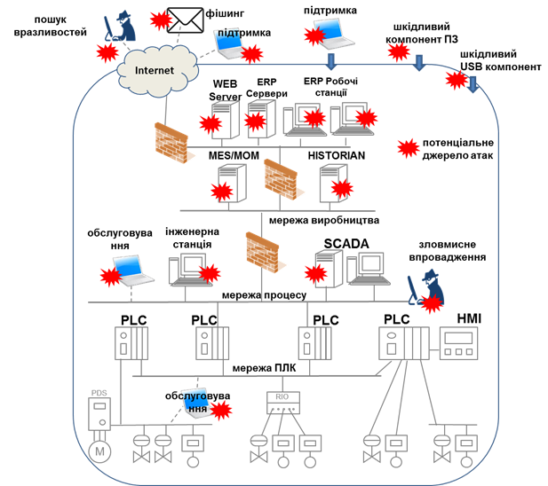
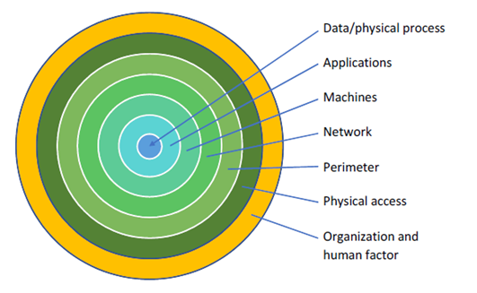
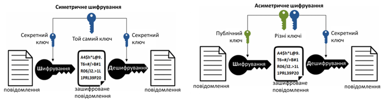
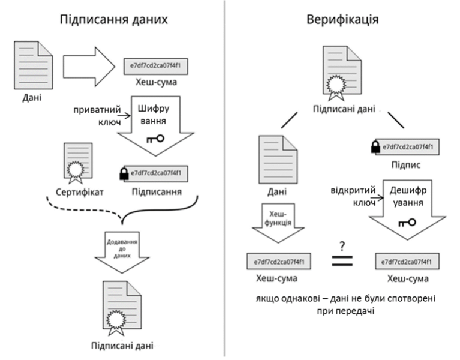
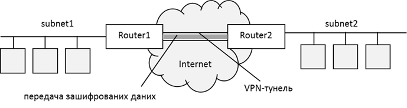
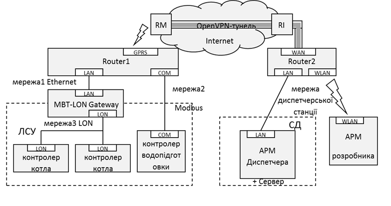

[Головна](README.md) > [9.Інтеграція з іншими засобами та кібербезпека](9.md)

# 9.5. Основи кібербезпеки в АСКТП

## 9.5.1. Актуальність питання кібербезпеки в АСКТП 

Останні десять років тема кібербезпеки в АСКТП є чи не найбільш обговорюваною s з кожним роком стає все більш актуальною. Проблеми, пов’язані з кібербезпекою, кілька разів відчули на собі і українці, зокрема під час вимкнення електромереж зловмисниками в 2015 р, та дії вірусу "Petya" (2017 р). Нижче наведені кілька інцидентів, які мали місце в системах керування.

Ще в 2000-х було поставлено питання про вразливість АСКТП. У 2007 р. експериментальний проект "Aurora" під керівництвом Національної лабораторії штату Айдахо продемонстрував можливість знищення генератора енергії за допомогою кібератаки. У цій атаці зловмисник використовує вразливий протокол зв'язку для доступу до мережі керування дизельного генератора. Це дає йому змогу запустити шкідливу комп'ютерну програму, розроблену для відкриття автоматичного вимикача, дочекатися розсинхронізації генератора та негайно закрити автоматичний вимикач. Такі дії були проведені досить швидко, щоб система захисту не могла виявити проблему, тому призвели до вибуху дизельного генератора. Це можна подивитися на відео експерименту [[19](https://youtu.be/bAWU5aMyAAo)].

Через кілька років Stuxnet зробив свій слід в історії кібербезпеки промислових систем та підвищив обізнаність про вразливість систем SCADA. За анонімними джерелами, Stuxnet був комп'ютерним хробаком, розробленим для уповільнення ядерної програми Ірану. Stuxnet спеціально орієнтований на ПЛК, що використовувалися в керуванні центрифугами для розділення ядерних матеріалів з метою збагачення урану. Це знищило б близько 20% виробничих потужностей. Принцип роботи Stuxnet полягав у такому. Хробак вводився в цільову систему через знімний накопичувач, використовуючи вразливість автоматичного запуску. Далі він поширювався між комп’ютерами мережі Windows, використовуючи кілька вразливостей. Коли вірус виявляв середовище програмування ПЛК (Step 7) модифікував бібліотеку, яка змінювала код програми, що надсилалася на ПЛК. Ця модифікація змінювала поведінку системи керування і погіршувала роботу центрифуг шляхом несвоєчасних прихованих перепадів швидкості.

У 2015 р. в результаті кібератаки з використанням трояну BlackEnergy3, було відключено кілька підстанцій у    Західній Україні. Зловмисники отримали віддалений доступ до робочого стола операторів і поступово відключали підстанції одну за одною. При цьому оператори бачили дії зловмисників і нічого не могли вдіяти, оскільки паролі було змінено. Деякі спроби зловмисників зняли на смартфон, відео можна подивитися в [[20](https://youtu.be/8ThgK1WXUgk)]. Детальніше про троян та атаку на українські енергомережі можна прочитати в [[21](https://uk.wikipedia.org/wiki/BlackEnergy)] 

Ще один переломний момент стався зовсім недавно, в 2017 р. Це атака під назвою TRITON, призначена для нападу на системи протиаварійного захисту Triconex, зокрема встановлені в промислових нафтових агрегатах. Точного розташування об'єктів, постраждалих від нападу, не виявлено, але передбачалося, що ці підрозділи знаходились у Саудівській Аравії. Метою цієї атаки було відключення систем протиаварійного захисту (СПАЗ), що могло призвести до аварій у випадку нештатних ситуацій. Згідно інформації від співробітників Шнейдер Електрик, при аналізі інциденту виявилося, що метою було керування контролером. Шкідливий код потрапив на виробництво із-за недоліків ІТ інфраструктури. При спробі дати команду на СПАЗ, система розпізнала несанкціоновану команду та зупинила технологічний процес. Фактично не було злому ні СПАЗу ні SCADA, так як СПАЗ відпрацював у відповідності до своїх функцій.

Подібних атак було набагато більше, і тільки частина з них стала відомою громадськості. Детальну інформацію про деякі з цих інцидентів можна знайти на теренах Інтернету, а також подивитися в матеріалах відео з тематичної конференції ТДА, що проходила в Харкові [[22](https://www.tda.in.ua/19-1-%D0%BA%D1%96%D0%B1%D0%B5%D1%80%D0%B1%D0%B5%D0%B7%D0%BF%D0%B5%D0%BA%D0%B0-%D0%B0%D1%81%D1%83%D1%82%D0%BF-%D1%85%D0%B0%D1%80%D0%BA%D1%96%D0%B2)]. 

Не дивлячись на наявні інциденти, пов’язані з недостатнім захистом систем керування промисловими об’єктами (а частіше з повною відсутністю такого захисту), багато виробничників вважають, що проблеми кібербезпеки в АСКТП для їх підприємств не є актуальними. У своєму посібнику [23] автор дає кілька типових міфів та їх спростування. Наведемо їх.

**1. Кібератаки не сильно актуальні для промислових чи кіберфізичних систем.** Звісно, що більшість атак стосуються традиційних комп'ютерних систем. Стосовно промислових систем, кількість атак значно менша. Але при цьому зловмисник має спеціальні знання про цільові системи та здійснює індивідуальну атаку. Ризики, пов'язані з кібербезпекою промислових систем, залежать від ступеня тяжкості пошкодження та ймовірності його виникнення. Для промислових установок чи атомних станцій збитки можуть бути катастрофічними та впливати на населення. У зв’язку з цим у світі впроваджуються та постійно розвиваються регуляторні зобов'язання, такі як LPM (Military Programming Act) у Франції, директива NIS (Network and Information Security) в Європі або Закон про захист критичних інфраструктур у США.

**2. Система ізольована від Інтернету, тому вона безпечна**. Тривалий час вважалося, що відсутність підключення до Інтернету є достатнім обмеженням, щоб уникнути будь-якого ризику комп'ютерного піратства. Професіонали називають це міфом про "повітряний зазор". Насправді є кілька факторів, які заперечують цей міф. По-перше, навіть якщо система не підключена до Інтернету, вона може стати жертвою технологічних зловмисних дій. Так,  славнозвісний вірус Stuxnet був занесений через USB-флеш накопичувач. По-друге, часто мережа рівня процесу (див. рис. 9.15) підключається до мереж верхнього рівня керування, що може стати жертвою атак та розміщувати шкідливі програми. Ті з часом можуть пошкодити мережі рівня процесу або навіть можуть забезпечити проходження атак безпосередньо через них. По-третє, у мережі рівня процесу можуть існувати тимчасові або постійні прямі підключення до Інтернету з метою обслуговування або конфігурування, і вони створюють реальну вразливість. Крім того, із зростанням потреби завантажувати дані в інформаційну систему підприємства або в хмару, із потребою оновлення систем із сайта виробника та потребою віддаленого обслуговування, ізоляція промислових систем стає все більш ілюзорною.

**3. Рівень імовірного пошкодження надто низький, щоб перейматися кіберзахистом.** Поширеною думкою є низький рівень ризиків у випадку, якщо виробниче обладнання не використовує небезпечні машини чи процеси. Зрозуміло, що шкода довкіллю та людям буде обмежена. Однак для компанії втрати можуть бути величезним, оскільки атака може призвести до відключення виробництва на тривалий період, до низької якості виробленої продукції або навіть до знищення виробничого обладнання. Необхідно проаналізувати економічні наслідки та провести аналіз витрат і вигід для визначення рівня заходів з кібербезпеки, яких слід вжити.

**4. Робочі станції оснащені антивірусним програмним забезпеченням і брандмауером, тому система захищена**. Використання антивірусу є тільки одним з базових кроків захисту, що може захистити робочі станції комп’ютера. Однак у промисловій системі є багато пристроїв, що працюють під операційними системами реального часу або спеціалізованих ОС, для яких, як правило, немає антивірусного ПЗ, і воно є вразливим. Окрім того, однією з проблем антивірусного програмного забезпечення для промислових робочих станцій є те, що воно не завжди оновлюється. Брандмауери також можуть не забезпечити необхідного захисту: по-перше, правила фільтрації не завжди добре налаштовані; по-друге, навіть якщо потоки даних добре фільтруються, це не запобігає проходженню всіх атак. Наприклад, система керування енергетичною станцією, яка була атакована в Україні у 2015 р, включала в себе брандмауери, які не змогли завадити атаці.

**5. Використання віртуальної приватної мережі (VPN) убезпечує від несанкціонованого доступу.** Це не є достатньою умовою захищеності. По-перше, значна кількість VPN використовує технології, які вважаються застарілими і тому вразливими. Проведені дослідження показали, що більшість тестованих мереж VPN все ще використовують протокол на основі старих методів шифрування, які зараз не рекомендуються для використання. По-друге, навіть при добре налаштованому VPN, при скомпрометованому одному вузлі (отримані захищених ключів та паролів), це може поставити під загрозу решту мережі.

**6. Система інформаційної безпеки (ISS Information System Security) є дорогою і створює багато обмежень для ефективного функціонування.** Поширена думка, що спеціалізовані системи ISS дорогі й накладають велику кількість експлуатаційних обмежень, несумісних із системами керування промисловими об’єктами. Насправді ISS промислових систем повинні бути адаптовані до викликів, тому важливо проаналізувати ризики та порівняти важливість цих ризиків із вартістю заходів щодо їх зменшення та обмежень, які вони накладають. Однак безпеку часто вважають джерелом витрат, що важко виправдати рентабельністю інвестицій. Більш релевантним є її вимірювання в термінах потенційних втрат, наприклад, щодо кількості виробленої продукції при тимчасовій непрацездатності системи, або витрат на реконструкцію, якщо система була пошкоджена.

Останніми роками було запропоновано багато стандартів та посібників у галузі безпеки інформаційних систем. Деякі з цих стандартів пропонують підхід до керування ризиками відповідно до ISO 31000: це стандарти ISO 27000. Стандарти  безпеки інформаційних систем не підходять до АСТКП у зв’язку з рядом відмінностей між ними (табл. 9.1). Тому для сегмента OT спеціально розроблено ряд стандартів з кібербезпеки, такі як IEC 62443 або посібник NIST SP 800-82. Крім того, розроблено ряд галузевих стандартів, наприклад, розподілу та виробництва електроенергії та атомної енергетики. 

*Таблиця 9.1.* **Відмінності між ІТ та ОТ**

|                                   | **Information  Technology (IT)**                             | **Operational  Technology (OT)**                             |
| --------------------------------- | ------------------------------------------------------------ | ------------------------------------------------------------ |
| Призна­чення                      | Використовується в бізнесовому або офісному середовищі  для підтримки щоденних заходів, таких як облік, замовлення, керування  персоналом, аналізу даних тощо | Використовується для моніторингу та керування процесами  у промислових умовах, таких як заводські приміщення, нафтопереробні заводи, нафтогазові  платформи, системи очистки води тощо |
| Приклади систем або устатко­вання | -  Робочі станції користувачів.  -  Файлові, поштові, або web-сервери.   -  Бази даних.  -  Мережні пристрої (маршрутизатори, комутатори,  брандмауери) | -  ПЛК.  -  Distributed  Control Systems (DCSs).  -  SCADA-системи.  -  Historian.   -  Конвертери протоколів |
| Інтереси кібербез­пеки            | Першочерговим завданням є конфіденційність даних, далі  – необхідність цілісності даних, а потім доступність системи. | Першочерговим завданням є доступність системи, за нею  йде цілісність даних, аж потім – конфіденційність даних. Але для OT  цілісність та конфіденційність даних особливо важливі для логіки пристрою та  файлів конфігурації, які використовуються в керуючих програмах. |
| Керування змінами | У рамках функції ІТ процеси керування змінами значною  мірою є самостійними | Зміни в технології є частиною загального процесу  керування змінами. Зміни та оновлення в системах OT можуть потребувати тимчасового виведення устатковання  з обслуговування, що може бути проблематичним для деяких виробництв |
| Інші фактори      | -  Для доступу до бізнес-систем співробітники все частіше  використовують власні пристрої, наприклад мобільні засоби.   -  Нові технології впроваджуються з недостатньою турботою  про безпеку. | -  Мережні протоколи та устатковання, як правило, є  пропрієтарними та закритими, що ускладнює впровадження типових засобів кібербезпеки.   -  Базова технологія може застаріти і, отже, стати вразливою  до атак.   -  Середовище устатковання майже завжди неоднорідне, і  включає пристрої різного віку та походження. |

В Україні в 2019 р. методом підтвердження прийнято стандарт ДСТУ EN IEC 62443-4-1:2019, який просувався в проекті aCampus як один з найважливіших міжнародних стандартів АСКТП. У цьому проекті випущено ряд матеріалів просвітницького змісту, зокрема біла книга "Кібербезпека індустріальних систем" [[24](https://tk185.appau.org.ua/cybersecurity/)], в якій представлено серію стандартів ISA99/IEC 62443, виклики щодо їх впровадження та єдиний каркас для кібербезпеки й функційної безпеки.

Засоби SCADA/HMI є частиною системи керування, тому вибір пристроїв та програмного забезпечення, проектування систем та їх впровадження також впливають на кібербезпеку системи взагалі. Детальний огляд питань кібербезпеки виходить за рамки цього посібника. Далі зупинимося на основних моментах, які допоможуть читачеві зорієнтуватися в темі і, за необхідності, детально вивчити потрібні складові. Крім того, увага приділятиметься питанням кібербезпеки АСКТП взагалі, а не окремим засобам SCADA/HMI, оскільки захист захисту вирішується в комплексі, а не для окремих пристроїв.  

## 9.5.2. Основні загрози та напрями кібератак у системах АСКТП 

Для розуміння необхідності кіберзахисту та можливих наслідків від кіберзлочинів варто розглянути основні загрози та напрями кібератак у системах АСКТП. 

Для початку зупинимося на самому означенні терміна "кібератака". Відповідно до Закону України "Про основні засади забезпечення кібербезпеки України" (від 5 жовтня 2017 року № 2163-VIII) [[25](https://zakon.rada.gov.ua/laws/show/2163-19)], ***кібератака*** – це спрямовані (навмисні) дії в кіберпросторі, які здійснюються за допомогою засобів електронних комунікацій (включаючи інформаційно-комунікаційні технології, програмні, програмно-апаратні засоби, інші технічні та технологічні засоби і обладнання) та спрямовані на досягнення однієї або сукупності таких цілей: порушення конфіденційності, цілісності, доступності електронних інформаційних ресурсів, що обробляються (передаються, зберігаються) в комунікаційних та/або технологічних системах, отримання несанкціонованого доступу до таких ресурсів; порушення безпеки, сталого, надійного та штатного режиму функціонування комунікаційних та/або технологічних систем; використання комунікаційної системи, її ресурсів та засобів електронних комунікацій для здійснення кібератак на інші об’єкти кіберзахисту. 

Слід розуміти, що кібербезпека АСКТП залежить не тільки від навмисних, цілеспрямованих нападів професійних хакерів. Інциденти з кібербезпекою можуть виникнути внаслідок нещасних випадків або ненавмисних дій уповноважених осіб (працівників, постачальників або підрядників). Багато загроз часто не є цільовими і можуть виникнути в тому числі й на невеликих підприємствах як побічний наслідок атак на інші об’єкти, або широкоспрямованих [[26](https://www.automation.com/en-us/assets/white-papers/industrial-cybersecurity-for-small-and-medium-size)]. Серед типів джерел атак можна виділити такі:

- *хакери-початківці*: маючи доступ до багатьох інструментів та ресурсів в Інтернеті (наприклад HackForums.net), кожен може знайти системи, підключені до Інтернету і втрутитися в їх роботу, часто для задоволення власних амбіцій чи престижу; 

- *професійні хакери*: хакери, що володіють більшою кількістю навичок та ресурсів, можуть проводити атаки з метою отримання прибутку від викупу (наприклад, розблокуванням попередньо заблокованих ними систем, або розшифруванням попередньо зашифрованих ними файлів);

- *активісти різного типу*: групи можуть працювати з хакерами для порушення діяльності організацій, які, за їхнім переконанням, роблять шкоду суспільству або природі;

- *незадоволені працівники або підрядники*: використовуючи знання про підприємство або/та привілейований доступ, можуть помститися зривом виробничих операцій або викрасти конфіденційну інформацію, щоб продати конкурентам; після звільнення з компанії людина, що володіє обліковими даними, може віддалено зайти в мережу підприємства для нанесення збитків компанії; 

- *державні структури або терористичні організації*: мають дуже великі ресурси для реалізації атак на організації критичної інфраструктури з метою створення нестабільності або для впливу на їхню волю (як вірус Stuxnet);

- *аварії чи ненавмисні дії*: дії працівників чи підрядників можуть ненавмисно призвести до інциденту кібербезпеки.

Цей перелік підтверджується численними інцидентами, які мали місце на виробничих підприємствах в усьому світі. Як видно, жодне підприємство не застраховане від кібератаки, навіть якщо атака не є фінансово вигідною. Крім того, слід розуміти, що неможливо реалізувати 100-відсотковий захист, але необхідно убезпечитися від основних потенційних джерел атак. 

Кібератака в системах автоматизованого керування може бути спрямована як на базову підсистему керування АСКТП, так і на СПАЗ (система протиаварійного захисту), підсистему, що забезпечує виконання функційної безпеки. Мета кібератаки – нанести шкоду одному з активів підприємства для знищення його, виконання ним неправильних дій, видачі ним недостовірних результатів, отримання з нього конфіденційної інформації, приведення до непрацездатності або уповільнення роботи. Для цього зловмисник може зробити як фізичні дії (крадіжка або знищення пристрою, відновлення даних зі списаного пристрою, вставлення пристрою для атаки тощо), так і дії з комп’ютером (змінити вміст пам’яті, виконати несанкціоновані дії по керуванню, змінити інформацію, що передається по мережі, прочитати інформацію, яка може сприяти неправомірним діям). 

Для проникнення в цільову систему та проведення атакуючих зловмисних дій можна поєднувати різні засоби. Цей процес може проходити через кілька етапів, наприклад:

- *етап розпізнавання*: дослідження цільової системи, ідентифікація, вибір цілей та їх вразливості; цілі можуть бути технічними (сервери, PLC) або людськими (персонал компанії);

- *етап передачі зловмисного програмного забезпечення в цільову систему*, зокрема:  електронною поштою, через шкідливий WEB-сайт, переносний накопичувач або за допомогою вразливості в цільовій системі;

- *етап експлуатації*: зловмисне програмне забезпечення приховано виконується в цільовій системі, шпигує або чекає команд від зловмисника; шкідливе ПЗ також може спробувати скопіювати себе на інші станції мережі.

Атаки можуть проходити також у кілька стадій. Первинна атака може мати за мету провести підготовчі засоби для наступної атаки іншого характеру. Це може здійснюватися до тих пір, поки зловмисник не досягне кінцевої мети або його дії будуть виявлені і знешкоджені. 

***Компрометація* (**compromise**) –** несанкціоноване розсекречення, зміна, заміщення або використання інформації (в тому числі криптографічних ключів до відкритого тексту та інших критичних параметрів безпеки). Якщо стосовно якогось засобу або користувача відбулася компрометація (отримання паролів, ключів і т. п.), то цей засіб або користувач називається ***скомпрометованим***. Компрометація одних засобів у системі може стати проміжною стадією для доступу до інших.   

**Категорії шкідливого ПЗ**

Зловмисники (особи або навіть цілі організації) можуть використовувати різні категорії шкідливого програмного забезпечення.  

***Вірус*** – це шкідливе програмне забезпечення, яке встановлюється прихованим чином на комп’ютер чи обладнання та здатне копіюватися з одного комп'ютера на інший. Код вірусу є частиною іншого програмного забезпечення (носія), і коли воно запускається, то вірус також виконується і може скопіювати себе як частину іншого файлу. Запуск зараженої програми може бути ініційований людиною або автоматично, наприклад, якщо USB-накопичувачі виконують файл автозапуску. ***Хробак*** (worm) – це тип вірусу, який поширюється по мережі, часто використовуючи вразливість віддаленого виконання. 

***Троян*** – це програмне забезпечення, яке часто передається через вкладення в електронний лист та видається за доброякісне, але по факту встановлюється на машину та проводить певні приховані дії (шпигування, надсилання інформації користувача на піратський сервер і т. ін). ***Логічна бомба*** – це категорія зловмисного програмного забезпечення, яка встановлюється приховано, наприклад, через троян та запускає дії в певну дату, визначену хакерами.

***Руткіт*** – це шкідливе програмне забезпечення, яке встановлюється прихованим способом, метою якого є надання зловмиснику доступу привілейованого користувача, який таким чином має можливість виконувати всі дії в операційній системі. 

***Шпигунське програмне забезпечення*** – це програмне забезпечення, яке шпигує за користувачами та записує їхню діяльність, наприклад, натискання клавіш (***keylog***), записування звуку та/або зображення. 

***Бекдор*** (Back doors) – це прихована особливість програмного забезпечення або операційної системи, яка найчастіше впроваджується на момент розроблення та дає можливість отримати доступ до певних опцій або обходити звичайну процедуру аутентифікації. Ця функція при розробленні може бути призначена як для благих цілей (наприклад, для відновлення втрачених паролів), так і для незаконних (крадіжка даних). 

***Ботнет*** (botnet, бот-мережа) – це мережа машин, підключених до Інтернету, кожна з яких виконує "***бот***", тобто програмне забезпечення робота, відповідального за реагування на зовнішні команди або виконання попередньо означених дій. Бот поширюється одним із способів, згаданих вище, таких як віруси або електронні листи. Вони приховано встановлюються на цільових робочих станціях або пристроях і чекають замовлень. Це дає можливість створювати армії машин, оснащених шкідливим програмним забезпеченням. Ці зомбі-машини можуть бути комп’ютерами або іншими пристроями, що підключені до Інтернету, наприклад, камерами або засобами промислового Інтернету речей (IIoT), і використовуються для здійснення інших атак. Вони можуть надсилати спам або здійснювати розподілені атаки відмови в обслуговуванні (DDoS).

***Програма-шантажист*** (Ransomware) – це тип зловмисного програмного забезпечення, яке перешкоджає або обмежує доступ користувачів до їх системи, блокуючи екран системи або файли користувачів. Для відновлення доступу необхідно виплатити викуп. 

По відношенню до цільової системи загрози кібератак можуть бути внутрішніми або зовнішніми. Внутрішні загрози базуються на наявності фізичного доступу зловмисника до цільової системи безпосередньо або через внутрішню мережу. Це може бути, наприклад, працівник підприємства або представник постачальника. У цьому випадку контрзаходи по суті є організаційними: обмежені права доступу, подвійна перевірка для адміністраторів, контроль прибуття та виїзду персоналу тощо. Зовнішні загрози використовують інші вектори нападу, такі як Інтернет або соціальна інженерія. Шлях або засоби, що використовуються для доступу до цільової системи, називаються ***вектором атаки***.

Зловмисники можуть використовувати різні вектори атак:

- *мережа*: внутрішні провідні та бездротові мережі; пристрої з кількома мережними портами; скомпрометовані пристрої в локальній мережі з підключенням до Інтернету; зв’язки з хмарними сервісами;  з’єднані тунелі (наприклад, при одночасному доступі до захищених ресурсів через VPN та Інтернет); бездротові мережі пристроїв та IoT (Hart, Zigbee і т.п.);   

- *фізичний доступ*: переносні носії USB або інші USB пристрої (keylogger); послідовні та інші порти (SATA, порт дисплею, HDMI, і т. д.), RJ45 порти; прямий доступ до клавіатури/миші; карти пам’яті Flash; 

- засоби АСКТП: USB та інші порти; логічні порти відкритих мереж (http, ftp, і т. п.); конфігураційне або завантажувальне ПЗ, що завантажує дані/код на технічний засіб;

- *програмне забезпечення*: логічні мережні порти (UDP, TCP і т. п); вікна входу користувача (локальні або через Web-інтерфейс); файли входу користувача; читання даних через бібліотеки; вразливість OS (наприклад, доступ до даних через інший застосунок);

- *персонал підприємства*: соціальна інженерія (через електронну пошту, телефон); внутрішнє шахрайство 

- *постачальник*: постачання електронних компонентів, плат; оновлення або постачання застосунків, ОС або прошивок  

**Атаки засобів**

Засоби (програмні та технічні) можуть бути атаковані через різні типи вразливостей. ***Атака переповнення буфера*** (Buffer overflow) намагається розмістити більше даних в області пам'яті, ніж вона може містити. Це може пошкодити інші змінні, заблокувати систему або, коли область даних перекривається з областю коду, записати в стек виклик потрібної підпрограми і тим самим призвести до виконання шкідливого коду. 

***Атака грубою силою*** – це метод проб і помилок, який використовується деяким програмним забезпеченням для декодування зашифрованих даних, таких як паролі або ключі шифрування даних. Подібно до того, як злочинець може "зламати" сейф, випробувавши безліч можливих комбінацій, програма для злому грубою силою проходить послідовно через усі можливі поєднання дозволених символів. Груба сила вважається безвідмовним підходом, хоч і займає тривалий час. Насправді програми, що виконують цей тип атаки, поєднують грубу силу та словниковий підхід: перш ніж систематично перевіряти всі комбінації, вони спочатку перевірять типові паролі, потім словникові слова, потім класичні варіанти наборів.

***Атака нульового дня*** (zero day) – це атака, яка використовує вразливості, які не були виправлені або оприлюднені. Часто цей тип нападу включає атаки, спрямовані на вразливості, відомі широкій публіці, але ще не виправлені. Якщо ці вразливості виявлять хакери, вони можуть використовувати їх для встановлення атак, через фрагменти програм чи програми, які називаються ***експлойтами*** (***exploits***). Експлойти будуть зберігатися в таємниці якомога довше, їх можна продати на чорному ринку кіберзлочинності. 

***Атака сторонніми каналами*** – використовують витоки інформації, такі як час виконання, споживання електроенергії або електромагнітні витоки, що спостерігаються під час звичайного виконання криптографічного алгоритму для виведення секретної інформації, такої як ключі шифрування. Певним чином цей спосіб схожий на відкриття сейфа за допомогою стетоскопа.

**Атаки** **WEB-серверів**

При WEB-доступі також можуть бути використані ***атаки з ін'єкцією SQL***, при якій зловмисний код вставляється в рядки, які потім передаються екземпляру SQL-сервера для аналізу та виконання. Якщо на сервері не стоїть попередня обробка та фільтрація запитів, таким чином, наприклад, можна отримати перелік усіх користувачів. 

***Атака міжсайтових сценаріїв*** (XSS) – це тип атаки, при якому зловмисник вводить дані, такі як шкідливий сценарій (як правило, Javascript), у контент (наприклад сторінку) з надійних WEB-сайтів. Атаки на міжсайтові сценарії трапляються у випадках, коли ненадійному джерелу дозволено вводити власний код у WEB-застосунок, і цей шкідливий код включається в динамічний вміст сторінки, що передається браузеру жертви. Так може відбуватися, наприклад, на форумах, якщо вміст, введений користувачами, не валідується. Включений сценарій може використовуватися для крадіжки ідентифікаційних даних або інформації з файлів cookies.

Для засобів АСКТП (ПЛК, засоби розподіленого введення/виведення тощо) також наявні особливі вектори атак. Наприклад, багато ПЛК різних виробників працюють на базі ОС VxWorks, яка має вразливості, що дозволяють через проблему неперевіреного переповнення цілих чисел дозволити користувачеві виконувати довільний код або зробити атаку DoS. Якщо ПЛК не передбачає захисту програми користувача від змін (наприклад, за паролем або спеціальним фізичним ключем), це надає можливість вставляти зловмисне програмне забезпечення в цільову програму, що може виконувати шкідливі дії або навіть створювати DoS. Існують експерименти, в яких у ПЛК був прописаний хробак, який поширювався по промисловій мережі на інші ПЛК. Інший тип атаки стосується класичного OPC DA, що базується на COM/DCOM. OPC дає зловмиснику змогу перелічити властивості системи або використовувати вразливості шляхом переповнення буфера. Протокол OPC був замінений стандартом OPC UA, який є набагато безпечнішим.

**Мережні атаки**

Принцип ***атаки*** ***людини посередині*** ***мережі*** (атаки ***МіМ*** або ***MitM***) полягає в передачі зв'язку між двома станціями через проміжний вузол зловмисника без відома цих станцій. Це можна зробити за допомогою різних методик: 

- *зараження кешу ARP*: якщо обидві робочі станції знаходяться в одній локальній мережі, то зловмисник може, поставивши "комутатор пакетів" (маршрутизатор, шлюз), змусити усі мережні пакети пройти через його комп'ютер; так він зможе передивитися або навіть підмінити зміст пакетів;

- *DNS-Spoofing*: якщо для зв’язку використовуються імена вузлів (наприклад, www.scada1.com), зловмисник може змінити адресу DNS-серверів на свою, щоб перенаправити усі пакети через потрібний вузол;

- *перенаправлення ICMP*: за допомогою ICMP зловмисник може надіслати роутеру підроблене повідомлення, щоб перенаправити потік даних жертви на його власну машину (тому ця опція повинна бути заблокована в маршрутизаторах).

***DoS-атака*** (Denial of service, відмова в обслуговуванні) – це атака, призначена для виведення системи чи служби з нормального режиму роботи. Вона може використовувати відому вразливість у конкретному застосунку чи операційній системі або використовувати певні вразливості в конкретних протоколах або сервісах. Під час DoS-атаки зловмисник намагається не допустити доступу авторизованих користувачів до конкретної інформації або до комп'ютерної системи чи самої мережі. Це може бути досягнуто несподіваним вимкненням (наприклад, через переповнення буфера) щоб затопити службу мережними запитами (наприклад ботнетом). Атака DoS також може застосовуватися разом з іншими діями для отримання несанкціонованого доступу до комп'ютера за допомогою атаки MitM. У контексті АСКТП, DoS-атака системи, що відповідальна за керування фізичним устаткованням, може мати серйозні наслідки. Якщо атакованою системою є СПАЗ, то можуть постраждати люди або довкілля. DoS-атака, що проводиться мережею комп'ютерів або підключених об'єктів, називається ***DDoS*** ***атакою*** (Distributed DoS). Атаки DoS/DDoS можуть бути проведені, наприклад, з використанням вразливості SYN-затоплення, коли створюється багато напіввідкритих TCP -з’єднань, що унеможливлює або ускладнює створення нових підключень.

Якщо засоби використовують стек TCP/IP, то вони можуть очікувати вхідних повідомлень по одному з портів TCP або UDP. Наприклад, порт 21 використовується для зв'язку FTP, порт 80 – для WEB-сервера, 102 – для ISO-TSAP (для S7 протоколу), а 502 – для Modbus. Якщо контроль та керування доступом до цих портів не проводиться, це може давати зловмиснику багато можливостей для несанкціонованих дій. Під час спроби вторгнення, сканування портів може дати зловмиснику інформацію про існування пристрою за адресою, а потім визначити його функціональні можливості та вразливості. Це може включати такі етапи:

- перевірка активність хоста;

- перевірка, чи знаходиться хост за брандмауером;

- виявлення ОС або типу обладнання;

- сканування доступних портів;

- пошук вразливості.

Спроба вторгнення виконується шляхом тестування відомих вразливостей на ідентифікованих портах. Наприклад, для порту 80, який використовується для WEB-сайтів, автоматичне програмне забезпечення надсилає запити для спроб ін'єкцій SQL, атак міжсайтових сценаріїв або спроб переповнення буфера. Для порту 22, який використовується SSH, спроби з'єднання можуть бути здійснені грубою силою. В Інтернеті можна знайти велику кількість утиліт для сканування мережі. Наприклад програмне забезпечення nmap дає змогу "сканувати" комп'ютерну мережу та відкриває порти; утиліта PLCSCAN – виявляти ПЛК, наявні в мережі. Виявлення активності сканування портів є важливим захисним процесом щодо знаходження спроби нападу і може запобігти інциденту.

***Атака повторного відтворення*** (Replay attack) – це атака, яка передбачає перехоплення пакетів з мережі (наприклад, за допомогою механізму MiM), а потім використання їх для повторного пересилання одержувачу. При цьому пакети слід обов’язково інтерпретувати чи розшифровувати. Наприклад, відправник може надіслати зашифроване ім’я та пароль, щоб ідентифікувати себе, після чого зловмисник, повторно використовуючи ту саму послідовність, може отримати права відправника. Атака такого типу можлива проти певних типів вразливих ПЛК: зловмисник, що має доступ до мережі керування процесом, може вкрасти номери сеансу та додати довільні команди, щоб зупинити або перезапустити ПЛК.

**Фізичні атаки** 

Якщо зловмисник отримає фізичний доступ до мети, то можлива низка додаткових атак. По-перше, зловмисник може знищити або пошкодити пристрої. Крім того, він може:

- підключити пристрої для шпигування даних (включаючи крадіжку паролів), таких як ***кейлогер***, який підключається до кабелю клавіатури та фіксує всі записування користувачів, або через порт тестування JTAG;

- вкрасти картки пам'яті для копіювання або заміни;

- вкрасти пристрої для здійснення зворотної інженерії та, можливо, виявлення вразливих місць, які можна використовувати віддалено;

- використовувати існуючу клавіатуру або мишу пристрою, щоб спробувати змінити щось, або екран, щоб вкрасти необхідну інформацію.

Фізична атака може також бути здійснена на викинутому обладнанні з метою викрадення даних або паролів. 

**Атаки з використанням людського фактора**

Однією з найслабших ланок безпеки ІТ-системи є людський фактор. Окрім ненавмисних (необережності) чи навмисних (свідоме недотримання правил) людських помилок, користувач може стати жертвою так званих методів ***соціальної інженерії***. Ці методи ґрунтуються на брехні, хибному представленні, шантажі чи жадібності. Наприклад, зловмисник може зв’язатися з системним адміністратором і прикинутися авторизованим користувачем, попросивши отримати новий пароль. Ще одна загальна стратегія – представити себе членом персоналу постачальника, якому потрібен тимчасовий доступ для проведення аварійного обслуговування.

Ці методи також значною мірою покладаються на фішинг-афери, які мають на меті зловживати "наївністю" користувачів для отримання своїх облікових даних. ***Фішинг*** — один з різновидів соціальної інженерії, заснований на незнанні користувачами основ мережної безпеки. Зокрема, багато хто не знає простого факту: сервіси не розсилають листів з проханнями повідомити свої облікові дані, пароль та ін. Існує два типи фішингу: масовий (mass phishing) – використання загальних електронних листів, а також цільовий (Spear phishing), який проводиться після дослідження цілі та компанії. Виявлення останнього може бути набагато складнішим. Атака подібного плану може включати в себе такі етапи:

- отримання жертвою електронного листа з використанням логотипу та кольорів компанії, яка надає якісь послуги (наприклад, постачальника або виробника);

- запит до жертви на виконання такої операції, як оновлення персональних даних або підтвердження пароля;

- підключення жертви до підробленого підконтрольного зловмиснику сайта;

- відновлення зловмисником логіну/паролів (або будь-яких інших конфіденційних даних), введених жертвою на підроблений сайт.

Іншим типом людського фактора є ***внутрішнє шахрайство***, коли уповноважений користувач свідомо використовує свій доступ з метою шкоди безпеці організації, в якій він працює. Користувачем може бути працівник, консультант або субпідрядник. Його слід відрізняти від користувача, який надає свої дані для доступу через необережність або через те, що він був введений в оману. 

## 9.5.3. Основні вразливості в системах АСКТП 

Успіх атаки на комп’ютерну систему залежить принаймні від однієї вразливості, що експлуатується. Слід розуміти, що це може бути вразливість не тільки технічного характеру, а й пов’язана з людським фактором чи недоліками в організації захисту. Технічні вразливості пов’язані з недоліками в технічному (апаратному, програмному) забезпеченні АСКТП. Однак для забезпечення надійного захисту необхідно в межах підприємства розробити політики безпеки, продуманість яких буде не меншою мірою впливати на це. Ступінь дотримання правил політик персоналом якраз і є людським фактором. Організаційними питаннями, зокрема формуванням та контролем виконання політик безпеки, повинні займатися спеціалісти з інформаційної безпеки, з компетенціями у сфері АСКТП. Розробники систем керування повинні реалізовувати ці політики в технічному плані, тому далі подано деякі аспекти, які стосуються налаштування засобів АСКТП.

Слід розуміти, що наведена нижче інформація з часом втрачає свою актуальність. Зловмисники постійно знаходять нові способи та засоби для проведення атак. Спеціалісти з кібербезпеки повинні постійно моніторити актуальну інформацію про нові вразливості та способи їх усунення як на спеціалізованих онлайн-ресурсах, так і в базах постачальника рішень та засобів автоматизації. Огляд вразливостей, наведений нижче, варто розглядати як приклад.   

При аналізі вразливості системи використовують термін ***поверхня атаки*** (Attack surface) – це перелік та опис усіх вразливих місць (вхідні точки), перелік заходів безпеки та перелік цілей, на які слід орієнтуватися. На рис. 9.39 наведено приклад поверхні атаки для ІАСК підприємства, де червоним показано джерела атак. Слід зазначити, що більшість цілей є проміжними на шляху досягнення кінцевої мети зловмисника, тому зрештою вони також можуть стати джерелами атак. 

Вхідними вразливими точками, що показані на рис. 9.39, можуть бути такі:

- погано налаштовані міжмережні екрани;

- WEB-сервери демілітаризованої зони (DMZ), до яких можна отримати доступ із зовнішньої мережі або мережі ІТ для впровадження зловмисного ПЗ; вони можуть використовуватися як проміжні вузли для цільової атаки;

- усі робочі станції за межами мереж OT (виробництва та процесу), які підключені до них через віртуальну приватну мережу (VPN), або взагалі напряму, що гірше; якщо ці робочі станції скомпрометовані, вони стають точками входу;

- USB-ключі та знімні пристрої пам'яті;

- мобільні комп’ютери (ноутбуки) або робочі станції, які можуть бути скомпрометовані під час знаходження за межами мережі OT;

- робочі станції в мережах OT, які можуть отримати доступ до Інтернету чи зовнішньої мережі і можуть бути скомпрометовані;

- робочі станції в мережі ОТ, що отримують електронні листи;

- ПЛК та інші пристрої, які підключаються до недостатньо захищених сайтів для оновлення;

- робочі станції, пристрої та програмне забезпечення від ненадійних постачальників;

- устатковання з порушеннями безпеки через несправну конструкцію чи реалізацію;

- незахищені фізичні точки доступу. 

 

*Рис. 9.39.* Приклад поверхні атаки інтегрованої автоматизованої системи керування підприємства

## 9.5.4. Методи та засоби кібербезпеки АСКТП

Для кіберзахисту використовують ряд заходів, які розглянуті в параграфі 9.5.5. Ті, в свою чергу, базуються на методах та засобах, що використовуються для кібербезпеки. Розглянемо деякі з них.   

**Ідентифікація та контроль активів і персоналу**

Цей метод захисту передбачає контроль усіх активів та персоналу підприємства щодо їх стану та діяльності. Для цього спочатку ці активи ідентифікують, тобто визначають місце розташування та усю необхідну інформацію (тип, виробник, прошивки тощо) та вносять у перелік (наприклад, базу даних). Для кожного засобу під час роботи системи проводять:

- моніторинг діяльності та ведення журналів подій, у тому числі журналювання трафіка, поведінки користувачів; 

- виявлення вторгнень, яке передбачає машинний аналіз стану та діяльності активів і персоналу; 

- ведення журналів інцидентів із записуванням причин. 

Для проведення цих діяльностей можуть використовуватися як вбудовані функції існуючих засобів АСКТП (наприклад, журнал ОС, підсистема тривог та журнали АСКТП, журнали мережного устатковання) так і спеціалізовані засоби кіберзахисту. 

**Архітектурні підходи до захисту**

Багато мереж OT функціонують на базі Ethernet, які використовують протоколи, що базуються на TCP/IP і не підтримують захист засобів АСКТП від несанкціонованого доступу та шифрування. У цьому випадку при використанні атак типу MitM зловмисник дуже легко може доступитися до пристрою або ПЗ і зробити будь-які дії, маючи звичайні комунікаційні утиліти. Якщо ж пристрої мають захист від несанкціонованого доступу (доступ по користувачу та паролю, обмеження за IP-адресою), кадри обміну між ними можна прослуховувати та навіть підмінити IP-пакети. Тому дуже важливо максимально ізолювати мережі OT від інших зовнішніх мереж (зокрема, ІТ та Інтернету). У контексті систем OT проектування захищеної архітектури передбачає розподіл на зони та тракти між зонами, які фільтруються та керуються. Крім того, може бути відстежена активність у кожній зоні. Завдання безпечної архітектури – забезпечити найкращу можливу ізоляцію між ОТ та іншими системами, всередині OT, щоб уразливі протоколи та обладнання в АСКТП були якомога менше піддані впливу.

***Зона безпеки(zone)*** – це фізичні або логічні угрупування активів, які мають спільні вимоги до безпеки та відокремлюють критичні компоненти систем керування.  ***Тракт*** (***conduits***) – це особливий тип зони безпеки, що групує інформаційні потоки, які здатні бути логічно організовані, поширюються всередині зони і поза нею. Тракт може являти собою єдиний сервіс (тобто одну Ethernet мережу) або бути утворений кількома засобами передачі даних (набором мережних кабелів і прямого фізичного доступу). Як і зона, тракт може бути утворений як фізичними, так і логічними компонентами, такими як, наприклад VLAN (віртуальна локальна мережа). Тракти можуть пов'язувати між собою активи в межах однієї зони або пов'язувати між собою різні зони. Розділення на зони та тракти може проводитися за різними критеріями: рівень керування, рівень доступу, наявність та обмеження протоколів, функціональне призначення, особливості експлуатації та обслуговування тощо. Для кожної зони безпеки означуються точки входу й виходу та прописуються окремі політики безпеки. Об’єднання зон проводиться через різне комунікаційне устатковання (керовані комутатори, маршрутизатори, шлюзи, брандмауери і т. п.). 

Щоб забезпечити обмін між зонами ІТ та ОТ та полегшити конфігурацію брандмауера, між рівнями 3(MOM) і 4(ERP) часто додається ***демілітаризована зона*** (***DMZ***). DMZ – це фізична та логічна підмережа, яка виступає посередником між мережами, наприклад, АСКТП та ІТ-мережами. Вона додає додатковий рівень безпеки в локальну мережу організації: IT<->DMZ та OT<->DMZ. Наприклад на рис. 9.39 сервери MES/MOM та Historian знаходяться в зоні DMZ (мережа виробництва), яка розділена як від мережі АСКТП так і IT. Розміщуючи ресурси, доступні через мережу ІТ, у DMZ пряма комунікація між АСКТП та ІТ-зоною не потрібна. Брандмауер може запобігати несанкціонованим пакетам ІТ-мережі, що надходять до мережі АСКТП, а також може фільтрувати трафік з інших областей мережі, включаючи мережу процесу. Завдяки чітко розробленому набору правил, розділення між мережею АСКТП та іншими мережами, пакети між ними не будуть проходити. Основним ризиком для безпеки в цій архітектурі є скомпрометованість комп'ютера в DMZ, який використовується для запуску атаки на мережу АСКТП через дозволений трафік застосунків із DMZ до мережі АСКТП. Цей ризик можна зменшити, регулярно зміцнюючи конфігурацію (див. нижче) та оновлюючи сервери в DMZ і конфігуруючи брандмауер з правилами керування з'єднаннями, ініційованими мережними пристроями OT до DMZ.

**Захист фізичного доступу**. Підхід, що застосовується, подібний до захисту логічного доступу, полягає у означенні периметра, який підлягає захисту, означенню ролей різних зацікавлених сторін, поділу установки на зони та означення фізичного доступу до зон залежно від ролей. Кабелі, що підключаються, також повинні бути захищені так само, як віддалене устатковання. Можна здійснити кілька шарів захисту, наприклад, огорожу навколо споруди, а потім двері під замком на будівлі АСКТП, а також додаткові двері для диспетчерського приміщення та приміщення з устаткованням. Перевірку доступу можна організувати, використовуючи різні типи прийомів (картка, ключі тощо), контролювати їх за допомогою камер та підключати до системи ведення журналу в SCADA. Необхідно забезпечити керування доступом на основі ролей та персоналу з урахуванням нових працівників та припинення їх роботи. Система керування доступом повинна бути сумісна із системою керування надзвичайними ситуаціями, пов'язаними з фізичними ризиками (наприклад, пожежа, токсичний витік).

**Мережні захисні компоненти**

Для застосування політики взаємодії між зонами використовують ***брандмауери*** (Firewall) – це програмний чи апаратний засіб, який дає змогу застосовувати політику розділення між двома зонами шляхом фільтрування потоків даних, їх контролю та реєстрації. Існує два типи брандмауерів: мережні брандмауери та брандмауери, встановлені на хостах, наприклад, пов'язані з операційною системою. Принципи роботи ідентичні, але безпека архітектури в основному базується на мережних брандмауерах.

Основна технічна функція будь-якого мережного брандмауера – фільтрація комунікаційних пакетів TCP/IP. Він налаштовується за допомогою означення правил, які можуть використовувати вихідні або цільові адреси або порти: IP-адреса джерела або/та призначення, TCP/UDP порт джерела та/або призначення. Брандмауер перевіряє кожен отриманий пакет, щоб визначити, чи відповідає він правилам. Правила можуть як дозволяти ("білий список"), так і забороняти ("чорний список"). Наприклад, трафік, який надходить із неозначеного в списку джерела, може бути заблокований. Брандмауер використовується на кордоні зони безпеки. Наприклад, правила можуть обмежувати трафік на одному сервері або дозволяти його лише на певних типах робочих станцій, таких як робочі станції з обслуговування. 

При використанні DMZ можна налаштувати систему так, щоб між двома зонами не дозволявся трафік: він завжди закінчується на серверах зони DMZ. Наприклад, робочі станції ІТ-мережі спілкуються з сервером Historian в DMZ за допомогою протоколу http, тоді як мережне устатковання АСКТП спілкується з цим сервером за допомогою Modbus TCP/IP. Такий підхід дозволяє значно підвищити безпечність системи. 

Існують брандмауери, які перевіряють вміст пакету і здатні розпізнавати промислові протоколи. Окрім аналізу джерел та адрес призначення й номерів портів, брандмауер аналізує вміст кадру. Наприклад, можна декодувати протокол Modbus і розпізнати тип функції, адресу, записану чи прочитану, та надіслані дані. Такі засоби називається Deep Protocol Inspection (***DPI***, докладний аналіз пакетів). З конфігурації ПЛК та SCADA можна визначити правила щодо цих засобів. Наприклад, правила можуть блокувати записування в область пам'яті або обмежувати значення команди в певних діапазонах. 

Віддалений доступ (див.9.5.7) є важливим питанням керування правилами брандмауера. Дуже часто віддалений доступ потрібен постачальникам або інтеграторам. Доступ повинен керуватися відповідною системою автентифікації, зазвичай багатофакторною та захищеною мережею, наприклад, віртуальною приватною мережею (VPN, див. далі). Сервер керування доступом повинен бути розміщений у DMZ або бути частиною ІТ-інфраструктури. Може бути корисним встановити другий рівень аутентифікації для доступу до мережі OT.

У якості мережного захисного компонента може бути використаний ***діод даних*** (data diode), який також називають "односпрямованим шлюзом", – це пристрій, який дає можливість даним рухатись лише в одному напрямку. Система може бути програмною або апаратною, наприклад, на основі оптичної системи, що гарантує блокування у зворотному напрямку.

**Керування доступом**

Керування доступом (access control) – це захист ресурсів системи від несанкціонованого доступу; процес, при якому використання ресурсів системи регулюється політикою безпеки і дозволений тільки суб'єктам (користувачам, програмам, процесам або іншим системам), авторизованим відповідно до цієї політики. Захист доступу, заснований на керуванні доступом користувачів, описаний у розділі 8.7 посібника.

**Зміцнення конфігурацій** 

***Зміцнення*** (***hardening***) ***конфігурацій*** – це зменшення ризиків для устатковання системи шляхом їх налаштування. Різне устатковання, комп'ютерні робочі станції, мережне устатковання, сервери, ПЛК та специфічне устатковання захищаються за допомогою таких заходів, що зменшують вразливість:

- дезактивація облікових записів за замовчуванням (наприклад, user: admin, password: admin);

- закриття відкритих TCP/UDP портів та використання нестандартних портів (наприклад, для SSH, не використовуйте порт 22);

- видалення застосунків і служб, що не використовуються, таких як інструменти тестування, налагодження або мережні функції;

- періодична установка виправлень безпеки;

- впровадження системи "білого списку" для застосунків (уповноважений список).

**Шифрування повідомлень**

Шифрування дає змогу захищати трафік від його аналізу та зміни, що можливе для звичайного трафіка атак МіМ. Детальніше розглянемо в наступному параграфі. 

## 9.5.5. Заходи для кіберзахисту в АСКТП  

   Один із підходів організації процесів кіберзахисту базується на розгляді різних етапів динаміки ризику, тобто розвитку подій, що призводять до шкоди та їх наслідків [23]. Насамперед, необхідно впровадити засоби керування, що обмежують можливість виникнення небажаних подій (захист). Якщо, незважаючи на ці кроки, все одно трапляються вдалі атаки, важливо вміти їх виявляти та забезпечувати механізми відповіді, які обмежили б ймовірну шкоду. Нарешті, якщо атака привела до наслідків, повинна бути передбачена можливість відновити систему та засвоїти уроки для підвищення її безпеки в майбутньому. 

Система, що запропонована організацією NIST для кібербезпеки [[27](https://nvlpubs.nist.gov/nistpubs/CSWP/NIST.CSWP.04162018.pdf)], фокусується на різних етапах керування ризиками та передбачає відповідні заходи.

1) **Ідентифікація (Detection)**, заходи: 

- означення активів;

- оцінювання ризиків;

- установлення системи керування безпекою.

2) **Захист (Protection)**, заходи:

- організаційні заходи (означення політик та процедур безпеки);

- регулярне проведення навчання з кібербезпеки;

- фізичний захист;

- захист мережі;

- захист фізичних портів;

- захист станцій та устатковання;

- захист даних і конфігурацій;

- захист доступу користувачів;

- захист взаємодії з постачальниками. 

3) **Виявлення під час експлуатації** (**Detection**), заходи:

- впровадження системи виявлення інцидентів;

- встановлення системи моніторингу безпеки. 

4) **Відповідь на атаку** (**Response**), заходи:

- розроблення плану дій та оповіщення при атаках.

5) **Відновлення** (**Recovery**), заходи:

- розроблення плану відновлення та неперервності діяльності.

Крім того, на етапі захисту використовують стратегію ***Захисту в глибину*** (англ. Defense-in Depth) – це механізм пошарового захисту, що підвищує безпеку всієї системи. Ця стратегія походить з військової справи, де кожна лінія оборони захищає укріплення і таким чином послаблює атаку. Кожен шар повинен бути незалежним, тобто прорив в одному шарі не повинен відбиватися на цілісності інших. Шари захисту (рис. 9.40) можуть бути описані так:

- організаційні заходи (organization): дотримання політик безпеки, навчання, обізнаність, керування ризиками;

- фізична безпека (physical security): обмеження фізичного доступу, замки, пристрої стеження;

- периметр (perimeter): брандмауери, карантин, VPN;

- мережа (network): сегментація мережі, віртуальні мережі, шифрування пакетів (IPsec), система виявлення вторгнень у мережу (NIDS);

- пристрої (machines): поліпшення безпеки ОС, регулярні оновлення, аутентифікація, система виявлення вторгнення на хості (HIDS);

- застосунки (applications): антивіруси, конфігурація;

- дані (data): список керування доступом, шифрування.

 

*Рис. 9.40.* Стратегія захисту в глибину

Ці заходи безпеки на кожному з етапів, слід здійснювати для задоволення найкращого рівня захисту. Якщо ж система АСКТП не є критичною, тобто ставки при ймовірних інцидентах низькі, може бути достатньо спрощеного підходу до керування ризиками, що базується на 13 хороших практиках, запропонованих у [28]. Ці практики охоплюють найважливіші аспекти. 

Перед застосуванням цих практик необхідно попередньо провести ідентифікацію активів для визначення: 

- робочих станцій та серверів по периметру підприємства;

- мережного устатковання;

- ПЛК та інших пристроїв керування нижнього рівня.

До переліку 13 хороших практик входять:

1) фізичний контроль доступу до устатковання та промислових мереж;

2) розділення мереж;

3) контроль обміну через знімні носії;

4) керування доступом користувачів та авторизацією користувачів;

5) зміцнення (hardening) конфігурацій – зменшення ризиків для пристроїв системи;

6) налаштування журналу аномальних подій та створення сигналів тривоги по ним;

7) керування конфігураціями та програмами ПЛК, щоб уникнути небажаних змін;

8) проведення резервних копій валідованих програм та даних;

9) мати актуальну версію документації щодо встановлення, зарезервовану для авторизованих користувачів;

10) застосовувати антивірусний захист з регулярними оновленнями;

11) регулярно застосовувати виправлення безпеки;

12) максимально захистити ПЛК з огляду на технічні можливості;

13) приділяти особливу увагу інженерним станціям, переконавшись у належному застосуванні згаданих вище хороших практик, особливо для мобільних консолей 

Такий прагматичний підхід полягає в застосуванні низки відносно загальних заходів, які дозволяють отримати "хороший" рівень безпеки та підтримувати його, як мінімум, установлюючи регулярні оновлення та моніторинг. Розглянемо їх детальніше. 

1) **Фізичний доступ** до устатковання є одним з потенційних векторів атак. Можна вставити USB-ключ або знімний носій, установити брелок, підключитися безпосередньо до мережі, викрасти дані або навіть устатковання для реверс-інжинірингу, або знищити пристрої. Тому фізична безпека дуже важлива, як і логічне керування доступом (див. 9.5.4). 

2) **Розділення мереж**. Мережна безпека передбачає сегментацію мереж та використання захисних мережних засобів. Доступ до мережі керується відповідно до ролей та користувачів (див. 9.5.4).

3) **Знімні носії**. Повинна бути визначена політика щодо використання змінних носіїв. Як мінімум, слід активувати обмеження програмного забезпечення (не дозволяти автозапуск зі знімних носіїв). Для більшої безпеки ці засоби не повинні використовуватися повсюдно, а тільки через спеціалізовану та безпечну робочу станцію в мережі з антивірусним програмним забезпеченням.

4) **Керування доступом користувачів**. Захист логічного доступу, заснований на контролі доступу користувачів, описаний в розділі 8.7. Слід ще раз нагадати, що користувачі та паролі за замовченням повинні бути змінені. 

5) **Зміцнення (hardening) конфігурацій.** Мережне устатковання, включаючи маршрутизатори, шлюзи, комутатори та брандмауери, промислові чи ні, – це пристрої з комп'ютером та операційною системою всередині. Тому необхідно відслідковувати вразливості, які з ними пов’язані, оновлювати прошивку та впроваджувати політику керування паролем для цих пристроїв (зміна пароля за замовчуванням, періодична зміна відповідно до зміни персоналу; див. 9.5.4).

Шлюзи IoT – це спеціальні пристрої, що забезпечують зв'язок між внутрішніми мережами пристроїв IoT та Інтернетом. Зокрема, вони відповідають за шифрування. Вони повинні бути налаштовані на використання TLS (Transport Layer Security) або іншого типу VPN, такого як IPsec, і використовувати аутентифікацію на основі сертифікатів як для внутрішньої, так і для зовнішньої комунікації. Хмарна платформа повинна бути налаштована відповідними елементами керування та забезпечена правильними сертифікатами (див. 9.5.6). 

6) **Контроль подій та ведення журналів**. На додаток до заходів захисту повинна бути запроваджена система виявлення інцидентів. Більшість систем (робочі станції, сервери, мережне устатковання) мають можливість реєструвати різні типи подій. Ці можливості необхідно активувати.

7) **Керування конфігураціями та програмами ПЛК**. Дані та конфігурації устатковання OT (програми та параметри) повинні керуватися спеціально. Необхідно встановити процедуру керування цілісністю цих даних та порівняння поточних запущених версій з версіями, збереженими на станціях розроблення. Крім того, коли нова версія введена в експлуатацію, необхідно перевірити, чи відповідають відмінності між попередньою та новою версіями внесеним змінам. Це завдання може полегшити комерційне програмне забезпечення для керування конфігурацією 

Крім того, всі важливі дані (мікропрограмне забезпечення, стандартне програмне забезпечення, програмні пакети SCADA, програми ПЛК, конфігурації тощо) повинні зберігатися та обмінюватися із застосуванням перевірки автентичності (електронним підписом).

8) **Резервне копіювання**. Необхідно визначити політику резервного копіювання. Для цього спочатку означують області елементів, що потребують резервування:

- образи дисків серверів та робочих станцій;

- конфігураційні бази даних (користувачі, налаштування тривог тощо);

- програми ПЛК (вихідні коди) та дані;

- параметри керування та прошивка інтелектуальних датчиків і виконавчих механізмів;

- бази даних SCADA (тренди, журнали тривог та подій);

- прошивки ПЛК, файли конфігурації та прошивки мережного устатковання (комутатор, VPN, маршрутизатор, брандмауер тощо).

На другому кроці необхідно визначити періодичність резервного копіювання, тривалість зберігання, способи та засоби для виконання резервного копіювання (автоматизовані або ручні). Останній крок – забезпечити регулярні процедури резервування.

9) **Керування документацією**. Опис розташування устатковання, технічна документація установок, архітектурні й географічні діаграми розміщення та план адресації надають образ установки. Ці документи можуть бути доповнені посібниками користувача, планами технічного обслуговування та експлуатаційними документами. Усі ці документи мають підтримуватися в актуальному стані, захищеними від несанкціонованого доступу, оскільки вони надають конфіденційну інформацію потенційним зловмисникам. Повинні бути означені політики керування документацією (процес оновлення, період зберігання, список розсилки, зберігання тощо). Документація, що стосується інформаційної системи, не повинна зберігатися в самій системі.

10) **Антивірусний захист**. Впровадження антивірусного програмного забезпечення є необхідним, але недостатнім заходом безпеки, оскільки воно не обов'язково виявляє всі віруси. Крім того, антивірусне ПЗ обмежене певними операційними системами (Windows або Mac OS) і не існує для ПЛК та іншого обладнання OT.

Антивірусне ПЗ слід постійно оновлювати. Оновлення в зоні OT повинно проводитися без шкоди для захисту, що надається архітектурою та захистом по периметру. Тому не слід встановлювати антивірусне ПЗ на всіх робочих станціях у зоні ОТ, а тільки на тих, що мають доступ до баз оновлення (антивірусних серверів). На інших робочих станціях слід використовувати інші механізми зміцнення конфігурації, які унеможливлюють потрапляння вірусів.

Політика щодо встановлення та оновлення антивірусів повинна включати:

- розміщення на всіх мобільних станціях, інженерних станціях, станціях віддаленого обслуговування та станціях SCADA (якщо у них немає проблем із сумісністю);

- антивірусне сканування на рівні брандмауера;

- автоматичне оновлення некритичних елементів;

- оновлення вручну чутливих елементів із фіксованою частотою;

- особливий догляд за моніторингом станцій зони DMZ (які можуть бути проміжними вузлами для атак);

- розгортання антивірусного сервера в зоні DMZ.

11) **Виправлення безпеки**. Нові вразливості апаратного та програмного забезпечення регулярно виявляються та публікуються в CERT (Computer Emergency Response Team). Оновлення виправлень безпеки повинно здійснюватися в рамках керованого процесу з реалізацією адаптованої організації. Порівняно з ІТ-системами, автоматичне оновлення програмних патчів не завжди можливе, з одного боку, тому що устатковання не завжди має таку можливість, а з іншого – тому що є високий ризик порушити виробничі процеси. Політика керування патчами повинна бути адаптована до ризиків та обмежень. Вона може бути адаптована до різних типів устатковання, наприклад:

- систематичне оновлення робочих станцій;

- періодичне оновлення або оновлення під час обслуговування ПЛК. 

Для оновлень робочих станцій доцільніше використовувати DMZ. 

12) **Захисти ПЛК**. ПЛК – особливо чутливий і вразливий пристрій. Окрім загальних заходів щодо робочих станцій, можуть застосовуватися додаткові заходи, зокрема:

- захист логічного доступу до ПЛК паролем (не повинен бути паролем за замовчуванням);

- захист фізичного доступу до ПЛК (закрита шафа) та, за необхідності, виявлення відкриття шляхом надсилання сигналу тривоги;

- деактивація режимів віддаленого конфігурування та/або режимів віддаленого програмування, така можливість існує;

- конфігурування доступу лише для читання, для обслуговування засобів першого рівня, якщо ця функціональність існує;

- захист доступу до вихідного та скомпільованого коду в ЦПУ;

- відключення зайвих сервісів (наприклад, WEB);

- відключення невикористовуваних логічних портів;

- обмеження IP-адрес, які можуть бути підключеними.

13) **Захист інженерних станцій**. Інженерні станції – це спеціальні робочі станції, які використовуються для розроблення та надсилання коду на ПЛК. Тому вони містять критичну інформацію та можуть, завдяки наявним середовищам розроблення, мати більше вразливих місць. Проведений аналіз атак показує, що вони часто є вектором нападу, як це, наприклад, було в Stuxnet. Тому, окрім загальних рекомендацій для робочих станцій, тут необхідні додаткові заходи:

- систематично виявляти та автентифікувати користувачів;

- перевіряти функціональність оновлення антивірусу;

- перевіряти оновлення ОС та програмного забезпечення;

- не підключати мобільні інженерні робочі станції до інших мереж, окрім мережі OT;

- відключати робочі станції, якщо вони не використовуються.

Брандмауери повинні бути налаштовані так, щоб ці робочі станції могли бути оновлені.

## 9.5.6. Захист даних з використанням криптографії

Криптографія (Cryptography) – одна з методик захисту інформаційних систем, що передбачає ***шифрування*** (Encryption) повідомлення або вмісту файлу за допомогою певного методу чи алгоритму, який робить його незрозумілим для сторонньої особи чи засобу. Окрім самого повідомлення, для шифрування використовується ***ключ*** (key) – певна послідовність символів. Ключ є унікальним для кожного шифрувальника, тому вихідні повідомлення будуть різні для кожного відправника навіть при однаковому їх змісті та використаному алгоритмі. Отримувач може ***розшифрувати*** (*Decryption*) повідомлення тільки з використанням відповідного алгоритму та ключа. Ключі можуть бути однаковими (симетричне шифрування) або різними (асиметричне шифрування), але при цьому тільки санкціоновані отримувачі зможуть розшифрувати повідомлення.

У криптографії використовуються симетричні та асиметричні методи шифрування. У ***симетричних*** (Symmetric) методах використовується той самий ключ як для шифрування, так і для дешифрування (рис. 9.41). Тому цей ключ повинен бути секретним і відомим тільки відправникові та отримувачу. Алгоритми шифрування та дешифрування працюють досить швидко, але є проблеми по’вязані з обміном цими ключами між відправником та отримувачем і ризиком їх викрадення. 

***Асиметричні*** (Asymmetric) методи шифрування використовують різні ключі: публічний ключ (відкритий, загальнодоступний і відомий кожному) та приватний ключ (секретний, відомий тільки одному вузлу). На рис. 9.41 наведений приклад, в якому отримувач повідомлення генерує для себе два взаємопов’язані алгоритмом ключі: публічний та приватний. Публічний ключ може використовувати будь-хто для відправки цьому отримувачеві повідомлення. Але при цьому цей ключ не дає можливості розшифрувати ці повідомлення. По факту навіть відправник повідомлення не зможе розшифрувати його. Тільки отримувач, який згенерував обидва ключі, може розшифрувати відправлене йому повідомлення з використанням приватного ключа.

Асиметричне шифрування може використовуватися і в інший спосіб. Наприклад, у електронних підписах приватний ключ використовується для шифрування, а публічний для дешифрування (див. опис далі). 

 

*Рис. 9.41.* Симетричні та асиметричні способи шифрування

Враховуючи, що асиметричні алгоритми складніші і потребують порівняно багато ресурсів та довгих ключів, вони використовуються, щоб передати ключі з метою симетричного шифрування для організації одного сеансу зв’язку.

У методах захисту часто застосовують хешування – формування певного унікального "відбитка" даних.  Механізм ***хешування*** (hashing) – перетворення вхідного масиву даних довільної довжини у вихідний бітовий рядок фіксованої, порівняно невеликої довжини. Такі перетворення також називаються ***хеш-функціями***, а їхні результати – хешем (hash), хеш-кодом або ***хеш-сумою***. 

Хешування застосовують для багатьох цілей, наприклад в якості контрольної суми для файлу чи повідомлення. Отримавши дані разом з їхньою хеш-сумою, можна зробити повторне хешування і порівняти результат з отриманою хеш-сумою: якщо вони збігаються, значить дані були отримані без спотворення. 

Враховуючи різну довжину та варіативність даних, якість та придатність алгоритму хешування для певної мети, оцінюється ймовірність збігання хеш-сум за різних повідомлень. Для криптографічних цілей хешування повинно задовольняти таким вимогам: 

- неможливості відновлення вхідних даних по хеш-сумі (незворотності);

- неможливості збігання хеш-сум для різних повідомлень;

- практичній неможливості підбору повідомлення для формування заданої хеш-суми.

Виконання цих вимог на сьогоднішній день забезпечується алгоритмами групи SHA-2. У старіших алгоритмах хешування (MD5, SHA-1) були виявлені недоліки, тому зараз їх не рекомендують для використання, хоч вони й працюють у кілька разів швидше. 

Один із прикладів хешування – формування ***електронних цифрових підписів*** (digital signature). Електронний цифровий підпис додається до даних і дає змогу підтвердити цілісність цих даних й ідентифікувати підписанта. Це працює так (рис. 9.42):

- підписання документа (або даних):

1) з електронного документа (даних), що має передаватися, формується хеш-сума;

2) хеш-сума шифрується з використанням приватного ключа підписанта (так званого відбитка); в результаті формується зашифроване підписання;

3) зашифроване підписання додається до документа (даних), що передається; в результаті формується підписаний документ (дані); 

4) підписант публікує відкритий ключ (у сертифікаті, див. далі), який дасть змогу розшифрувати його електронний підпис будь-кому з отримувачів документів; 

 

*Рис.  9.42.* Принципи електронної сертифікації

- верифікація (перевірка) документа (або даних):

1) отримувач робить хешування отриманого документа (даних), отримує хеш-суму;

2) електронний підпис дешифрується з використанням публічного ключа підписанта, отримується хеш-сума;

3) хеш-суми з кроків 1 та 2 порівнюються між собою; якщо вони ідентичні, то документ (дані) оригінальний і підписант дійсний.

Отримувач повинен знати про відповідність публічного ключа його власнику, який вказаний у підписі. Ця відповідність вказується в цифровому ***сертифікатові*** (Certificates) – електронний файл, як правило, формату X.509 (розширення *.DER, *.PEM або *.CER), який включає в себе:

- відкритий ключ особи (або юридичної особи, чи доменного імені), який завіряється;

- опис особи, наприклад, прізвище та ім'я, додаткова інформація;

- підпис довіреної третьої сторони, відповідальної за справжність відкритого ключа і власника.

Таким чином, достовірність сертифіката завіряє третя сторона, якій довіряють усі учасники обміну. Ця довірена (trusted) особа виконує й інші функції. Вона є органом із сертифікації (***CA***), який відповідає за:

- перевірку особи, яка просить створити сертифікат;

- створення сертифіката після перевірки, потім його підписання (приватним ключем від CA);

- поширення поточного стану сертифікатів

- ведення списку анульованих сертифікатів (наприклад, якщо ключ зламаний).

Довірені треті сторони можуть бути відомими публічними організаціями, які за замовченням можуть бути в переліку центрів сертифікації програмних засобів, що потребують перевірки (наприклад WEB-браузерів). Центри сертифікації можуть мати ієрархічну структуру.  

Для керування сертифікатами можна застосовувати інфраструктуру відкритих ключів (Public key infrastructure, ***PKI***) – інтегрований комплекс методів та засобів (набір служб), призначених забезпечити впровадження та експлуатацію криптографічних систем із відкритими ключами. Інфраструктура дає змогу зв’язувати відкриті ключі з особами (наприклад, іменами користувачів або організаціями) та надає гарантії того, що відкритому ключу, отриманому за допомогою нього, можна довіряти апріорі. PKI може базуватися на різних механізмах, наприклад, центрах сертифікації або блокчейн. У першому випадку до інфраструктури входять і центри реєстрації (які також можуть підтвердити дійсність сертифіката), репозитарії та архіви сертифікатів. 

Механізми описаного вище шифрування можна використати для обміну шифрованими повідомленнями між різними засобами, а шифрування може проходити на різних рівнях комунікаційної моделі. Зокрема ***SSH*** (Secure SHell – "безпечна оболонка") – мережний протокол прикладного рівня, що дає можливість проводити віддалене керування комп'ютером (чи іншим пристроєм) і тунелювання TCP-з'єднань (наприклад, для передачі файлів). SSH може бути використаний для віддаленого доступу термінала до пристрою (ПК чи іншого пристрою), аналогічно як Telnet, при цьому шифрує весь трафік, у тому числі й паролі, що передаються. Інше використання SSH – передача будь-яких даних по шифрованому каналу та побудови тунелів. Один з вузлів у з’єднанні є SSH-сервером (прослуховує TCP порт 22), інший – SSH-клієнтом, який ініціює підключення.

SSH не призначений для шифрування даних прикладних протоколів, для цього можуть використовувати протоколи ***SSL/TLS*** (остання версія TLS 1.3). SSL/TLS забезпечують сеанс зв’язку для передачі зашифрованих даних прикладного рівня поверх TCP/IP. Так, наприклад, на ньому базується ***HTTPS,*** який є схемою функціонування протоколу HTTP поверх SSL/TLS. Схема працює так:

- спочатку клієнт (браузер) надсилає запит на сервер, щоб установити з'єднання, захищене протоколом TLS;

- сервер відповідає, надсилаючи свій сертифікат;

- клієнт (браузер) перевіряє підпис із сертифіката в одному з центрів сертифікації (CA), який входить до переліку і браузері;

- якщо підпис сертифіката підтверджений, клієнт генерує ключ шифрування та передає його зашифрувавши з використанням відкритого ключа сервера (міститься в його сертифікаті) для продовження шифрованого обміну. 

Сертифікат сервера може бути підписаний самостійно і не підтверджуватися CA. У цьому випадку існує ймовірність того, що сайт є шахрайським, але користувач може дозволити з'єднання, якщо потребується шифрований обмін і є довіра до сервера. Аналогічно користувач може діяти в разі прострочення сертифіката. В інших випадках з’єднання не відбувається.  

Шифрування можна також організувати на мережному рівні з використанням протоколу ***IPsec***, який забезпечує захист на рівні пакета IP. Таким чином можуть шифруватися будь-які пакети TCP або UDP. IPsec може передавати зашифроване корисне навантаження (транспортний режим) або передавати весь IP-пакет у зашифрованому IPsec-пакеті (тунельний режим). Тунельний режим можна використати для побудови VPN, де два вузли (наприклад маршрутизатори) передаватимуть усі IP-пакети по шифрованому тунелю IPsec, а інші вузли будуть обмінюватися з маршрутизаторами, використовуючи звичайні IP-пакети.  

Детальніше про використання VPN-тунелей читайте в наступному параграфі.

## 9.5.7. Віддалений доступ та використання VPN

У ряді випадків необхідно підключати засоби з-поза меж периметра географічного розташування системи керування (наприклад, через Інтернет); у цьому разі кажуть про ***віддалений доступ*** (remote access). Пристрій, що підключається із-за меж технологічної мережі до устатковання автоматизації в межах периметра, називається ***віддаленим клієнтом*** (remote client). Для безпечної організації такого зв’язку прийнято використовувати VPN. 

***VPN*** (Virtual Private Network) – це віртуальна приватна мережа, тобто така, яка базується на іншій мережі, однак логічно відділяє її ресурси. Іншими словами, окремі вузли мережі Internet можна поєднати таким чином, щоб тільки вони могли обмінюватися між собою. З точки зору Internet вузли кожної VPN є звичайними вузлами, але вміст пакетів, якими вони обмінюються, зашифровано і доступно тільки в межах VPN. 

Одним із способів реалізації VPN є використання тунелів. ***VPN-тунель*** – це створене логічне з’єднання між двома вузлами в мережі (наприклад маршрутизаторами), призначене для передачі мережних пакетів у якості корисного навантаження. У процесі обміну по тунелю проходить включення (інкапсуляція) одних пакетів в інші. Для аналогії тунель можна порівняти з паромною переправою, по якій можна переправити інший транспорт, наприклад автобус. Таким чином, з точки зору пасажирів автобуса, вони рухалися по маршруту в автобусі. Якщо мережні пакети (або сегменти), які передаються по тунелю, попередньо зашифрувати, то тунель забезпечить шифровану 
 VPN-мережу, яка складається з двох вузлів. Для збільшення кількості вузлів VPN-мережі кількість тунелів теж збільшують. 

Якщо тунелем з’єднати дві локальні мережі, то можна організувати інтермережу, як це показано на рис. 9.43. У цьому випадку вузли підмережі "subnet1" передають усі дані, адресовані за межі підмережі маршрутизатору "Router1", а вузли з "subnet2" аналогічно – "Router2". Пакети всередині підмереж не шифруються. Маршрутизатори поєднані тунелем, по якому всі пакети, які передаються від "subnet1" до "subnet2" і навпаки, упаковуються в нові пакети і шифруються. Іншими словами, для вузлів підмереж взагалі нічого невідомо про наявність тунелю і, тим більше, про особливості його функціонування. Тобто обмін між вузлами мереж "subnet1" та "subnet2" проходить так, ніби підмережі були об’єднані маршрутизаторами напряму.     

 

*Рис. 9.43*. Об’єднання двох локальних мереж за допомогою тунелю

На сьогоднішній день є декілька технологій реалізації мереж шляхом VPN-тунелів. Серед них IPSec, PPTP, PPPoE або PPP, L2TP, а також OpenVPN, на якому зупинимося більш детально. Крім притаманних більшості технологій можливості захисту даних від несанкціонованого доступу, OpenVPN має ряд переваг [29]. У тунельному режимі OpenVPN-маршрутизатор (може бути також реалізований як служба на ПК) упаковує всі пакети підмереж у пакет UDP або TCP, попередньо зашифрувавши їх одним із способів шифрування. Один з маршрутизаторів вибирається як OpenVPN-сервер, який буде очікувати підключення з боку іншого маршрутизатора – OpenVPN-клієнта. При цьому вибір сторони клієнта і сервера визначається виключно зручностями і обмеженнями провайдерів Internet. Наприклад, при наявності тільки однієї "білої" (публічної) адреси IP необхідно назначити саме на цьому маршрутизаторі OpenVPN-сервер. Слід зазначити, що розподіл ролей OpenVPN-клієнта та сервера ніяк не впливає на обмін між вузлами в підмережах, тому розміщення клієнтських і серверних застосунків у них не має значення.

Враховуючи, що тунель налаштовується на транспортному рівні в межах "дозволених" TCP/UDP-портів, на його функціональність не будуть впливати особливості реалізації каналу провайдера. Наприклад, NAT-транслятори не дають можливості реалізувати мережі VPN через L2TP/IPSec. Для цього необхідна додаткова переадресація портів або попередня додаткова упаковка. OpenVPN-пакети можуть передаватися через будь-який порт, якщо маршрутизатори не призначають його статично. 

OpenVPN реалізований для більшості популярних платформ, зокрема для Windows та Linux. Багато маршрутизаторів підтримують цю технологію або можуть бути перепрошиті  прошивкою DD-WRT з реалізованим OpenVPN.

 VPN-мережі можна використовувати для різних завдань SCADA/HMI: побудови розподіленої системи збирання даних, віддаленої диспетчеризації, забезпечення доступу терміналу програмування, конфігурування чи діагностики тощо. Можливу структуру системи віддаленої диспетчеризації з використанням OpenVPN розглянемо на прикладі диспетчеризації котельні. Часто в якості реалізації локальних контурів керування (ЛСУ) котельних беруть ПТК на базі конфігурованих контролерів, що надають доступ через мережу LON (рис. 9.44).

 

*Рис .9.44*. Приклад технічної структури системи віддаленої диспетчеризації

Для інтегрування їх у систему диспетчеризації можна використати шлюзи Modbus/TCP-LON, які підключаються до мережі Ethernet. Маршрутизатори Router1 та Router2 підтримують OpenVPN тунелі через канали WAN та GPRS/3G. При цьому один із маршрутизаторів матиме виділену IP адресу і виступатиме в ролі серверу OpenVPN. RM – точка виходу в Internet оператора мобільного зв’язку, RI – провайдера Internet станція диспетчеризації. Маршрутизатори Router1 та Router2 налаштовані таким чином, щоб IP-пакети циркулювали між локальними мережами диспетчеризації та ЛСУ. На маршрутизаторі Router1 також запущена програма-демон Modbus/TCP–ModbusRTU шлюзу, яка дає можливість звертатися до контролера водопідготовки.  

OpenVPN, як і багато інших технологій VPN, надають можливість убезпечити трафік від несанкціонованого прослуховування чи модифікації. Але слід ще раз зауважити, що це одна з рекомендованих, але не достатніх практик захисту від проникнення із-за периметра об’єкта. При скомпрометованому шлюзі така схема надає можливість підключитися до устатковання зловмиснику, тому необхідно враховувати ці ризики, наприклад постійним контролем сеансів, зміною паролів, додатковою ідентифікацією тощо.   

[<-- 9.4. Промисловий Інтернет речей та інтеграція з хмарними застосунками](9_4.md)

[--> Розділ 10. Життєвий цикл SCADA/HMI](10.md)
