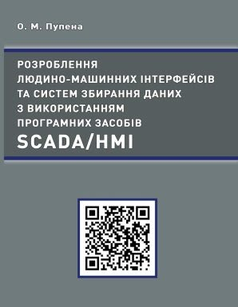

# Розроблення людино-машинних інтерфейсів та систем збирання даних з використанням програмних засобів SCADA/HMI
Це [електронна версія посібника](https://pupenasan.github.io/hmibook/): Пупена О.М., Розроблення людино-машинних інтерфейсів та систем збирання даних з використанням програмних засобів SCADA/HMI. : Навч. посіб. Київ : Видавництво Ліра-К, 2020. — 594 с.

Посібник виданий у електронному варіанті під час війни з росією задля спрощення доступу до технічної інформації україномовному населенню на території України і по всьому світі. Я сподіваюсь цей крок хоч трохи прискорить відновлення нашої неньки після війни. Слава Україні!

Паперовий варіант книги можна придбати у видавництві [Ліра-К](https://lira-k.com.ua/books/promislov%d1%96st/rozroblennja-ljudyno-mashynnyh-interfejsiv-ta-system-zbyrannja-danyh-z-vykorystannjam-programnyh-zasobiv-scada-hmi.html).

Лабораторні роботи та лекції по курсу доступні в репозиторії дисципліни за [цим посиланням](https://pupenasan.github.io/hmi/) . 

Усі побажання та зауваження пишіть [в цій темі](https://github.com/pupenasan/hmibook/issues/1).

**[Від автора](autor.md)**

**[Вступ](intro.md)**

**[РОЗДІЛ 1](1.md). Призначення та можливості людино-машинних інтерфейсів та збирання даних в автоматизованих системах керування**

- [1.1](1_1.md). Місце засобів SCADA/HMI в структурі керування
- [1.2](1_2.md). Людино-машинний інтерфейс (HMI)
- [1.3](1_3.md). Підсистема тривожної сигналізації та подій
- [1.4](1_4.md). Підсистема трендів
- [1.5](1_5.md). Додаткові підсистеми SCADA/HMI
- [1.6](1_6.md). Мережні архітектури
- [Питання та посилання](1_q.md)

**[РОЗДІЛ 2](2.md). Загальні принципи розроблення SCADA/HMI**

- [2.1](2_1.md). Загальний опис процесів життєвого циклу програмного проекту SCADA/HMI
- [2.2](2_2.md). Розроблення проекту
- [2.3](2_3.md). Виконання та налагодження
- [2.4](2_4.md). Введення в дію
- [2.5](2_5.md). Приклад організації проектів у Citect
- [2.6](2_6.md). Приклад організації проектів в SCADA zenon
- [2.7](2_7.md). Приклад організації проектів у WinCC Comfort
- [Питання та посилання](2_q.md)

**[РОЗДІЛ 3](3.md). Підсистема керування збором та обробленням даних в реальному часі**

- [3.1](3_1.md). База даних реального часу та підсистема введення/виведення
- [3.2](3_2.md). Змінні (Теги)
- [3.3](3_3.md). Ідентифікація тегів
- [3.4](3_4.md). Зв'язок із джерелом даних
- [3.5](3_5.md). Масштабування, діапазони та обмеження на введення
- [3.6](3_6.md). Одиниці виміру, формат відображення
- [3.7](3_7.md). Властивості тегів у режимі виконання
- [3.8](3_8.md). Типи даних тегів
- [3.9](3_9.md). Деякі підходи до організації БДРЧ
- [3.10](3_10.md). Підходи до автоматизації створення БДРЧ
- [3.11](3_11.md). Приклади конфігурування бази даних реального часу у Citect
- [3.12](3_12.md). Приклади конфігурування бази даних реального часу в SCADA zenon
- [3.13](3_13.md). Приклади конфігурування бази даних реального часу для WinCC Comfort
- [Питання та посилання](3_q.md)

**[РОЗДІЛ 4](4.md). Підсистема введення/виведення**

- [4.1](4_1.md). MODBUS
- [4.2](4_2.md). OPC DA
- [4.3](4_3.md). OPC UA
- [4.4](4_4.md). Протокол Simatic S7
- [4.5](4_5.md). Протокол MQTT
- [Питання та посилання](4_q.md)

**[РОЗДІЛ 5](5.md). Людино-машинний інтерфейс**

- [5.1](5_1.md). Основи побудови ефективних людино-машинних інтерфейсів
- [5.2](5_2.md). Дисплеї
- [5.3](5_3.md). Редактори графічної підсистеми
- [5.4](5_4.md). Об'єкти людино-машинного інтерфейсу та анімація
- [5.5](5_5.md). Анімовані компоненти (символи) та сторінки із замінними прив’язками анімацій
- [5.6](5_6.md). Можливості розширення палітри анімаційних компонентів
- [5.7](5_7.md). Ієрархія дисплеїв та навігація
- [5.8](5_8.md). Принципи розроблення високоефективного людино-машинного інтерфейсу
- [Питання та посилання](5_q.md)

**[РОЗДІЛ 6](6.md). Розроблення підсистеми тривожної сигналізації**

- [6.1](6_1.md). Важливість і стандарти впровадження підсистем тривожної сигналізації
- [6.2](6_2.md). Місце підсистеми тривожної сигналізації в системі автоматизованого керування
- [6.3](6_3.md). Взаємодія оператора з процесом
- [6.4](6_4.md). Автомат станів тривог
- [6.5](6_5.md). Приклад діаграми поведінки тривоги в часі
- [6.6](6_6.md). Типи, групування та класифікація тривог
- [6.7](6_7.md). Атрибути тривог
- [6.8](6_8.md). Людино-машинний інтерфейс для систем тривожної сигналізації
- [6.9](6_9.md). Розширені та прогресивні методи організації тривог
- [6.10](6_10.md). Події
- [6.11](6_11.md). Підсистема тривожної сигналізації в SCADA Citect
- [6.12](6_12.md). Підсистема тривожної сигналізації в SCADA zenon
- [6.13](6_13.md). Підсистема тривожної сигналізації у WinCC Comfort
- [Питання та посилання](6_q.md)

**[РОЗДІЛ 7](7.md). Розроблення підсистеми трендів**

- [7.1](7_1.md). Модель трендового контуру
- [7.2](7_2.md). Збереження трендових даних
- [7.3](7_3.md). Відображення трендових даних
- [7.4](7_4.md). Підсистема трендів в SCADA Citect
- [7.5](7_5.md). Підсистема трендів в SCADA zenon
- [7.6](7_6.md). Підсистема трендів у WinCC Comfort
- [Питання та посилання](7_q.md)

**[РОЗДІЛ 8](8.md). Інші підсистеми SCADA/HMI**

- [8.1](8_1.md). Підсистема скриптів
- [8.2](8_2.md). Підсистема генерування подій
- [8.3](8_3.md). Доступ до баз даних зі SCADA/HMI
- [8.4](8_4.md). Підсистема роботи з рецептами
- [8.5](8_5.md). Підсистема звітів
- [8.6](8_6.md). Підсистема календарного виконання
- [8.7](8_7.md). Підсистема керування доступом
- [8.8](8_8.md). Мультимовна підтримка
- [Питання та посилання](8_q.md)

**[РОЗДІЛ 9](9.md). Інтеграція з іншими засобами та кібербезпека**

- [9.1](9_1.md). Мережні архітектури
- [9.2](9_2.md). Інтегрування SCADA/HMI з верхніми рівнями керування
- [9.3](9_3.md). Historian
- [9.4](9_4.md). Промисловий Інтернет речей та інтеграція з хмарними застосунками
- [9.5](9_5.md). Основи кібербезпеки в АСКТП
- [Питання та посилання](9_q.md)

**[РОЗДІЛ 10](10.md). Життєвий цикл SCADA/HMI**

- [10.1](10_1.md). Загальні процеси життєвого циклу SCADA/HMI
- [10.2](10_2.md). Керування життєвим циклом HMI відповідно до стандарту ISA-101
- [10.3](10_3.md). Модель життєвого циклу систем тривожної сигналізації відповідно до ISA-18.2
- [10.4](10_4.md). Життєвий цикл проекту
- [Питання та посилання](10_q.md)
