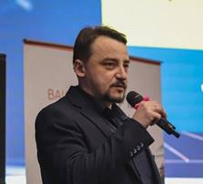

[Головна](README.md)

# Від автора

Використання програмних засобів SCADA/HMI та операторських панелей разом з ПЛК займає більшу частину моєї професійної діяльності. Як програмісту АСКТП, мені доводилося використовувати різні платформи, при роботі з якими визначалися однакові функції засобів різних брендів. Як тренер, я з колегами читав курси підвищення кваліфікації як мінімум для 5-ти різних платформ, для деяких з них читаю і понині. Як лектор, вже кілька років я веду курс "Людино-машинний інтерфейс" для студентів Національного університету харчових технологій (НУХТ), а до цього проводив лабораторні роботи. І весь цей час мене не полишала думка про те, що варто написати посібник по темі SCADA/HMI. Мій старший колега скептично відносився до цієї ідеї: "А про що ти будеш писати? Про конкретну платформу? Таких посібників достатньо!" Мої аргументи про те, що таки є щось загальне для всіх платформ і що варто це доводити до студентів та молодих спеціалістів вочевидь були не дуже переконливими. Хоч, думаю, з часом він також змінив свою думку стосовно цього. 

Тригером до початку написання посібника стало неочікуване отримання лекцій з дисципліни "Людино-машинні інтерфейси". Оскільки написання посібника для курсу, що веду, було питанням часу, я вирішив це не відкладати і реалізувати свою давню ідею. Крім того, вже велися роботи по розділу людино-машинного інтерфейсу іншого посібника – "Автоматизація виробничих процесів". Він практично на 90% складає основу першого розділу цієї книги. 

Теза "Писати посібник про конкретну платформу" стала червоною лінією, за яку не можна було переходити. Подібних посібників дійсно достатньо для різних платформ. Тим не менше, за останній десяток років вийшло кілька англомовних книг по людино-машинним інтерфейсам та системам тривожної сигналізації, з якими варто ознайомитися не тільки студентам а і спеціалістам. Вони неодноразово згадуються в цьому посібнику і великою частиною лягли в основу деяких його підрозділів. Хоча, навіть при наявності таких фундаментальних праць з джерелами для теоретичної основи було досить складно. Інформацію по деяким підсистемам прийшлося збирати крупицями, а деякі, наприклад підсистема трендів, залишилися досить обмежені в теорії.    

Не дивлячись на важливість теоретичної основи, розповідь про засоби SCADA/HMI та технології, які там використовуються, не можуть бути зрозумілими без прикладів реалізації. Я вирішив поєднати в посібнику загальне з конкретним, теорію з практикою. За цієї причини кожен розділ включає теоретичні основи і реалізацію на кількох платформах, які були вибрані за рядом критеріїв:

- засоби, з якими довелося працювати неодноразово;

- до платформ входять як засоби SCADA так і HMI;

- платформи мають різні парадигми;

- дані платформи використовуються в лабораторних роботах в НУХТ;

- є консультативна підтримка;

- користуються попитом на ринку України. 

При такій структурі посібника, "вирвавши" усі параграфи з прикладами платформи, посібник залишається цілісним. Це може дати додаткові можливості в майбутньому. Зокрема, так можна писати розділи для платформ, у формі додатків до посібника, або видавати інші редакції в комплекті теорія + платформа. Будь які форми подібних варіантів посібників можна розглядати.

Початково планувалося, що посібник буде в полегшеній редакції, орієнтований тільки на студентів. Наявність великої кількості цікавого для спеціалістів матеріалу зумовило систематизувати його і викласти у відповідних розділах. Так тривало до тих пір, поки розділення між "легким" і "важким", "обов’язковим" і "необов’язковим" стало неочевидним. Тому я вирішив зробити один посібник, замість двох. Але для спрощення читання на початку кожного розділу вказані рекомендовані параграфи для вивчення студентами. Інші підрозділи можуть вивчатися за необхідності.

Викладачам відомо, що робота над будь яким посібником значно розширює знання викладача. Робота над цим посібником змусила систематизувати всі мої знання, що були на той час. Але значно більше я отримав нової! Хоч було надзвичайно важко, а вихід посібника затягнувся більш ніж на рік, усі заплановані теми були висвітлені. У "заплановані" треба також включати ті теми, які з’являлися на пізніх етапах роботи над книгою. Кожне нове завдання було важким психологічним бар’єром, але воно було варте того.        

Для більш якісної подачі матеріалу до рецензування посібника окрім основних рецензентів були залучені спеціалісти з ринку. Деякі з них консультували по темам, в яких у мене не було достатнього досвіду. Дякую за допомогу Ярославу Люлько, Максиму Савельєву, Олександру Ніколенко, Андрію Гуменному,  Олександру Голінько, Володимиру Патрахіну та іншим, яких можливо не пригадав. Якби не ви – посібник би не вийшов в цьому обсязі і містив багато помилок та неточностей. 

Хочу також подякувати Володимиру Миколайовичу Кушкову за його школу в цій та інших темах АСКТП. Хоч на багато тем у нас думки розходяться, основи SCADA/HMI були закладені саме за Вашого викладання та консультування. Окремо хочу подякувати Леоніду Юрійовичу Юрчуку, якого я вже не бачив кілька років за причини його важкої хвороби. Його матеріали з ТДА також сильно допомогли при написанні деяких розділів. Дякую також Ігорю Володимировичу Ельперіну, який створив на кафедрі атмосферу, яка сприяє професійному розвитку спеціалістів. Дякую усій команді i4u за допомогу в роботі над деяким розділами.

Дякую асоціації промислових підприємств автоматизації України (АППАУ, https://appau.org.ua), куди входить НУХТ, а також персонально Юрчаку Олександру Володимировичу за розвиток індустрії та просування актуальних міжнародних стандартів в Україні. Це відіграло велику роль як в налагодженні контактів з рецензентами так і у відкритті додаткових інформаційних ресурсів.  

Дякую своїй сім’ї (дружині та сину) за те, що терпіли мою фактичну відсутність вдома при фізичній присутності.  

Не дивлячись на те, що ми – автор, рецензенти і редактори робили все, щоб в тексті не було помилок та неточностей, я впевнений, що їх там залишилося достатньо, щоб завалити мене електронними листами J . Пишіть мені на пошту з критикою, питаннями і пропозиціями [pupena_san@ukr.net](mailto:pupena_san@ukr.net). Також мене можна знайти в соц-мережах Facebook та Linkedin під своїм іменем. 

Бажаю Вам приємного і головне корисного чтива! 

*З найкращими побажаннями,* 

*Олександр Пупена*  

[Вступ -->](intro.md)